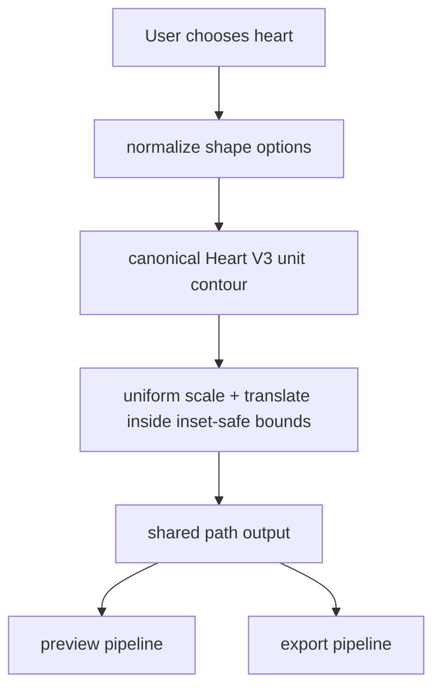

# Goja Heart V3 Recognizability Plan

## Merge Status

- Merged into master plan as Wave 13 (`rev53..rev58`).
- Source of truth for execution order/status is:
  - ``
- This document remains as the detailed design reference for Wave 13.

## Goal

Make the heart shape visually recognizable to typical users at a glance, while keeping preview/export visually lockstep and preserving existing stability/fallback behavior.

## Why this should look more like a heart

Current heart rendering is generated from a unit contour but then mapped with independent width/height scaling, which can distort silhouette proportions on non-square targets. The plan changes this to **similarity-fit** (uniform scale + translation) so the heart keeps its intended lobe/notch/waist/tail proportions across frame ratios.

Concretely, recognizability improves because:

- **No anisotropic warp**: prevents “teardrop/leaf-like” deformation under wide/tall canvases.
- **Shape-prioritized fitting**: maximize area **within inset** under a fixed heart aspect prior, instead of forcing both axes to near-100% occupancy.
- **Perception-oriented gates**: add silhouette tests closer to human recognition, not only geometric occupancy checks.

## Scope

- Heart geometry only (no changes to other shape math except shared plumbing if required).
- One canonical heart source used by both preview and export.
- Keep current safety fallbacks and capability behavior.

## Primary Files

- Geometry core:
  - [/Users/luke/Documents/00_Mundo/02product/01_coding/project/goja/js/shape-contour.js](/Users/luke/Documents/00_Mundo/02product/01_coding/project/goja/js/shape-contour.js)
  - [/Users/luke/Documents/00_Mundo/02product/01_coding/project/goja/js/frame-shape-geometry.js](/Users/luke/Documents/00_Mundo/02product/01_coding/project/goja/js/frame-shape-geometry.js)
  - [/Users/luke/Documents/00_Mundo/02product/01_coding/project/goja/js/shape-clip-utils.js](/Users/luke/Documents/00_Mundo/02product/01_coding/project/goja/js/shape-clip-utils.js)
- Tests:
  - [/Users/luke/Documents/00_Mundo/02product/01_coding/project/goja/tests/unit/frame-shape-geometry.test.js](/Users/luke/Documents/00_Mundo/02product/01_coding/project/goja/tests/unit/frame-shape-geometry.test.js)
  - [/Users/luke/Documents/00_Mundo/02product/01_coding/project/goja/tests/unit/shape-clip-utils.test.js](/Users/luke/Documents/00_Mundo/02product/01_coding/project/goja/tests/unit/shape-clip-utils.test.js)
  - [/Users/luke/Documents/00_Mundo/02product/01_coding/project/goja/tests/e2e/goja.spec.js](/Users/luke/Documents/00_Mundo/02product/01_coding/project/goja/tests/e2e/goja.spec.js)
- Release record:
  - [/Users/luke/Documents/00_Mundo/02product/01_coding/project/goja/CHANGELOG.md](/Users/luke/Documents/00_Mundo/02product/01_coding/project/goja/CHANGELOG.md)

## Architecture Change (Heart only)

## Execution Steps (TDD-first)

1. Add failing tests for heart recognizability and anti-distortion behavior across multiple aspect ratios.
2. Implement heart similarity-fit transform in geometry core (uniform scale only).
3. Tune Heart V3 contour control points/parameterization to improve lobe/notch/waist readability.
4. Keep preview/export on one geometry source; remove any remaining heart-specific divergence.
5. Re-run targeted suites, then full `npm test` + `npm run test:e2e`.
6. Run `cloc` SLOC checks and function-size/complexity static checks; refactor any violations before final verification.
7. Re-run full validation after refactor pass (`npm test` + `npm run test:e2e`).
8. Update `CHANGELOG.md` with today’s date and exact validation evidence.

## Battlefield-Tested Rules Embedded

- **TDD first**: every behavior change starts with failing tests.
- **One canonical source**: no dual heart math between preview/export.
- **Fast-build-quick-fail**: land in narrow, test-gated slices.
- **Fallback safety**: unsupported paths must degrade safely without breaking export.
- **Evidence-first validation**: only claim ready after targeted + full gates pass.

## Function Size and Complexity Control (Industry-Aligned)

### Objective

Keep code readable, testable, and maintainable by combining SLOC checks with complexity and responsibility checks.

### Standards

1. **Program/File SLOC target**
  - Preferred: keep each program file under 100 SLOC where practical.
  - Measurement command: `cloc <path-to-file>`.
  - Exception allowed only when splitting would reduce clarity or break cohesion.
2. **Function size**
  - Soft limit: 40 lines per function.
  - Hard warning threshold: 60 lines per function.
  - If exceeded, refactor into smaller, well-named helper functions.
3. **Single responsibility**
  - Each function should perform one logical operation.
  - Mixed responsibilities (validation + IO + transformation + persistence in one function) must be split.
4. **Complexity guardrails**
  - Enforce cyclomatic/cognitive complexity thresholds via lint/static analysis.
  - Any function flagged for high complexity must be refactored even if line count is below threshold.
5. **Line width (readability)**
  - Use a 78-character column limit unless project style requires otherwise.
6. **Testing requirement for refactors**
  - Any refactor for size/complexity must keep unit, function, and integration tests passing.

### Enforcement Workflow

1. Run `cloc <file>` to verify SLOC target.
2. Run lint/static analysis for size/complexity violations.
3. Refactor oversized/high-complexity functions into cooperating modules.
4. Run full test suite before claiming completion.

### Decision Principle

- Prefer clarity and maintainability over strict numeric adherence.
- Numeric thresholds are guardrails, not goals by themselves.

## SLOC / Comments / Clean-code Compliance

- Prefer editing existing modules; avoid adding new files unless necessary.
- Any new JS module must satisfy `SLOC < 100` (verified by `cloc`).
- Touched legacy modules should be non-increasing where practical.
- Add only minimal, high-signal comments for non-obvious geometry logic.
- Remove temporary artifacts/scripts after use.
- Target 78-char line width for new/edited code where practical.
- Keep functions under 40 lines when feasible; treat 60+ lines as refactor-required.
- Split mixed-responsibility functions before adding new behavior.

## Validation Gates

- Targeted:
  - `npx vitest run tests/unit/frame-shape-geometry.test.js tests/unit/shape-clip-utils.test.js`
  - `npx playwright test tests/e2e/goja.spec.js --grep "heart|iPhone class preview stays in sync"`
- Full:
  - `npm test`
  - `npm run test:e2e`
- SLOC:
  - `cloc --by-file --include-lang=JavaScript 02product/01_coding/project/goja/js/shape-contour.js 02product/01_coding/project/goja/js/frame-shape-geometry.js 02product/01_coding/project/goja/js/shape-clip-utils.js 02product/01_coding/project/goja/tests/unit/frame-shape-geometry.test.js 02product/01_coding/project/goja/tests/unit/shape-clip-utils.test.js 02product/01_coding/project/goja/tests/e2e/goja.spec.js`
- Static complexity/size/readability gate:
  - `npx -y eslint@9.22.0 02product/01_coding/project/goja/js/shape-contour.js 02product/01_coding/project/goja/js/frame-shape-geometry.js 02product/01_coding/project/goja/js/shape-clip-utils.js --max-warnings 0 --rule "max-lines-per-function: [\"error\", {\"max\": 40, \"skipBlankLines\": true, \"skipComments\": true}]" --rule "complexity: [\"error\", 10]" --rule "max-len: [\"error\", {\"code\": 78, \"ignoreUrls\": true}]" --rule "max-depth: [\"error\", 4]"`

## Acceptance Criteria

- Heart is visually recognizable as a heart under common frame ratios (portrait/square/landscape).
- Heart retains notch/lobe/tail structure without anisotropic deformation artifacts.
- Preview/export heart outputs are visually lockstep (same geometry source).
- Unit + e2e + full gates pass.
- SLOC governance and coding rules are satisfied with recorded evidence.
- No unresolved high-complexity/oversized functions remain in touched files.

