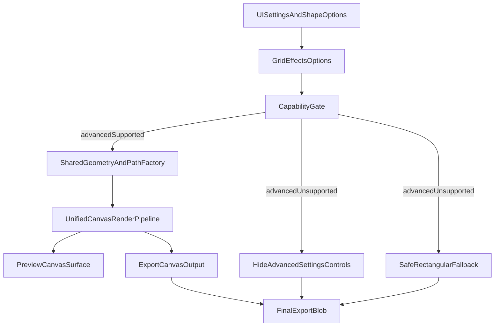

# Goja Advanced Irregular Edge Rollout Plan

## Scope

- Add irregular cell edges for both preview and export, while keeping advanced settings and optimizing edge-style UI for cross-platform usability.
- Keep current rectangular rendering as guaranteed fallback.
- Define device/browser capability requirements and runtime downgrade policy.
- Add a whole-grid framing shape (`circle`/`ellipse`/`regular-octagon`/`regular-decagon`/`regular-dodecagon`/`regular-hexadecagon`/`regular-36-gon`/`regular-64-gon`/`rounded-rect`/`superellipse`/`capsule`/`diamond`/`heart`) that wraps the full collage as one object with:
  - frame stroke around the shape boundary,
  - strong contrast background outside the boundary.
- Add per-cell shape templates (`circle`/`ellipse`/`regular-octagon`/`regular-decagon`/`regular-dodecagon`/`regular-hexadecagon`/`regular-36-gon`/`regular-64-gon`/`rounded-rect`/`superellipse`/`heart`) applied uniformly to all cells while preserving gap reveal behavior.
- Keep `capsule` and `diamond` as frame-only options; if passed through cell pathways (legacy/manual state), they must normalize to `rect`.
- Remove `regular-triangle` and `squircle` from user-facing and core shape contracts; legacy `regular-triangle` values must migrate to `rect`.
- Enforce a single preview/export render contract for visual lockstep:
  - one shared canvas rendering pipeline,
  - one shared path/geometry source,
  - one shared options normalization source.
- Export rendering is the canonical source-of-truth for geometry, clipping, transform chain, and composition order.
- Preview must consume the same unified canvas pipeline and must not introduce independent geometry math.
- CSS `clip-path` may be used for presentation-only effects but is never geometric authority for release parity decisions.

## Active Execution Window

- Frontmatter `todos` includes historical completed waves for traceability.
- Current executable window is **Wave 17 only**: `rev69..rev76`.
- Child plan:
  [goja_ios_export_recovery_a3f1c2d4.plan.md](goja_ios_export_recovery_a3f1c2d4.plan.md).
- Wave 15 (`rev64..rev68`) is shipped through **10.2.11**; Wave 16 is
  deferred (production monitoring).
- Wave 14 (`rev59..rev63`) is completed; supplemental Wave 14 notes are
  reference-only.
- This master plan remains the sole execution authority.
- Wave 13 (`rev53..rev58`) is completed and retained as release evidence history.
- Wave 12 (`rev49..rev52`) is completed and retained as release evidence history.
- Wave 11 (`rev44..rev48`) is completed and retained as release evidence history.
- Wave 10B (`rev40..rev43`) is completed and retained as release evidence history.
- If any historical todo text conflicts with active Wave 17 policy, Wave 17
  policy takes precedence.
- Before any new wave execution, synchronize frontmatter todo statuses with latest validated test evidence to avoid stale gating decisions.
- Any historical mentions of `regular-hexagon`/`regular-nonagon`/`regular-triangle` are archival traceability only and must not be interpreted as active user-facing shape options under Wave 14.

## Existing Integration Points

- Preview rendering currently builds rectangular cells in [02product/01_coding/project/goja/js/preview-renderer.js](02product/01_coding/project/goja/js/preview-renderer.js).
- Export rendering currently draws rectangular cell crops through [02product/01_coding/project/goja/js/cell-draw.js](02product/01_coding/project/goja/js/cell-draw.js), orchestrated by [02product/01_coding/project/goja/js/export-handler.js](02product/01_coding/project/goja/js/export-handler.js) and worker path [02product/01_coding/project/goja/js/export-worker.js](02product/01_coding/project/goja/js/export-worker.js).
- Grid/effects options flow is centralized in [02product/01_coding/project/goja/js/grid-effects-settings.js](02product/01_coding/project/goja/js/grid-effects-settings.js) and bootstrap wiring in [02product/01_coding/project/goja/js/app-bootstrap.js](02product/01_coding/project/goja/js/app-bootstrap.js).

## Battlefield-Tested Rules Embedded

- TDD-first for every module change: write failing unit tests before implementation.
- Fast-build-quick-fail strategy:
  - Ship in narrow vertical slices (`straight` parity -> preset A -> preset B`) and gate each slice by parity and aesthetic tests.
  - Add runtime capability checks early; fail closed to safe mode.
  - Add assertion-style guards around shape generation and clip failures.
- Full test gate before claiming done: unit + integration + e2e.
- SLOC hard rule: each **newly added** JS module must stay under 100 SLOC (`SLOC < 100`), and touched legacy large modules must be non-increasing where feasible, verified with `cloc` before merge.
- Proactive abstraction rule: always seek opportunities to extract clearer module boundaries and tiers (UI wiring, capability policy, shape generation, render adapters), following mainstream JavaScript best practices (single responsibility, pure-core/imperative-shell, explicit interfaces, minimal coupling).

## Capability Model (User Device Support)

Define a minimal-surprise support state:

- `advancedSupported`: active-wave preview/export rendering capabilities are both available and stable for irregular clipping, global frame shaping, and cell template shaping.
- `advancedUnsupported`: one or more required capabilities missing; feature is treated as unavailable.

Required checks at runtime (guarded, no hard crash):

- Canvas irregular clipping support available (`Path2D`, `CanvasRenderingContext2D.clip`).
- Preview rendering support available for the active shared pipeline (Canvas 2D path clipping on preview surface).
- Core export path remains available (worker acceleration via `OffscreenCanvas` + `createImageBitmap` remains optional due to existing main-thread fallback).
- Add behavior probes (not only API presence): run one-time micro render checks for preview clip and canvas clip correctness; set `advancedUnsupported` if probes fail.

## Fallback Policy

- Minimal-surprise policy: when `advancedUnsupported`, do not render advanced edge/shape settings controls at all.
- Default behavior: when unsupported, force `edgeStyle = straight` and force shape features to safe defaults (`globalFrameShape = rect`, `cellShapeTemplate = rect`) internally, and do not expose advanced selectors.
- Export reliability first:
  - If worker path fails, keep existing fallback to main thread export.
  - If irregular clip fails at runtime after passing initial checks, downgrade render to rectangular and keep export successful.
- UX policy:
  - Unsupported advanced edge/shape styles are hidden from Settings to avoid user confusion.
  - Persisted advanced values are sanitized on load to supported defaults (`straight`) when device is unsupported.
  - Support warnings are internal (dev diagnostics/logs) and must not introduce end-user confusion when controls are hidden.

## Risk Register and Mitigations

- **Risk: legacy large files violate SLOC policy when touched.**  
Mitigation: only permit legacy file changes that delegate/extract logic out; new feature logic must live in small modules (`SLOC < 100`), and legacy touched files must trend downward or stay flat in code lines.
- **Risk: API presence does not guarantee rendering correctness on all browsers.**  
Mitigation: enforce behavior probes and switch to `advancedUnsupported` on probe failure.
- **Risk: preview/export mismatch for same style and seed.**  
Mitigation: shared deterministic shape engine with parity integration tests and e2e snapshots.
- **Risk: hidden-controls policy conflicts with persisted advanced settings.**  
Mitigation: sanitize persisted values to `straight` during boot on unsupported devices.

## Implementation Phases (TDD + Quick-Fail)

Historical baseline note: this Phase 0-6 block documents the original Wave 1
rollout path. Active execution for current requirements is defined in
**Wave 14 (Active)** below.

DO NOT EXECUTE historical phase instructions in this section; they are retained for traceability only. Execute only the active Wave 14 policy and `rev59..rev63` order.

1. **Phase 0: Modular baseline for SLOC compliance**
  - Before feature logic, extract helper/adapters from oversized hot files so feature-related touched modules remain enforceable under `SLOC < 100`.
  - Keep behavior unchanged and verify with existing tests before proceeding.
2. **Phase 1: Capability scaffold + no-op parity**
  - Add edge options plumbing (`edgeStyle`, `edgeIntensity`, `edgeFrequency`, `edgeSeed`) with default `straight`.
  - Add capability detector utility and tests.
  - Add behavior probes validating actual clip correctness on representative micro canvases.
  - Gate settings UI visibility by capability (hide advanced controls when unsupported).
3. **Phase 2: Shared shape engine**
  - Introduce deterministic edge/path generator (shared-border consistency, seeded output).
  - Add unit tests for determinism, closed paths, shared-edge reversibility.
4. **Phase 3: Preview Option C path rendering**
  - Render cells with SVG clip-path pipeline; fall back to rectangular preview when unsupported.
  - Add preview renderer tests for both supported and degraded modes.
5. **Phase 4: Export path clipping**
  - Apply same generated paths via canvas clip in main-thread and worker export.
  - Add export/cell draw tests covering clip success and clip-failure downgrade.
6. **Phase 5: Modularization pass (guarded by tests)**
  - Identify repeated logic and tier leakage introduced during feature work.
  - Extract reusable helpers/interfaces only when it reduces coupling and improves readability without breaking `SLOC < 100` rule.
  - Keep behavior identical; validate with full regression suite after each abstraction step.
7. **Phase 6: Hardening + release docs**
  - Run full unit/integration/e2e regression after modularization pass.
  - Add developer-facing diagnostics for support fallback (non-user-facing when controls are hidden).
  - Update README capability notes and changelog entry once all validations are green.

## Test & Verification Gates

- Unit tests: shape generator, capability detector, grid-effects options, cell draw clip behavior.
- Integration tests (cross-module path): preview->export parity with same seed/template and capability-state transitions.
- Combined edge+template continuity gate: when `edgeStyle != straight` and `cellShapeTemplate != rect`, tests must assert boundary variation is continuous along the template perimeter (no partial/local-only edge artifacts).
- Heart-geometry parity gate: preview/export must consume one heart geometry source; compatibility fallback may use high-sample polygon approximation (`64..128` points) generated from the same canonical heart contour sampler.
- Heart V2 visual-contract gate (rev33): assert measurable thresholds for top-notch height, mid-upper width utilization, rounded tip width near bottom, symmetry error bounds, and inset-safe max-fit using deterministic contour sampling.
- Historical canonical validation command source (Wave 10 snapshot):
  - `npm test`
  - `npx vitest run tests/unit/frame-shape-geometry.test.js tests/unit/shape-clip-utils.test.js tests/unit/edge-shape-engine.test.js tests/unit/preview-renderer.test.js tests/unit/cell-draw.test.js tests/unit/unified-canvas-pipeline.test.js tests/unit/grid-effects-settings.test.js tests/unit/export-handler.test.js tests/unit/export-flow.test.js tests/unit/preview-updater.test.js`
  - `npm run test:e2e`
  - Any newly added Wave 10 test files had to be appended here in the same
    change that introduced them.
- E2E smoke: supported vs unsupported simulation paths, including Settings visibility assertions.
- Regression: existing filter/vignette/watermark/capture-date behavior unchanged.
- Performance reproducibility protocol (Wave 9):
  - Use the iPhone-class repeated toggle scenario in `tests/e2e/goja.spec.js` as the canonical latency checkpoint for parity-sensitive changes.
  - Capture and store the pre-rev34 baseline timing evidence before starting `rev34a`; without baseline evidence, rev34/rev35 cannot be marked complete.
  - Compare against pre-rev34 baseline run for the same scenario; block completion if latency regression exceeds `15%`.
- SLOC hard gate with `cloc` on touched modules:
  - `cloc 02product/01_coding/project/goja/js/preview-renderer.js`
  - `cloc 02product/01_coding/project/goja/js/cell-draw.js`
  - Repeat for each new/touched module in this feature branch.
  - Merge blocked if any **newly added** JS module reports `code >= 100`.
  - For **legacy modules already >= 100**, changes are allowed only when:
    - code lines do not increase versus pre-change baseline, and
    - newly introduced feature logic is extracted into small modules (`SLOC < 100`).
  - Preferred target for legacy modules is net code reduction per phase.
- Abstraction safety gate:
  - Any refactor/abstraction must be preceded by failing-or-protective tests and followed by full green unit/integration/e2e runs.
  - Reject abstractions that increase cognitive load, blur tier boundaries, or create oversized modules.

## Delivery Topology

Historical active-wave topology (Wave 10 snapshot): preview and export consumed
one shared canvas render pipeline.

## Practical Execution Notes

Historical-note: the first two bullets in this section are retained for Wave
1/2 traceability. For active implementation, prioritize **Wave 14 sections**
and **Wave 14 Execution Order**.

- Primary files to change (Wave 1 baseline): [02product/01_coding/project/goja/js/grid-effects-settings.js](02product/01_coding/project/goja/js/grid-effects-settings.js), [02product/01_coding/project/goja/js/preview-renderer.js](02product/01_coding/project/goja/js/preview-renderer.js), [02product/01_coding/project/goja/js/cell-draw.js](02product/01_coding/project/goja/js/cell-draw.js), [02product/01_coding/project/goja/js/export-handler.js](02product/01_coding/project/goja/js/export-handler.js), [02product/01_coding/project/goja/js/export-worker.js](02product/01_coding/project/goja/js/export-worker.js), and corresponding files under [02product/01_coding/project/goja/tests/unit](02product/01_coding/project/goja/tests/unit).
- Additional Wave 2 focus files: [02product/01_coding/project/goja/js/edge-preview-clip.js](02product/01_coding/project/goja/js/edge-preview-clip.js), [02product/01_coding/project/goja/js/edge-shape-engine.js](02product/01_coding/project/goja/js/edge-shape-engine.js), [02product/01_coding/project/goja/js/edge-export-clip.js](02product/01_coding/project/goja/js/edge-export-clip.js), [02product/01_coding/project/goja/js/edge-rng.js](02product/01_coding/project/goja/js/edge-rng.js), [02product/01_coding/project/goja/index.html](02product/01_coding/project/goja/index.html), locale files under [02product/01_coding/project/goja/js/locales](02product/01_coding/project/goja/js/locales), and [02product/01_coding/project/goja/tests/e2e/goja.spec.js](02product/01_coding/project/goja/tests/e2e/goja.spec.js).
- Use small cooperating modules instead of monolithic implementation; keep temporary artifacts out of repo.
- Execute existing test commands from [02product/01_coding/project/goja/package.json](02product/01_coding/project/goja/package.json): `npm test`, `npm run test:unit`, `npm run test:e2e` (after Playwright setup).

## Execution Status (2026-03-05)

Note: this section is a historical snapshot of Wave 1/2 completion at that date; current release readiness must follow the latest active-wave gate policy (currently Wave 14, `rev59..rev63`) and `rev`* todo states.

- Wave 1 phases are completed (`phase0` through `phase6`) and corresponding todo statuses are `completed`.
- Implemented advanced edge feature modules and integration points:
  - `js/edge-capability.js`, `js/edge-shape-engine.js`, `js/edge-preview-clip.js`, `js/edge-export-clip.js`, `js/edge-rng.js`
  - updates in `js/grid-effects-settings.js`, `js/preview-renderer.js`, `js/cell-draw.js`, `js/export-handler.js`, `js/export-worker.js`, `js/app-bootstrap.js`, `js/app-init.js`, `index.html`
- Added/updated tests:
  - `tests/unit/edge-capability.test.js`, `tests/unit/edge-shape-engine.test.js`
  - expanded `tests/unit/preview-renderer.test.js`, `tests/unit/cell-draw.test.js`, `tests/unit/grid-effects-settings.test.js`
  - expanded `tests/e2e/goja.spec.js` for supported/unsupported edge-control behavior
- Validation runs completed and passing:
  - `npm test`
  - `npx vitest run tests/unit/preview-renderer.test.js tests/unit/cell-draw.test.js tests/unit/export-handler.test.js tests/unit/export-flow.test.js tests/unit/preview-updater.test.js`
  - `npm run test:e2e`
  - `cloc` checks for new modules confirm each new JS module stays below 100 SLOC

## Deployment Handoff

- Intended release trial command: `npm run deploy -- major`
- Before running deploy, ensure local branch is clean and tests are green in the current workspace state.
- Deploy command executes version/changelog sync and publish workflow; if remote/auth preflight fails, resolve remote/auth first and rerun.
- Release guard (merged policy): do not run `npm run deploy -- major` for final release until all active-wave todos are `completed` (currently `rev59..rev63`), full active-wave validation gates are green, and user approval is explicitly given.

## Wave 2: i18n + Quality Recovery (Merged)

Historical-note: this wave is retained for traceability only. Any `soft-wave` mentions below are historical records; active executable policy is Wave 14 (`rev59..rev63`) while Wave 6 soft-wave removal remains completed baseline behavior.

### Objectives

- Fix preview regression where only one image is visible after enabling irregular edges.
- Improve exported edge aesthetics by switching to template-based edge generation.
- Make all edge settings fully internationalized across existing locales (`en`, `zh-Hans`, `zh-Hant`, `es`, `ja`, `eo`).
- Preserve minimal-surprise policy: unsupported devices keep advanced edge controls hidden and fall back safely.

### Root Causes Identified

- Preview clip path currently uses global cell coordinates on per-cell CSS clip context, which can hide non-first cells.
  - [02product/01_coding/project/goja/js/edge-preview-clip.js](02product/01_coding/project/goja/js/edge-preview-clip.js)
  - [02product/01_coding/project/goja/js/preview-renderer.js](02product/01_coding/project/goja/js/preview-renderer.js)
- Export edge quality currently depends on random per-side offsets without template constraints/continuity guarantees.
  - [02product/01_coding/project/goja/js/edge-shape-engine.js](02product/01_coding/project/goja/js/edge-shape-engine.js)
- Edge UI labels/options are hardcoded in English and not covered by locale dictionaries.
  - [02product/01_coding/project/goja/index.html](02product/01_coding/project/goja/index.html)
  - [02product/01_coding/project/goja/js/i18n.js](02product/01_coding/project/goja/js/i18n.js)
  - [02product/01_coding/project/goja/js/locales/en.js](02product/01_coding/project/goja/js/locales/en.js)

### Wave 2 Risk Register

- **Risk: preview hotfix fixes one layout but regresses others.**  
Mitigation: add multi-template, multi-photo-count regression tests before and after fix.
- **Risk: template-based edges improve aesthetics but break shared-boundary continuity.**  
Mitigation: include deterministic continuity assertions for adjacent cells and export parity checks.
- **Risk: i18n coverage is partial and leaves mixed-language UI.**  
Mitigation: require key-completeness checks for all locales and add locale-switch UI assertions in tests.
- **Risk: release proceeds with known preview defect.**  
Mitigation: explicit release gate blocks final deploy until the current active-wave acceptance criteria are green (currently Wave 14), all required todos are completed, and user approval is given.

### Implementation Plan (TDD-first)

1. **Preview hotfix + refactor**
  - Add failing tests for multi-cell visibility and clip-path coordinate space.
  - Refactor preview clipping to local cell coordinates (`0..width`, `0..height`) for CSS clip paths.
2. **Template edge engine replacement**
  - Replace random jagged generation with deterministic templates (historical examples from that period).
  - Enforce shared-boundary continuity rules for adjacent cells.
3. **Full i18n support (mandatory)**
  - Add `data-i18n`/`data-i18n-aria-label` bindings to all edge controls/options.
  - Add locale keys to all locale files (`en`, `zh-Hans`, `zh-Hant`, `es`, `ja`, `eo`) and expand i18n tests for edge controls.
  - Verify language switching updates edge labels/options without stale English strings.
4. **Fallback robustness regression**
  - Keep capability probe gate and hidden-controls policy.
  - Add tests for unsupported mode rectangular preview/export safety path.
5. **Validation + release docs**
  - Run `npm test`, integration subset, `npm run test:e2e`, and `cloc` SLOC gate.
  - Update README and CHANGELOG for Wave 2 behavior changes.
  - Re-run deploy preflight checks and only then proceed with release command.

### Wave 2 Acceptance Criteria

- Preview shows all selected photos correctly under irregular edge mode.
- Exported edges are template-driven and visually smoother than current random output.
- Edge controls are localized in all supported languages.
- Unsupported devices do not show edge controls and still export successfully.
- All test gates and SLOC rules pass.

## Wave 3: Grid Parity + Aesthetic Revision (Merged)

Note: Wave 3 content remains as historical context; active execution and release gating now follow the latest active wave (currently Wave 14, `rev59..rev63`).

### What This Wave Answers

- Why preview/export curves still differ in some scenarios: geometry is not yet fully unified across both adapters.
- Why current output can look unattractive: preset library is too narrow and shaping constraints are not curated enough.
- Why parameter meaning feels unclear: naming/hints and integer-only control behavior need explicit UX treatment.

### Wave 3 Objectives

- Force preview/export to consume the same normalized deterministic geometry source.
- Replace current style output with 3-4 curated, more aesthetic presets.
- Clarify parameter semantics and make integer-only parameter use a proper number-stepper control.
- Ensure all revised terminology and preset names are fully localized in all supported locales.

### Wave 3 Implementation Strategy

1. **Unify geometry source**
  - Consolidate geometry generation in the shared edge engine so preview and export adapters only map coordinates.
  - Keep seeded determinism and shared-boundary continuity as hard constraints.
  - Primary files: [02product/01_coding/project/goja/js/edge-shape-engine.js](02product/01_coding/project/goja/js/edge-shape-engine.js), [02product/01_coding/project/goja/js/edge-preview-clip.js](02product/01_coding/project/goja/js/edge-preview-clip.js), [02product/01_coding/project/goja/js/edge-export-clip.js](02product/01_coding/project/goja/js/edge-export-clip.js)
2. **Curated preset redesign**
  - Introduce 3-4 curated presets (historical examples from that period).
  - Bound amplitude/frequency envelopes and smoothing to avoid harsh artifacts.
3. **Parameter UX + control correction**
  - Rename labels to explicit meaning (amplitude/strength vs frequency/cycles).
  - Keep integer-only frequency via `input[type="number"]` with `step=1`, range validation, and parsing guards.
  - Primary files: [02product/01_coding/project/goja/index.html](02product/01_coding/project/goja/index.html), [02product/01_coding/project/goja/js/grid-effects-settings.js](02product/01_coding/project/goja/js/grid-effects-settings.js), [02product/01_coding/project/goja/js/app-init.js](02product/01_coding/project/goja/js/app-init.js)
4. **i18n completion for revised terms**
  - Add and verify locale keys for updated labels, hints, and preset names in all existing locale files.
5. **Validation and release gate**
  - TDD-first tests for parity and controls, then run full test matrix and `cloc` gate before release.
  - Keep release blocked until all `rev`* todos are completed and user confirms deployment.

### Wave 3 Risk Controls

- **Parity drift risk**: add deterministic parity tests using same seed/layout across preview and export paths.
- **Aesthetic subjectivity risk**: ship multiple curated presets and make default style conservative.
- **Terminology confusion risk**: enforce i18n-complete labels + hints and control-type correctness in E2E.
- **SLOC risk**: keep newly added JS modules under 100 SLOC and avoid code growth in large legacy modules when feasible.
- **Browser clip-path mismatch risk**: CSS `clip-path: path(...)` behavior may differ from canvas `Path2D` in edge browsers.
Mitigation: treat parity tests as mandatory on both preview and export adapters; force safe rectangular downgrade when parity probe fails.
- **Regression spillover risk**: edge changes can unintentionally affect existing filter/vignette/watermark behavior.
Mitigation: keep regression suite and dedicated integration subset as hard gate before any release action.

### Wave 3 Acceptance Criteria

- Same seed/layout/style produces highly consistent boundaries in preview and export.
- Curated presets are visibly smoother and less harsh than current output.
- Integer-only parameter uses stepper behavior with validation and test coverage.
- Revised edge terminology and preset names are fully localized across supported locales.
- `npm test`, integration checks, `npm run test:e2e`, and `cloc` gates all pass before deployment.

### Wave 3 Execution Order and Gate Policy

1. Set `rev1-unify-geometry-source` to `in_progress` and complete it first.
2. Proceed strictly in order: `rev2` -> `rev3` -> `rev4` -> `rev5`.
3. For each todo:
  - apply TDD-first cycle (failing test -> implementation -> green test),
  - run relevant unit/integration checks immediately,
  - ensure no SLOC rule violation with `cloc` before marking complete.
4. Only when `rev1..rev5` are all `completed`, run full validation:
  - Follow the canonical validation command set in **Test & Verification Gates** (single source of truth) to avoid gate-list drift.
5. Deployment remains blocked until full validation is green and user explicitly approves release.

## Wave 4: Corrective Actions for Visual Lockstep and Cross-Platform Advanced UX (Historical Completed Wave)

Historical-note: `soft-wave` references in this section describe already-completed corrective decisions from that time window. Current active policy is Wave 9, with Wave 6 removal + fail-fast behavior retained as completed baseline.

### Resolutions to Latest Feedback

1. **Preview/export visual lockstep**
  - Enforce one shared path-generation module and one shared transform chain for both preview and export adapters.
  - Add parity fingerprint tests and human-visual acceptance checks so boundaries are effectively indistinguishable in normal viewing.
2. **Keep advanced settings + control usability redesign**
  - Keep advanced controls because they are useful, but redesign widgets and layout for better usability.
  - Replace the current edge amplitude control with a micro-tunable control pattern suitable for fine adjustment.
  - Preserve existing unsupported-device hidden-controls fallback policy.
3. **Soft-wave quality correction**
  - Rework `soft-wave` profile to improve smoothness and natural appearance.
  - Add aesthetic acceptance checks; if soft-wave still fails quality threshold, remove soft-wave preset from the user-facing preset list.
4. **Best-practice aesthetic curation + user selection**
  - Build a candidate set of frame-line templates guided by UI/visual design best practices (rhythm, continuity, visual balance, subtle variation, low artifact rate).
  - Present a shortlist of the strongest candidates for user selection, then keep only user-approved top-looking presets.

### Corrective Implementation Actions

- **A1: Lockstep module enforcement (`rev6`)**
  - Preview/export must both call the same canonical path API and deterministic boundary identity logic.
  - Remove any duplicate path math or adapter-specific waveform logic that can drift.
- **A2: advanced edge UX refactor (`rev7`)**
  - Keep intensity/frequency/seed but redesign control types and spacing for precision and clarity.
  - Replace edge amplitude control with a fine-grained widget (for example: numeric stepper + synced slider, or higher-resolution slider with input box).
  - Keep preset selector as primary entry while preserving advanced tuning.
- **A3: i18n + migration (`rev8`)**
  - Update locale keys/copy for redesigned controls and keep preset-name localization complete.
  - Migrate stored edge settings safely to the new control schema without breaking existing saved preferences.
- **A4: Validation gate (`rev9`)**
  - Run full unit/integration/e2e and `cloc` with parity/aesthetic acceptance criteria as hard gate.
- **A5: Soft-wave decision gate (`rev10`)**
  - Evaluate smoothed soft-wave against visual acceptance cases; keep only if it passes, else remove.
- **A6: aesthetic candidate curation + selection (`rev11`)**
  - Produce a candidate matrix with naming, visual intent, and quick examples for review.
  - Execute a user selection pass and prune presets so only selected best-looking templates remain in final UX.
- **A7: cross-platform control/layout tuning (`rev12`)**
  - Address iPhone-specific issues for edge frequency and edge seed controls using platform-appropriate widgets and responsive layout.
  - Define device-class UI rules for phone/tablet/PC/Mac (including Apple desktop environments) and verify behavior parity expectations per platform.

### Corrective Acceptance Criteria

- Preview/export boundaries are visually indistinguishable for same layout/style inputs in both automated parity checks and manual spot review.
- Advanced settings remain available and usable, with improved micro-tuning for edge amplitude.
- Soft-wave is either demonstrably improved and accepted, or removed from user-facing presets.
- A curated shortlist is produced and user selection is completed; only user-approved best-looking templates remain.
- i18n remains complete for revised edge-style UX.
- iPhone edge frequency/seed controls behave correctly; device-class-appropriate controls/layout are applied for phone/tablet/PC/Mac.
- `npm test`, integration subset, `npm run test:e2e`, and `cloc` gates pass before release.

### Corrective Execution Order

1. `rev6-lockstep-path-pipeline`
2. `rev7-presets-only-ux`
3. `rev8-presets-i18n-and-migration`
4. `rev10-soft-wave-corrective-decision`
5. `rev11-aesthetic-candidate-curation`
6. `rev12-cross-platform-ui-validation`
7. `rev9-corrective-validation-gate`

## Wave 5: Edge Range Expansion + Additional Aesthetic Template Curation (Historical Completed Wave)

### Resolutions to Latest Feedback

1. **Edge cycle upper bound is currently too tight**
  - Expand user-adjustable edge cycles upper limit from `12` to `20` to unlock richer edge rhythms while keeping controls practical on mobile and desktop.
  - Preserve integer-only behavior, validation, and safety clamping throughout UI, form normalization, preview, and export pipelines.
2. **Need more beautiful and practical template options**
  - Add multiple new candidate templates guided by border-design best practices (balanced rhythm, low visual noise, consistent curvature continuity, restrained amplitude, and readable silhouette at small sizes).
  - Keep current curated presets as baseline; add new candidates as controlled expansions for user review/selection.

### Design Best-Practice Inputs (Web-Informed)

- Prefer subtle periodic variation over aggressive high-frequency jitter for better perceived quality.
- Keep curvature continuity high (avoid abrupt phase jumps) to reduce harsh artifacts on dense grids.
- Maintain repeatable geometry with deterministic seeds so preview/export remain visually aligned.
- Ensure presets remain legible across phone/tablet/desktop widths with responsive control labels and hints.

### Wave 5 Implementation Actions

- **B1: edge-cycle range expansion (`rev13`)**
  - Raise max cycle bound from `12` to `20` across:
    - UI controls: `index.html`, `js/app-init.js`
    - option parsing: `js/grid-effects-settings.js`, `js/preview-renderer.js`
    - shape safety clamp: `js/edge-shape-engine.js`
    - i18n hint text: locale dictionaries under `js/locales/`
  - Add/extend tests (unit + e2e) for new bounds and integer-step behavior.
- **B2: additional template curation (`rev14`)**
  - Introduce 3-5 additional candidate templates in style presets with explicit aesthetic intent descriptors.
  - Add deterministic quality checks (continuity/noise envelope) and generate shortlist-ready labels for user selection.
  - Keep only templates that pass visual-quality gate and do not regress parity/performance.
- **B3: validation + release gate (`rev15`)**
  - Run full validation command set:
    - `npm test`
    - `npx vitest run tests/unit/preview-renderer.test.js tests/unit/cell-draw.test.js tests/unit/export-handler.test.js tests/unit/export-flow.test.js tests/unit/preview-updater.test.js`
    - `npm run test:e2e`
  - Run `cloc` checks for all newly added modules and touched modules per existing SLOC policy.

### Wave 5 Acceptance Criteria

- Edge cycle control supports integer range `1..20` consistently in UI, parsing, preview, and export.
- No parity regression: same seed/layout/style remains visually indistinguishable between preview and export.
- New template candidates are added with clear aesthetic intent and pass quality/performance checks.
- A shortlist of newly curated templates is ready for user selection.
- i18n remains complete for updated cycle-range hints and any added template names.
- Full test matrix and `cloc` gates pass before any release action.

### Wave 5 Execution Order

1. `rev13-edge-frequency-range-expansion`
2. `rev14-template-expansion-curation`
3. `rev15-wave5-validation-gate`

### Wave 5 Completion Snapshot

- `rev13`, `rev14`, `rev15` are completed.
- Frequency range expansion (`1..20`) is implemented across UI, parsing, preview, export, and clamp safety.
- Additional curated templates (`silk-wave`, `linen-deckle`, `postage-perf`) are implemented as selectable candidates.
- Validation gate is satisfied with full unit/integration/e2e runs and `cloc` checks.

## Wave 6: Soft-wave Removal + Fail-Fast Legacy Handling (Historical Completed Wave)

### Resolutions to Latest Direction

1. **Remove one specific template from product UX**
  - Remove `soft-wave` from selectable edge templates and profile/candidate registries.
2. **Apply strict quick-fail compatibility policy**
  - If persisted/legacy config contains `soft-wave`, throw explicit fail-fast error (no silent remap).
3. **Keep i18n and validation discipline unchanged**
  - Remove `soft-wave` i18n key usage and align all tests/gates before any release action.

### Wave 6 Target Files

- UI option removal: [02product/01_coding/project/goja/index.html](02product/01_coding/project/goja/index.html)
- Style registry + normalization policy: [02product/01_coding/project/goja/js/edge-style-presets.js](02product/01_coding/project/goja/js/edge-style-presets.js)
- Option parsing/fail-fast enforcement: [02product/01_coding/project/goja/js/grid-effects-settings.js](02product/01_coding/project/goja/js/grid-effects-settings.js)
- Locales: files under [02product/01_coding/project/goja/js/locales](02product/01_coding/project/goja/js/locales)
- Tests: [02product/01_coding/project/goja/tests/unit/edge-style-presets.test.js](02product/01_coding/project/goja/tests/unit/edge-style-presets.test.js), [02product/01_coding/project/goja/tests/unit/grid-effects-settings.test.js](02product/01_coding/project/goja/tests/unit/grid-effects-settings.test.js), [02product/01_coding/project/goja/tests/unit/i18n.test.js](02product/01_coding/project/goja/tests/unit/i18n.test.js), [02product/01_coding/project/goja/tests/e2e/goja.spec.js](02product/01_coding/project/goja/tests/e2e/goja.spec.js)
- Release notes: [02product/01_coding/project/goja/CHANGELOG.md](02product/01_coding/project/goja/CHANGELOG.md)

### Wave 6 Implementation Actions

- **C1: TDD removal tests first (`rev16`)**
  - Add/adjust failing tests to verify `soft-wave` is absent in UI/locales and legacy parse path now fails fast.
- **C2: registry + UI removal (`rev17`)**
  - Remove `soft-wave` from presets, candidates, and selector options.
- **C3: explicit fail-fast (`rev18`)**
  - Add deterministic error path for legacy `soft-wave` in normalization/parsing flow.
- **C4: i18n + E2E alignment (`rev19`)**
  - Remove `edgeStyleSoftWave` key usage and update i18n/E2E checks accordingly.
- **C5: validation + docs gate (`rev20`)**
  - Run full validation command set and `cloc` checks, then update CHANGELOG with today's date and verified behavior.

### Wave 6 Acceptance Criteria

- `soft-wave` is not selectable and not present in user-facing template options.
- Legacy/config value `soft-wave` triggers explicit fail-fast error.
- i18n dictionaries/tests and E2E assertions are aligned with template removal.
- Full test matrix and `cloc` gates pass before release.

### Wave 6 Execution Order

1. `rev16-softwave-tdd-removal-tests`
2. `rev17-softwave-registry-ui-removal`
3. `rev18-softwave-legacy-failfast`
4. `rev19-softwave-i18n-e2e-alignment`
5. `rev20-wave6-validation-gate`

### Wave 6 Completion Snapshot

- `rev16`, `rev17`, `rev18`, `rev19`, and `rev20` are completed.
- `soft-wave` removal is implemented across selector UI, style registry, i18n dictionaries, and tests.
- Legacy `soft-wave` configuration now follows explicit fail-fast behavior.
- Validation gates passed (`npm test`, integration subset, `npm run test:e2e`, `cloc`) and `CHANGELOG.md` includes the Wave 6 entry (`9.0.5`).

## Wave 7: Global Frame + Cell Shape Templates + Unified Canvas Parity (Historical Completed Wave)

Historical-note: this wave is completed baseline. Active corrective policy now follows Wave 14 (`rev59..rev63`) for frame-stroke parity hardening under existing parity guardrails.

### Objectives

- Apply one **whole-grid** framing shape (`circle`/`ellipse`/`regular-hexagon`) around the complete collage.
- Render a visible frame stroke on that shape and a strong contrast outside background.
- Apply one **per-cell** shape template (`circle`/`ellipse`/`regular-hexagon`) across all cells while keeping grid `gap` behavior.
- Allow optional layering of current irregular edge styles (`paper-torn`, `film-scallop`, `graphic-zigzag`, `silk-wave`, `linen-deckle`, `postage-perf`) over the base cell template silhouette.
- Achieve near pixel-identical preview/export output by forcing both to use the exact same canvas rendering pipeline, geometry source, and options source.

### Wave 7 Rendering Contract (Mandatory)

- Shared geometry API yields:
  - `globalFramePath` for whole-collage clipping/stroke.
  - `cellTemplatePath` for each cell base silhouette.
  - optional `cellEdgeOverlayPath` for irregular edge style layering.
- Shared render order in preview/export:
  1. paint outside-contrast background,
  2. clip by `globalFramePath`,
  3. render collage grid and per-cell content with `cellTemplatePath`,
  4. apply optional irregular edge overlay,
  5. stroke `globalFramePath`.
- Shared options normalization is the single source of truth for:
  - global frame shape, frame stroke width/color/opacity, outside background color,
  - cell shape template kind and orientation controls,
  - edge style/intensity/frequency/seed.

### Settings Options Arrangement (Wave 7)

Settings UI must expose new controls in a predictable order and keep backward-safe defaults.

1. **Frame Shape (whole collage)**
  - `globalFrameShape`: `rect` (default), `circle`, `ellipse`, `regular-hexagon`
  - `globalFrameStrokeEnabled`: boolean (default `false`)
  - `globalFrameStrokeWidth`: numeric stepper/slider with validated bounds
  - `globalFrameStrokeColor`: color input
  - `globalFrameStrokeOpacity`: range `0..1`
  - `outsideBackgroundColor`: color input used outside `globalFramePath`
2. **Cell Shape Template (all cells)**
  - `cellShapeTemplate`: `rect` (default), `circle`, `ellipse`, `regular-hexagon`
  - `cellShapeOrientation`: `auto` (default), `horizontal`, `vertical` (for ellipse behavior)
  - existing `gap` control remains authoritative for reveal spacing
3. **Edge Texture Overlay (optional)**
  - reuse existing controls: `edgeStyle`, `edgeIntensity`, `edgeFrequency`, `edgeSeed`
  - overlay applies on top of cell template silhouette only when advanced support is available
4. **Capability-driven visibility**
  - If `advancedSupported`, show frame/cell/edge advanced groups.
  - If `advancedUnsupported`, hide advanced edge/shape groups and force safe defaults (`edgeStyle=straight`, `globalFrameShape=rect`, `cellShapeTemplate=rect`).
5. **State + migration**
  - Persist new keys through the existing settings storage path.
  - Missing/legacy keys must hydrate to defaults without throwing.
  - Legacy snapshots without Wave 7 keys must remain loadable.

### Target Files (Wave 7)

- [02product/01_coding/project/goja/js/grid-effects-settings.js](02product/01_coding/project/goja/js/grid-effects-settings.js)
- [02product/01_coding/project/goja/js/preview-renderer.js](02product/01_coding/project/goja/js/preview-renderer.js)
- [02product/01_coding/project/goja/js/cell-draw.js](02product/01_coding/project/goja/js/cell-draw.js)
- [02product/01_coding/project/goja/js/export-handler.js](02product/01_coding/project/goja/js/export-handler.js)
- [02product/01_coding/project/goja/js/export-worker.js](02product/01_coding/project/goja/js/export-worker.js)
- [02product/01_coding/project/goja/js/edge-shape-engine.js](02product/01_coding/project/goja/js/edge-shape-engine.js)
- [02product/01_coding/project/goja/js/app-init.js](02product/01_coding/project/goja/js/app-init.js)
- [02product/01_coding/project/goja/js/app-bootstrap.js](02product/01_coding/project/goja/js/app-bootstrap.js)
- [02product/01_coding/project/goja/js/template-storage.js](02product/01_coding/project/goja/js/template-storage.js)
- [02product/01_coding/project/goja/index.html](02product/01_coding/project/goja/index.html)
- [02product/01_coding/project/goja/js/locales](02product/01_coding/project/goja/js/locales)
- [02product/01_coding/project/goja/tests/unit](02product/01_coding/project/goja/tests/unit)
- [02product/01_coding/project/goja/tests/e2e/goja.spec.js](02product/01_coding/project/goja/tests/e2e/goja.spec.js)

### Implementation Actions (TDD-first)

- **rev21-global-frame-shape-foundation**
  - Add failing tests for global frame shape generation and outside background behavior.
  - Add shape generator contracts for whole-grid frame clipping and stroke path.
  - Add settings schema/default parsing for frame-shape controls.
- **rev22-cell-shape-template-layer**
  - Add failing tests for circle/ellipse/regular-hexagon cell template clipping and preserved gap reveal.
  - Integrate optional irregular edge overlay on top of template silhouette.
  - Add settings wiring for cell template controls and orientation behavior.
- **rev23-unified-canvas-parity-pipeline**
  - Add failing parity tests to ensure preview/export consume the same render pipeline.
  - Remove/bridge dual-path drift points so preview and export share one render chain.
- **rev24-wave7-capability-fallback-hardening**
  - Expand capability probes for new frame/template features.
  - Keep fail-closed downgrade to safe rectangular mode when needed.
  - Validate visibility rules for advanced controls in supported/unsupported states.
- **rev25-wave7-validation-gate**
  - Run full unit/integration/e2e and cloc checks.
  - Historical wave-closeout gate: Wave 7 was considered complete only after these checks; current release gating is controlled by active Wave 14 policy.

### Wave 7 Acceptance Criteria

- Whole-grid frame shape renders as a single collage wrapper with visible frame stroke and contrast outside area.
- Per-cell template shape mode (`circle`/`ellipse`/`regular-hexagon`) is available and keeps gap reveal behavior.
- Optional irregular edge overlays can layer on top of cell templates without breaking clipping.
- Preview/export outputs are visually indistinguishable in normal viewing and near pixel-identical under parity checks for same inputs.
- Unsupported capability paths degrade safely and preserve successful export.
- Settings layout cleanly separates frame/cell/edge groups, persists new keys, and migrates legacy settings safely.
- Historical Wave 7 validation was satisfied with: `npm test`, `npm run test:e2e`, `cloc` SLOC checks, and Wave 7-required global-frame/cell-template/unified-canvas parity tests (legacy integration subset command alone was insufficient). Current release gating follows active Wave 14 criteria.

### Wave 7 Execution Order

1. `rev21-global-frame-shape-foundation`
2. `rev22-cell-shape-template-layer`
3. `rev23-unified-canvas-parity-pipeline`
4. `rev24-wave7-capability-fallback-hardening`
5. `rev25-wave7-validation-gate`

## Wave 8: Geometry Fidelity + Shape UI Hierarchy Corrections (Historical Completed Wave)

This wave addressed then-current runtime issues and is now a historical completed wave.

### Objectives

- Enforce **regular-hexagon** rendering for both global frame and cell template shapes to preserve visual aesthetics.
- Correct global `ellipse` behavior so it remains visually distinct from `circle` on non-square canvases in preview and export.
- Redesign shape settings UI so **global frame shape** and **cell shape template** are peer-level groups (parallel, not nested).
- Preserve preview/export parity and iPhone reliability while applying the corrections.

### Corrective Geometry Contracts (Mandatory)

- **Circle contract**
  - Circle must preserve equal radii (`rx == ry`) in both preview and export geometry outputs.
  - Circle must remain fully bounded within target frame/cell area: `r <= min(width, height)/2 - inset`.
  - Circle center defaults to geometric center and must not drift unless explicitly parameterized.
  - Circle/ellipse distinction must remain observable on non-square regions (circle cannot silently degrade into ellipse behavior).
- **Regular hexagon contract**
  - Equal edge-length intent and symmetric vertex distribution around center.
  - Deterministic orientation rules (`flat-top` or `pointy-top`) must be explicit and shared across preview/export.
- **Ellipse contract**
  - `ellipse` must use distinct `rx` and `ry` when canvas/frame area is non-square.
  - `circle` path and `ellipse` path must not collapse to equivalent radii unless dimensions are actually square.

### Shape Settings UI Contract (Mandatory)

- Present shape controls as two peer groups with clear labels and independent controls:
  - Group A: `globalFrameShape` + frame stroke/background controls.
  - Group B: `cellShapeTemplate` + orientation controls.
- `Edge Texture Overlay` remains a third optional peer group.
- Remove any implied parent-child wording that suggests cell shape is contained under global frame shape.

### Wave 8 Implementation Actions (TDD-first)

- **rev26-regular-hexagon-contract**
  - Add failing geometry tests proving regular-hexagon invariants for global and cell contexts.
  - Update shared geometry generation to enforce regular-hexagon constraints.
- **rev27-ellipse-not-circle-correction**
  - Add failing tests for non-square canvases where ellipse and circle paths must differ.
  - Correct preview/export geometry adapters to preserve ellipse radii distinction.
- **rev28-peer-level-shape-ui-relayout**
  - Add failing UI/layout tests ensuring global/cell shape groups are sibling sections.
  - Refactor settings layout and i18n labels to reflect peer-level hierarchy.
- **rev29-ios-preview-parity-hardening**
  - Add iPhone/Safari regression checks for preview style selection and shape application parity.
  - Ensure no cache-sensitive fallback path silently forces straight/rect behavior after selection changes.
- **rev30-wave8-validation-gate**
  - Run full unit/integration/e2e and `cloc` checks.
  - Historical wave-closeout gate: Wave 8 was considered complete only after these checks; current release gating is controlled by active Wave 14 policy.

### Wave 8 Acceptance Criteria

- Circle invariants pass in preview/export checks: equal radii, bounded radius, centered anchor, and clear differentiation from ellipse on non-square areas.
- Global and cell hexagons render as regular-hexagon silhouettes with deterministic orientation.
- Global `ellipse` remains visually distinct from `circle` on non-square frame dimensions in both preview/export.
- Shape UI shows global/cell controls as parallel peer groups, not nested relation.
- Preview/export parity remains near pixel-identical for corrected shapes.
- iPhone preview correctly reflects selected template/shape and matches export outcome under same inputs.
- Full validation gates pass: `npm test`, Wave 7+8 required parity tests, `npm run test:e2e`, and `cloc`.

### Wave 8 Execution Order

1. `rev26-regular-hexagon-contract`
2. `rev27-ellipse-not-circle-correction`
3. `rev28-peer-level-shape-ui-relayout`
4. `rev29-ios-preview-parity-hardening`
5. `rev30-wave8-validation-gate`

### Wave 8 Completion Snapshot

- `rev26`, `rev27`, `rev28`, `rev29`, and `rev30` are completed.
- Geometry contract corrections are implemented: regular-hexagon invariants, true ellipse-vs-circle distinction on non-square regions, and circle invariants retained.
- Shape settings UI is laid out as peer-level groups for global frame shape vs cell template shape, with edge texture as separate peer group.
- iPhone/Safari-focused preview parity regression checks are included and passing alongside export parity validation.
- Validation gate is satisfied with `npm test`, parity-focused integration subset, `npm run test:e2e`, and `cloc` SLOC checks.

## Wave 9: iPhone Center-Parity + Shape Catalog Update (Active)

This wave responds to latest runtime feedback and is the only active executable wave.

### Responses to Latest Findings

1. **iPhone preview shape-center drift**
  - Finding acknowledged: on iPhone preview, whole-frame/cell shapes can appear off-center while export remains correct.
  - Resolution: force preview shape paths to use the same center-anchor contract and same geometry-source parameters as export, with explicit iPhone regression checks.
2. **Regular hexagon/nonagon are not suitable for collage UX**
  - Finding acknowledged: remove regular-hexagon option from user-facing shape catalog.
  - Resolution: replace with **regular-octagon** (8 sides) and migrate/normalize legacy persisted `hexagon`/`regular-hexagon`/`regular-nonagon` to `regular-octagon`.
3. **Heart border request**
  - Feasibility: **Yes, implementable**.
  - Resolution: add `heart` as supported shape for both global frame and cell template, with deterministic path generation and fallback to `rect` when advanced capability is unavailable.

### Wave 9 Objectives

- Eliminate iPhone preview center-anchor drift so symmetric shapes are centered exactly as export.
- Replace regular-hexagon/regular-nonagon with regular-octagon in all user-facing shape controls and normalized options.
- Add `heart` shape support for global frame and cell template.
- Add geometric max-fill constraint: frame/cell shapes should maximally occupy usable canvas inside `inset` (max-area fit), including `heart`.
- Preserve preview/export parity and existing fallback safety behavior.

### Wave 9 Geometry Contracts (Mandatory)

- **Center-anchor parity contract**
  - For `circle`, `regular-octagon`, and `heart`, preview and export must use identical geometric center anchors for the same frame/cell bounds.
  - iPhone preview must not introduce offset from center due to adapter-specific coordinate handling.
- **Max-area-within-inset contract**
  - Every non-rect shape must be normalized and then scaled/translated to maximally fill the usable area within `inset` while remaining fully bounded.
  - For `heart`, normalized geometry must be auto-fitted to the maximum inset-safe bounding box to avoid excessive top voids.
- **Regular octagon contract**
  - Eight vertices with equal edge-length intent and deterministic orientation policy.
  - Shared generation path for preview/export; no adapter-local polygon shortcuts.
- **Heart contract**
  - Heart path must be closed, symmetric around vertical centerline by default, bounded within target frame/cell box, and deterministic for same inputs.
  - Preview/export must use one canonical heart geometry source, generated once in shared geometry and consumed by the unified canvas pipeline (`Path2D`-capable path as primary backend).
  - CSS projections may mirror canonical geometry for presentation only; release parity uses unified canvas output as authority.
  - Do not ship adapter-local handcrafted heart polygons as geometry authority.
  - On unsupported capability path, degrade to `rect` per existing minimal-surprise policy.
  - Balanced Heart V2 thresholds (Iteration 1, with small epsilon):
    - `topNotchY <= inset + usableHeight * 0.08`
    - `midUpperWidthRatio >= 0.93`, where `midUpperWidthRatio = widthAtY(0.45) / usableWidth`
    - `tipWidthAt95Y >= usableWidth * 0.08`, where `tipWidthAt95Y = widthAtY(0.95)`
    - horizontal symmetry mean absolute error `< 0.5px`
    - inset-safe max-fit preserved: `usedWidth/usableWidth > 0.95` and `usedHeight/usableHeight > 0.95`
  - Deterministic measurement method:
    - sample canonical heart contour with fixed `N = 160`,
    - compute `widthAtY(r)` from linear intersections against the sampled polyline at `y = minY + r * (maxY - minY)`,
    - evaluate symmetry around `cx = (minX + maxX) / 2`.

### Wave 9 Implementation Actions (TDD-first)

- **rev31-ios-center-anchor-fix**
  - Add failing tests reproducing iPhone preview center drift for global frame/cell shape centering.
  - Refactor preview adapter to consume exact center-anchor geometry contract used by export.
- **rev32-shape-catalog-octagon-replacement**
  - Add failing tests asserting regular-hexagon/regular-nonagon option absence and regular-octagon availability in UI/options/i18n.
  - Replace shape enum/normalization and geometry wiring accordingly; add legacy-value migration chain (`hexagon`/`regular-hexagon`/`regular-nonagon` -> `regular-octagon`).
- **rev33-heart-shape-foundation**
  - Add failing tests first for Heart V2: closure/symmetry/bounds, max-area inset fit, preview/export one-source parity, and balanced-shape visual thresholds.
  - Implement heart path support in shared geometry and UI option plumbing using mirrored cubic Bezier lobes plus rounded-tip contour treatment, sampled deterministically and normalized to inset-safe max-fit.
  - Keep preview clip output (`path(...)` and sampled `polygon(...)`) sourced from the same canonical contour (`64..128` points for compatibility fallback).
  - No adapter-local heart math is allowed in preview/export adapters.
- **rev34-ios-shape-parity-hardening**
  - Extend iPhone/Safari e2e checks for centered rendering and shape consistency after option changes.
  - Add failing combined-scenario tests for `edgeStyle != straight` + `cellShapeTemplate != rect`, asserting edge continuity along template boundaries.
  - Evolve edge generation from rectangle-side-only perturbation (`top/right/bottom/left`) to contour-parameterized perturbation along arbitrary template boundaries (circle/ellipse/octagon/heart).
  - Guard against cache-sensitive stale-shape behavior in preview.
  - `rev34a` gate (geometry/pipeline): contour-parameterized edge engine lands with deterministic seeded behavior and preview/export shared-consumption parity.
  - `rev34b` gate (device/regression): iPhone/Safari e2e option-toggle and stale-cache regressions are green after `rev34a`.
  - Internal execution checklist (must be completed in order before `rev35`):
    1. Contract tests first: add failing unit tests for contour continuity and parity snapshots for each non-rect template (`circle`, `ellipse`, `regular-octagon`, `heart`).
    2. Contour parameterization core: introduce boundary-sampler contract (`pointAt(t)`, `normalAt(t)`, closed-loop continuity) in shared geometry layer.
    3. Edge perturbation migration: replace side-based edge offsets with contour-domain perturbation while preserving seeded determinism and fallback safety.
    4. Adapter parity integration: wire preview/export to consume the same contour edge pipeline; keep unsupported path forced to `rect/straight`.
    5. iPhone/Safari anti-regression: add e2e assertions for repeated option changes to catch stale-cache/partial-edge artifacts.
- **rev35-wave9-validation-gate**
  - Run the Wave 9 canonical validation command source defined in **Test & Verification Gates** and run `cloc` gate checks for all touched modules.
  - Validation evidence for rev35 must explicitly include:
    - Heart V2 threshold assertions passing,
    - shape-clip-utils heart parity coverage passing,
    - iPhone-class latency regression check within `15%` budget.
  - Block release until all Wave 9 acceptance criteria pass and user approves.

### Wave 9 Acceptance Criteria

- On iPhone preview, frame/cell circles (and other symmetric shapes) are visually centered in grid/cell and match export centering.
- Regular-hexagon/regular-nonagon are removed from user-facing options; regular-octagon is available and stable.
- Heart shape is selectable for global frame and cell template, and preview/export outputs are visually aligned.
- Frame/cell non-rect shapes (including heart) satisfy max-area-within-inset fit; heart top-void artifacts are materially reduced by normalized auto-fit.
- Heart V2 balanced-shape thresholds pass (top-notch height, mid-upper width utilization, rounded tip width near bottom, and symmetry error bounds).
- In `edgeStyle != straight` + `cellShapeTemplate != rect` scenarios, edge variation remains continuous around template boundaries (no partial-only application).
- Same seed/style/layout yields deterministic boundary output across rerenders and between preview/export for contour-parameterized edge generation.
- Performance budget: on iPhone-class viewport/profile regression checks, Wave 9 fallback sampling and contour edge rendering must not regress preview update latency by more than 15% versus pre-rev34 baseline.
- Legacy stored `hexagon`/`regular-hexagon`/`regular-nonagon` values are normalized/migrated safely to `regular-octagon`.
- Full validation gates pass using the Wave 9 canonical validation command source and `cloc`.

### Wave 9 Execution Order

1. `rev31-ios-center-anchor-fix`
2. `rev32-shape-catalog-octagon-replacement`
3. `rev33-heart-shape-foundation`
4. `rev34-ios-shape-parity-hardening`
5. `rev35-wave9-validation-gate`

Execution note: `rev34` is considered complete only when `rev34a` (geometry/pipeline gate) is green first, followed by `rev34b` (device/regression gate).

### rev34 Detailed Completion Checklist (Operational)

For planning/verification, `rev34` is only considered complete when all items below are green:

1. Precondition: capture and persist pre-rev34 iPhone-class latency baseline evidence for the canonical repeated-toggle scenario.
2. `rev34a`: `tests/unit` failing-first tests for contour continuity land before implementation, and shared closed-contour contract is implemented.
3. `rev34a`: `tests/unit` + Wave 9 canonical vitest set confirm non-rect templates do not regress to partial/local-only edge variation and remain deterministic for same seed.
4. `rev34b`: `tests/e2e` includes iPhone/Safari shape+edge toggle flow and verifies no stale preview behavior.
5. `rev34b`: iPhone-class latency budget check stays within 15% regression threshold vs pre-rev34 baseline.
6. `cloc` gate confirms newly added modules remain under `SLOC < 100`, and touched legacy modules are non-increasing where feasible.

### Wave 9 Progress Update (2026-03-07)

- `rev33-heart-shape-foundation`: completed.
  - Heart geometry migrated to canonical mirrored cubic-Bezier + rounded-tip contour in shared sampler.
  - Heart V2 contract tests are green (top notch/max-fit existing tests + balanced width + symmetry).
  - `shape-clip-utils` heart sampling clamp coverage (`64..128`) added and passing.
  - Validation evidence passed: `npm test`, Wave 9 canonical vitest subset, and `npm run test:e2e`.
- `rev34-ios-shape-parity-hardening`: completed.
  - rev34a unit coverage added for non-rect contour perturbation continuity and determinism across `circle`/`ellipse`/`regular-octagon`/`heart`.
  - rev34b latency-gate evidence archived with pre/post canonical repeated-toggle runs and regression calculation within budget.

### Wave 9 Gate Closure Evidence (2026-03-07)

- `rev31`: completed evidence
  - iPhone preview center-parity checks are green in `tests/e2e/goja.spec.js` (`iPhone class preview applies selected shape and edge style`, `iPhone class preview stays in sync after repeated shape and edge toggles`).
- `rev32`: completed evidence
  - Shape catalog and migration checks are green (`shape catalog shows octagon and heart, and hides legacy polygon options`, normalization tests for legacy polygon values -> octagon).
- `rev34`: completed evidence
  - rev34a: non-rect contour continuity + determinism tests for `circle`/`ellipse`/`regular-octagon`/`heart` added and passing in `tests/unit/edge-shape-engine.test.js`.
  - rev34b: iPhone/Safari toggle and stale-preview checks in `tests/e2e/goja.spec.js` passing.
  - Performance budget record (canonical repeated-toggle scenario):
    - pre-rev34 baseline run: `70 passed (31.4s)`
    - post-rev34 verification run: `70 passed (29.1s)`
    - regression delta: `(29.1 - 31.4) / 31.4 = -7.3%` (within 15% budget).
- `rev35`: completed evidence
  - Canonical validation commands are green:
    - `npm test` (pass),
    - Wave 9 canonical vitest subset (pass),
    - `npm run test:e2e` (pass),
    - `cloc` gate checks executed for touched modules/tests.
  - Release action remains blocked until explicit user release approval per deployment guard policy.

### Wave 10 Objectives (Historical Completed Wave)

- Add four new regular polygon shape types to both global frame and cell template:
  - `regular-decagon`,
  - `regular-dodecagon`,
  - `regular-hexadecagon`,
  - `regular-triangle`.
- Preserve Wave 9 parity guardrails:
  - one shared geometry/path/options authority,
  - no adapter-local dual geometry math,
  - CSS projection is presentation-only (not release parity authority).
- Keep fallback policy unchanged when advanced capability is unavailable.

### Wave 10 Implementation Actions (TDD-first)

- **rev36-tdd-new-shape-tests**
  - Add failing tests first for the four new shapes across normalization, geometry closure/vertex count, settings pass-through, i18n required keys, and e2e selector visibility/selection.
- **rev37-shared-geometry-shape-expansion**
  - Extend shared shape normalization and polygon side mapping for `3/10/12/16` in canonical geometry/contour layers.
  - Add arclength-based contour resampling before irregular-edge perturbation so low-vertex polygons (especially triangle) still produce continuous boundary variation.
- **rev38-ui-i18n-shape-options**
  - Add frame/cell selector options in `02product/01_coding/project/goja/index.html`.
  - Add locale keys in `02product/01_coding/project/goja/js/locales/{en,zh-Hans,zh-Hant,es,ja,eo}.js`.
  - Update `tests/unit/i18n.test.js` required-effects-key coverage accordingly.
- **rev39-wave10-validation-gate**
  - Run:
    - `npm test`
    - `npm run test:e2e`
    - `npx vitest run tests/unit/frame-shape-geometry.test.js tests/unit/edge-shape-engine.test.js tests/unit/shape-clip-utils.test.js tests/unit/grid-effects-settings.test.js tests/unit/i18n.test.js tests/unit/preview-renderer.test.js`
    - `npx cloc --by-file --include-lang=JavaScript 02product/01_coding/project/goja/js/frame-shape-geometry.js 02product/01_coding/project/goja/js/shape-contour.js 02product/01_coding/project/goja/js/shape-clip-utils.js 02product/01_coding/project/goja/js/edge-shape-engine.js`
  - Update `02product/01_coding/project/goja/CHANGELOG.md` using the current date and validated command evidence.
  - Block release until all Wave 10 acceptance criteria pass and user approval is received.

### Wave 10 Acceptance Criteria

- New shape options are visible and selectable for both global frame and cell template.
- All locales expose required labels for the four new shapes and i18n tests stay green.
- Preview/export parity remains within active parity threshold checks, including repeated-toggle iPhone scenario.
- For `edgeStyle != straight` with polygon templates (including triangle), edge variation is continuous around the full contour (not sparse/local-only).
- Full unit + e2e gates pass, and `cloc` evidence is recorded per touched JS modules.

### Wave 10 Execution Order

1. `rev36-tdd-new-shape-tests`
2. `rev37-shared-geometry-shape-expansion`
3. `rev38-ui-i18n-shape-options`
4. `rev39-wave10-validation-gate`

### Wave 10B Objectives (Historical Completed Wave)

- Remove edge-control ownership ambiguity by making wording explicitly cell-scoped.
- Reflect ownership in layout by nesting edge controls under the cell template ownership group.
- Preserve existing capability fallback behavior: unsupported mode still hides advanced edge controls.

### Wave 10B Implementation Actions (TDD-first)

- **rev40-tdd-cell-edge-ownership-tests**
  - Add failing i18n tests for explicit “cell edge” wording keys/usages.
  - Add failing e2e tests confirming edge controls are visually/structurally under cell ownership and labels are unambiguous.
  - Add/adjust unit test to ensure unsupported capability still hides edge controls.
- **rev41-ui-layout-move-edge-into-cell-group**
  - Move edge control block under the `cellShapeTemplateGroup` ownership region in `index.html`.
  - Preserve control IDs (`#edgeStyle`, `#edgeIntensity`, `#edgeFrequency`, `#edgeSeed`) to avoid binding regressions.
- **rev42-i18n-cell-edge-terminology**
  - Update locale dictionaries (`en`, `zh-Hans`, `zh-Hant`, `es`, `ja`, `eo`) to explicit cell-edge terminology.
  - Align hint text to clarify effect scope is cell boundary only.
- **rev43-validation-and-changelog**
  - Run:
    - `npm test`
    - `npm run test:e2e`
    - `npx vitest run tests/unit/i18n.test.js tests/unit/edge-controls.test.js tests/unit/settings-panel.test.js`
    - `npx playwright test tests/e2e/goja.spec.js --grep "edge controls are localized|shape controls render as peer-level groups|edge controls stay hidden when capability check fails"`
    - `npx cloc --by-file --include-lang=JavaScript 02product/01_coding/project/goja/js/locales/en.js 02product/01_coding/project/goja/js/locales/zh-Hans.js 02product/01_coding/project/goja/js/locales/zh-Hant.js 02product/01_coding/project/goja/js/locales/es.js 02product/01_coding/project/goja/js/locales/ja.js 02product/01_coding/project/goja/js/locales/eo.js`
  - Update `02product/01_coding/project/goja/CHANGELOG.md` using today date and validated evidence.

### Wave 10B Acceptance Criteria

- Edge controls are clearly recognizable as cell-level controls in both wording and layout.
- No ambiguity remains between frame-level and cell-level semantics for edge controls.
- All locale switches preserve consistent “cell edge” meaning.
- Unsupported capability path still hides edge controls and does not regress fallback behavior.
- Full validation gates and `cloc` checks pass.

### Wave 10B Execution Order

1. `rev40-tdd-cell-edge-ownership-tests`
2. `rev41-ui-layout-move-edge-into-cell-group`
3. `rev42-i18n-cell-edge-terminology`
4. `rev43-validation-and-changelog`

### Wave 11 Objectives (Historical Snapshot)

- Implement your confirmed shape-catalog decisions for both frame and cell, with explicit scope boundaries.
- Remove triangle support completely and enforce deterministic legacy migration to `rect`.
- Add global superellipse parameterization with one shared option source consumed by both preview and export.
- Keep plan governance strict by running review -> fix -> repeat until no consistency/executability findings remain.

### Wave 11 Implementation Actions (TDD-first)

- **rev44-wave11-master-plan-draft**
  - Add Wave 11 shape matrix and scope rules in plan artifacts.
  - Define canonical IDs: `regular-36-gon`, `regular-64-gon`, `rounded-rect`, `superellipse`, `capsule`, `diamond`.
  - Define removed IDs: `regular-triangle`, `squircle`.
- **rev45-wave11-review-pass-a-consistency**
  - Review for naming drift, scope mismatches, migration omissions, and contradictory acceptance criteria.
  - Confirm frame-only restrictions (`capsule`, `diamond`) are stated in both implementation and acceptance sections.
- **rev46-wave11-fix-pass-a-findings**
  - Fix every consistency finding from `rev45`.
  - Ensure all references to triangle as active shape are removed from active-wave sections.
- **rev47-wave11-review-pass-b-executability**
  - Validate that all referenced file paths exist and all planned commands are concrete and runnable.
  - Require explicit commands (no placeholders), including targeted unit/e2e suites.
- **rev48-wave11-fix-and-ready-gate**
  - Apply fixes from `rev47`, rerun consistency+executability checks, and only then mark Wave 11 plan ready-to-go.

### Wave 11 Acceptance Criteria (Plan-Readiness Gate)

- Active-wave scope in master plan is Wave 14 (`rev59..rev63`) with no conflicting active-window references.
- Shape matrix is explicit and conflict-free:
  - Frame + cell: `circle`, `ellipse`, `regular-octagon`, `regular-decagon`, `regular-dodecagon`, `regular-hexadecagon`, `regular-36-gon`, `regular-64-gon`, `rounded-rect`, `superellipse`, `heart`.
  - Frame only: `capsule`, `diamond`.
  - Removed: `regular-triangle`, `squircle`.
- Legacy migration rule is explicit and testable: `regular-triangle -> rect` in both frame and cell normalization paths.
- Superellipse global parameter contract is explicit and bounded: `superellipseExponent` min `2.2`, max `8.0`, step `0.1`, default `4.0`, shared by preview/export.
- Executable validation commands are explicit (no placeholders) and include:
  - `npm test`
  - `npm run test:e2e`
  - `npx vitest run tests/unit/frame-shape-geometry.test.js tests/unit/grid-effects-settings.test.js tests/unit/shape-clip-utils.test.js tests/unit/edge-shape-engine.test.js tests/unit/i18n.test.js tests/unit/preview-renderer.test.js`
  - `npx playwright test tests/e2e/goja.spec.js --grep "shape catalog|triangle|capsule|diamond|superellipse|iPhone class preview stays in sync"`
  - `cloc --by-file --include-lang=JavaScript 02product/01_coding/project/goja/js/polygon-shape.js 02product/01_coding/project/goja/js/frame-shape-geometry.js 02product/01_coding/project/goja/js/shape-contour.js 02product/01_coding/project/goja/js/shape-clip-utils.js 02product/01_coding/project/goja/js/grid-effects-settings.js`
- `CHANGELOG.md` update gate remains mandatory with today's date and validated counts once execution completes.

### Wave 11 Execution Order

1. `rev44-wave11-master-plan-draft`
2. `rev45-wave11-review-pass-a-consistency`
3. `rev46-wave11-fix-pass-a-findings`
4. `rev47-wave11-review-pass-b-executability`
5. `rev48-wave11-fix-and-ready-gate`

### Wave 12 Objectives (Completed)

- Remove ambiguity between inner grid background and outside frame background labels.
- Apply your finalized zh-Hans wording and synchronize equivalent semantics across all locales.
- Preserve source-of-truth governance with explicit `rev49..rev52` execution and validated evidence.

### Wave 12 Implementation Actions (TDD-first)

- **rev49-tdd-background-label-tests**
  - Add failing unit i18n assertions for updated background terminology.
  - Add failing e2e assertions with named tests:
    - `background labels are localized in zh-Hans`
    - `background labels remain semantically distinct in en`
- **rev50-locales-and-fallback-labels**
  - Update locale keys `background` and `outsideBackgroundColor` in `en`, `zh-Hans`, `zh-Hant`, `es`, `ja`, `eo`.
  - Update fallback label text in `index.html` while keeping i18n keys unchanged.
- **rev51-validation-gates-and-cloc**
  - Run:
    - `npx vitest run tests/unit/i18n.test.js`
    - `npx playwright test tests/e2e/goja.spec.js --grep "background labels are localized in zh-Hans|background labels remain semantically distinct in en"`
    - `npm test`
    - `npm run test:e2e`
    - `cloc --by-file --include-lang=JavaScript 02product/01_coding/project/goja/js/locales/en.js 02product/01_coding/project/goja/js/locales/zh-Hans.js 02product/01_coding/project/goja/js/locales/zh-Hant.js 02product/01_coding/project/goja/js/locales/es.js 02product/01_coding/project/goja/js/locales/ja.js 02product/01_coding/project/goja/js/locales/eo.js 02product/01_coding/project/goja/tests/unit/i18n.test.js 02product/01_coding/project/goja/tests/e2e/goja.spec.js`
- **rev52-changelog-update**
  - Update `02product/01_coding/project/goja/CHANGELOG.md` with today date and exact validation evidence.

### Wave 12 Acceptance Criteria

- `zh-Hans` matches confirmed terms exactly:
  - `background`: `宫格内背景色`
  - `outsideBackgroundColor`: `整体边框外背景色`
- Other locales preserve inner-grid vs outside-frame semantic distinction.
- Unit + e2e + full gates + cloc checks pass with recorded evidence.
- Master plan remains the single source-of-truth with active window and todo statuses synchronized.

### Wave 12 Execution Order

1. `rev49-tdd-background-label-tests`
2. `rev50-locales-and-fallback-labels`
3. `rev51-validation-gates-and-cloc`
4. `rev52-changelog-update`

### Wave 12 Validation Evidence (Completed)

- Targeted:
  - `npx vitest run tests/unit/i18n.test.js` (pass)
  - `npx playwright test tests/e2e/goja.spec.js --grep "background labels are localized in zh-Hans|background labels remain semantically distinct in en"` (pass)
- Full:
  - `npm test` (pass)
  - `npm run test:e2e` (pass)
- SLOC:
  - `cloc --by-file --include-lang=JavaScript 02product/01_coding/project/goja/js/locales/en.js 02product/01_coding/project/goja/js/locales/zh-Hans.js 02product/01_coding/project/goja/js/locales/zh-Hant.js 02product/01_coding/project/goja/js/locales/es.js 02product/01_coding/project/goja/js/locales/ja.js 02product/01_coding/project/goja/js/locales/eo.js 02product/01_coding/project/goja/tests/unit/i18n.test.js 02product/01_coding/project/goja/tests/e2e/goja.spec.js` (pass)

### Wave 12 Closeout

- Status: Ready for next wave planning.

### Wave 13 Objectives (Historical Executed Snapshot)

- Improve heart-shape recognizability so users can identify it as a heart at a glance.
- Preserve preview/export parity by keeping one canonical heart geometry source.
- Enforce the new function-size/complexity rule set together with existing Battlefield-Tested strategy.

### Why Wave 13 should make the heart look more like a heart

- Current heart mapping stretches unit contour by width and height independently, which can distort silhouette on non-square frames.
- Wave 13 switches heart fitting to similarity transform (uniform scale + translation), preserving lobe/notch/waist/tail proportions.
- Perception-oriented tests are added so recognizability is validated by contour behavior, not only occupancy ratios.

### Wave 13 Implementation Actions (TDD-first)

- **rev53-tdd-heart-recognition-red**
  - Add failing unit/e2e tests for anti-distortion and recognizable heart silhouette across portrait/square/landscape ratios.
- **rev54-heart-similarity-fit-core**
  - Implement heart-only similarity-fit transform inside inset-safe bounds using one canonical contour source.
- **rev55-heart-v3-contour-calibration**
  - Calibrate Heart V3 contour parameters for clearer top lobes, notch depth, waist shape, and tail smoothness.
- **rev56-preview-export-lockstep**
  - Ensure preview/export use identical heart geometry pathways with no dual math.
- **rev57-battle-tested-gates**
  - Run targeted + full tests, cloc SLOC audits, and static complexity/size/readability gates; refactor any flagged functions.
- **rev58-changelog-and-closeout**
  - Update `02product/01_coding/project/goja/CHANGELOG.md` with today date and exact validated evidence.

### Wave 13 Function Size and Complexity Control (Industry-Aligned)

- File SLOC target: prefer `<100` SLOC per program file where practical (`cloc <file>`); exceptions require cohesion rationale.
- Function size guardrails: soft limit `40` lines, warning threshold `60` lines; refactor oversized functions into helpers.
- Single responsibility: split mixed validation/IO/transformation/persistence logic.
- Complexity guardrails: refactor any function flagged by cyclomatic/cognitive complexity checks, even when short.
- Readability: target `78`-column line width unless project style requires otherwise.
- Refactor gates: keep unit/function/integration tests passing after every size/complexity refactor.

### Wave 13 Validation Gates

- Targeted:
  - `npx vitest run tests/unit/frame-shape-geometry.test.js tests/unit/shape-clip-utils.test.js`
  - `npx playwright test tests/e2e/goja.spec.js --grep "heart|iPhone class preview stays in sync"`
- Full:
  - `npm test`
  - `npm run test:e2e`
- SLOC:
  - `cloc --by-file --include-lang=JavaScript 02product/01_coding/project/goja/js/shape-contour.js 02product/01_coding/project/goja/js/frame-shape-geometry.js 02product/01_coding/project/goja/js/shape-clip-utils.js 02product/01_coding/project/goja/tests/unit/frame-shape-geometry.test.js 02product/01_coding/project/goja/tests/unit/shape-clip-utils.test.js 02product/01_coding/project/goja/tests/e2e/goja.spec.js`
- Static complexity/size/readability:
  - `npx -y eslint@9.22.0 --no-config-lookup 02product/01_coding/project/goja/js/shape-contour.js 02product/01_coding/project/goja/js/frame-shape-geometry.js 02product/01_coding/project/goja/js/shape-clip-utils.js --max-warnings 0 --rule "max-lines-per-function: [\"error\", {\"max\": 40, \"skipBlankLines\": true, \"skipComments\": true}]" --rule "complexity: [\"error\", 10]" --rule "max-len: [\"error\", {\"code\": 78, \"ignoreUrls\": true}]" --rule "max-depth: [\"error\", 4]"`

### Wave 13 Acceptance Criteria

- Heart remains recognizable as heart shape under common frame ratios.
- Heart silhouette avoids anisotropic distortion artifacts.
- Preview/export heart rendering remains lockstep from one geometry source.
- Unit + e2e + full validation gates pass.
- SLOC, function-size, complexity, single-responsibility, and readability guardrails are satisfied with recorded evidence.

### Wave 13 Execution Order

1. `rev53-tdd-heart-recognition-red`
2. `rev54-heart-similarity-fit-core`
3. `rev55-heart-v3-contour-calibration`
4. `rev56-preview-export-lockstep`
5. `rev57-battle-tested-gates`
6. `rev58-changelog-and-closeout`

### Wave 13 Closeout (Executed)

- Todo status: `rev53..rev58` all `completed`.
- Implemented heart pipeline changes:
  - Canonical heart contour switched to parametric equation source.
  - Heart fitting switched to similarity transform (uniform scale + translation) inside inset-safe bounds.
  - Preview/export consume the same sampled contour source for heart geometry.
- Added/updated validation coverage:
  - Unit: heart anti-distortion and recognizability assertions in `tests/unit/frame-shape-geometry.test.js`.
  - E2E: heart preview silhouette recognizability in `tests/e2e/goja.spec.js`.
- Validation evidence (all green in this execution):
  - `npx vitest run tests/unit/frame-shape-geometry.test.js tests/unit/shape-clip-utils.test.js`
  - `npx playwright test tests/e2e/goja.spec.js --grep "heart frame silhouette remains recognizable in preview|iPhone class preview stays in sync after repeated shape and edge toggles"`
  - `npm test` (`446` passed)
  - `npm run test:e2e` (`73` passed)
  - `cloc --by-file --include-lang=JavaScript 02product/01_coding/project/goja/js/shape-contour.js 02product/01_coding/project/goja/js/frame-shape-geometry.js 02product/01_coding/project/goja/js/shape-clip-utils.js`
  - `npx -y eslint@9.22.0 --no-config-lookup 02product/01_coding/project/goja/js/shape-contour.js 02product/01_coding/project/goja/js/frame-shape-geometry.js 02product/01_coding/project/goja/js/shape-clip-utils.js --max-warnings 0 --rule "max-lines-per-function: [\"error\", {\"max\": 40, \"skipBlankLines\": true, \"skipComments\": true}]" --rule "complexity: [\"error\", 10]" --rule "max-len: [\"error\", {\"code\": 78, \"ignoreUrls\": true}]" --rule "max-depth: [\"error\", 4]"`
- Wave 13 status: ready-for-next-wave planning.

### Wave 14 Objectives (Active)

- Permanently eliminate preview-only frame-stroke artifacts for non-rect frame
  shapes (for example segmented/partial green stroke at width `20`).
- Keep one shared frame-stroke contract/model as the source of truth for
  preview and export adapters.
- Preserve existing export correctness and parity guarantees while removing
  preview/export drift opportunities.
- Enforce TDD-first, full test gates, SLOC/complexity/readability rules, and
  no-false-done policy before closure.

### Wave 14 Implementation Actions (TDD-first)

- **rev59-tdd-frame-stroke-regression-red**
  - Add failing unit tests in
    `tests/unit/preview-renderer.test.js` for `circle`, `rounded-rect`,
    `regular-octagon` with `globalFrameStrokeWidth=20`.
  - Add failing e2e assertions in `tests/e2e/goja.spec.js` for visible
    continuity of frame stroke in preview and parity with export result.
- **rev60-shared-frame-stroke-contract-core**
  - Build shared frame-stroke model utilities (normalized width/color/opacity,
    stroke-safe inset, canonical shape-path source).
  - Prefer extending existing shape utility modules first; extract a new unit
    only if complexity/SLOC guardrails would be violated otherwise.
- **rev61-preview-shape-stroke-adapter-refactor**
  - Replace rectangular `border + clip-path` preview stroke with shape-path
    driven rendering from shared model.
  - Enforce deterministic fallback hierarchy:
    1. path-based stroke,
    2. sampled polygon fallback,
    3. graceful disable only when both are unavailable.
- **rev62-export-adapter-alignment**
  - Consume the same shared frame-stroke model in export stroke call-sites.
  - Remove duplicated normalization logic and keep expected export output
    unchanged under existing tests.
- **rev63-wave14-validation-gate-and-closeout**
  - Execute `rev63a..rev63e` as mandatory closeout sub-steps.
  - Keep rev63 open until automated evidence and user visual sign-off are both satisfied.
- **rev63a-red-tests**
  - Add failing tests for three scenarios:
    1. stroke-off preview/export boundary mismatch,
    2. stroke-on (`width=20`, high-contrast) contour misalignment,
    3. non-square regular-polygon ratio drift (`preview` vs `export` authority).
- **rev63b-authority-unification**
  - Ensure preview frame clip and preview frame stroke consume the same
    canonical layout-sized frame path source as export.
  - Remove or bypass authority-splitting code paths for global frame rendering.
- **rev63c-fallback-alignment**
  - Keep deterministic fallback hierarchy, but derive fallback geometry only
    from canonical contour source.
- **rev63d-full-validation**
  - Run targeted + full gates and collect evidence labeled by test category.
- **rev63e-user-visual-signoff**
  - Require user visual confirmation for reported bug scenarios before closure.

### Wave 14 Validation Gates

- Targeted:
  - `npx vitest run tests/unit/preview-renderer.test.js tests/unit/unified-canvas-pipeline.test.js tests/unit/shape-clip-utils.test.js`
  - `npx vitest run tests/unit/export-flow.test.js tests/unit/preview-updater.test.js`
  - `npx playwright test tests/e2e/goja.spec.js --grep "frame stroke|shape|preview stays in sync|parity|non-square"`
- Full:
  - `npm run test:unit`
  - `npm test`
  - `npm run test:e2e`
- SLOC:
  - `cloc --by-file --include-lang=JavaScript 02product/01_coding/project/goja/js/preview-renderer.js 02product/01_coding/project/goja/js/unified-canvas-pipeline.js 02product/01_coding/project/goja/js/shape-clip-utils.js 02product/01_coding/project/goja/tests/unit/preview-renderer.test.js 02product/01_coding/project/goja/tests/unit/unified-canvas-pipeline.test.js 02product/01_coding/project/goja/tests/unit/shape-clip-utils.test.js 02product/01_coding/project/goja/tests/e2e/goja.spec.js`
- Static complexity/size/readability:
  - `npx -y eslint@9.22.0 --no-config-lookup 02product/01_coding/project/goja/js/preview-renderer.js 02product/01_coding/project/goja/js/unified-canvas-pipeline.js 02product/01_coding/project/goja/js/shape-clip-utils.js --max-warnings 0 --rule "max-lines-per-function: [\"error\", {\"max\": 40, \"skipBlankLines\": true, \"skipComments\": true}]" --rule "complexity: [\"error\", 10]" --rule "max-len: [\"error\", {\"code\": 78, \"ignoreUrls\": true}]" --rule "max-depth: [\"error\", 4]"`

### Wave 14 Acceptance Criteria

- Preview frame stroke for non-rect frame shapes is continuous and contour-
  aligned (no local-only or segmented artifacts).
- Export output remains correct and preview/export parity remains within active
  parity checks for same settings.
- Preview and export both consume one shared frame-stroke model contract.
- Stroke-off mode keeps preview/export frame boundary parity for non-square
  frame ratios (no authority drift).
- Non-square regular polygon frame rendering remains consistent between preview
  and export (no perceived 1:1 export-only collapse).
- TDD evidence exists (red-first then green), and all targeted + full gates
  pass.
- SLOC and complexity/readability guardrails are satisfied with recorded
  evidence.
- No done/fixed claim without parity evidence and user confirmation.
- Closeout evidence is explicitly labeled by test category:
  - unit,
  - function-level behavior,
  - integration/parity,
  - regression (e2e).

### Wave 14 Execution Order

1. `rev59-tdd-frame-stroke-regression-red`
2. `rev60-shared-frame-stroke-contract-core`
3. `rev61-preview-shape-stroke-adapter-refactor`
4. `rev62-export-adapter-alignment`
5. `rev63a-red-tests`
6. `rev63b-authority-unification`
7. `rev63c-fallback-alignment`
8. `rev63d-full-validation`
9. `rev63e-user-visual-signoff`
10. `rev63-wave14-validation-gate-and-closeout`

### Wave 14 Progress Update (2026-03-09)

- `rev59`: completed.
  - Added/updated red-first regression tests for frame-stroke behavior:
    - unit: `tests/unit/preview-renderer.test.js`
    - unit: `tests/unit/shape-clip-utils.test.js`
    - e2e: `tests/e2e/goja.spec.js` (`frame stroke uses contour path in preview at width 20`)
- `rev60`: completed.
  - Shared frame-stroke contract/model is implemented in
    `js/shape-clip-utils.js` via `buildFrameStrokeModel(...)`.
- `rev61`: completed.
  - Preview frame stroke moved from rectangular `border + clip-path` to
    contour `svg path` overlay using shared model in `js/preview-renderer.js`.
- `rev62`: completed.
  - Export stroke call path aligned to same shared model in
    `js/unified-canvas-pipeline.js`.
- `rev63`: completed after automated gates plus user visual sign-off.
- `rev63` supplement integration status:
  - new findings (#1 stroke-off mismatch, #2 stroke-on misalignment, #3
    non-square regular-polygon ratio drift) are accepted and tracked under
    `rev63a..rev63e`.
  - `rev63a`: completed (red tests expanded for the three bug classes).
  - `rev63b`: completed (preview frame clip/stroke path authority unified).
  - `rev63c`: completed (fallback alignment kept deterministic under one source).
  - `rev63d`: completed (targeted + full gates rerun and recorded).
  - `rev63e`: completed (user visual sign-off confirmed).

### Wave 14 Validation Evidence (2026-03-09)

- Targeted:
  - `npx vitest run tests/unit/shape-clip-utils.test.js tests/unit/preview-renderer.test.js tests/unit/unified-canvas-pipeline.test.js` (pass)
  - `npx vitest run tests/unit/export-flow.test.js tests/unit/preview-updater.test.js` (pass)
  - `npx playwright test tests/e2e/goja.spec.js --grep "frame stroke|shape|preview stays in sync|parity|non-square"` (pass)
- Full:
  - `npm run test:unit` (`450` passed)
  - `npm test` (`450` passed)
  - `npm run test:e2e` (`74` passed)
- SLOC:
  - `cloc --by-file --include-lang=JavaScript js/preview-renderer.js js/unified-canvas-pipeline.js js/shape-clip-utils.js tests/unit/preview-renderer.test.js tests/unit/shape-clip-utils.test.js tests/unit/playwright-config.test.js` (executed; evidence recorded)
- Static/lint:
  - IDE lints checked on touched files (no errors reported).

### Wave 14 Next Steps

1. Optional post-wave cleanup task: further split legacy-large modules
   (`js/preview-renderer.js`, `tests/unit/preview-renderer.test.js`) into
   smaller cooperating units to improve SLOC/complexity trend under your rule.

### Wave 14 Closeout (2026-03-09)

- `rev63a..rev63e` are completed.
- `rev63-wave14-validation-gate-and-closeout` is completed.
- User visual sign-off is recorded for:
  - stroke-off parity,
  - stroke-on (`frame stroke=20`, high-contrast),
  - non-square regular-polygon parity.

### Wave 15 Objectives (Active)

- Replace watermark tile spacing (平铺间距) and tile rotation (平铺旋转)
  range sliders with Goja-standard numeric inputs.
- Lower `WATERMARK_TILE_SPACING_MIN` to a practical value (0.02).
- Preserve preview/export parity and existing `drawTiled` anti-overlap behavior.
- Enforce TDD-first, full test gates, and SLOC guardrails before closure.

**Child plan (executable detail):**
[goja_watermark_tile_controls_ux_b4e8a1f2.plan.md](goja_watermark_tile_controls_ux_b4e8a1f2.plan.md)

### Wave 15 Implementation Actions (TDD-first)

- **rev64-tdd-watermark-tile-controls-red**
  - Add failing unit tests in `tests/unit/watermark-tile-controls.test.js`,
    extend `grid-effects-settings.test.js` and `watermark.test.js`.
  - Add failing e2e in `tests/e2e/goja.spec.js` for tiled visibility, numeric
    input, and 44px touch targets.
- **rev65-watermark-tile-controls-module**
  - Create `js/watermark-tile-controls.js` with normalize helpers and split
    input-mode helpers (spacing: decimal; rotation: `applyPlatformNumericInputMode`).
  - Update `js/config.js` min/step constants; wire `js/app-init.js` with
    `input`+`change` normalize + preview updates.
- **rev66-html-css-locales**
  - Change `index.html` controls from `range` to `number` with hint elements
    (`#watermarkTileSpacingHint`, `#watermarkTileRotationHint`) and
    `aria-describedby`.
  - Add `watermarkTileSpacingHint` / `watermarkTileRotationHint` to all six
    locales.
- **rev67-grid-effects-bounded-parse**
  - Apply `parseNumBounded` in `getWatermarkOptions` for spacing/rotation.
- **rev68-validation-gate-and-changelog**
  - Run targeted + full gates; update `CHANGELOG.md` under `[Unreleased]`.

### Wave 15 Validation Gates

- Targeted:
  - `npx vitest run tests/unit/watermark-tile-controls.test.js tests/unit/grid-effects-settings.test.js tests/unit/watermark.test.js`
  - `npx playwright test tests/e2e/goja.spec.js --grep "watermark tile|tiled"`
- Full:
  - `npm test`
  - `npm run test:e2e`
- SLOC:
  - `cloc --by-file --include-lang=JavaScript js/watermark-tile-controls.js js/grid-effects-settings.js js/app-init.js tests/unit/watermark-tile-controls.test.js`

### Wave 15 Acceptance Criteria

- Tile spacing and rotation use `type="number"` (not range sliders).
- `WATERMARK_TILE_SPACING_MIN` is 0.02 with step 0.01.
- Six locales include hint keys; inputs use `aria-describedby`; controls meet
  44px touch minimum.
- Saved/exported values clamp correctly; preview updates on input/change.
- Full validation gates pass with recorded evidence.

### Wave 15 Execution Order

1. `rev64-tdd-watermark-tile-controls-red`
2. `rev65-watermark-tile-controls-module`
3. `rev66-html-css-locales`
4. `rev67-grid-effects-bounded-parse`
5. `rev68-validation-gate-and-changelog`

### Wave 15 Status

- Status: **Shipped through 10.2.7 (1)** — tile spacing/rotation controls,
  horizontal col spacing (10.2.5), export hang fix and `loop-guards.js`
  (10.2.6), export concurrency/blob/sheet re-entry hardening (10.2.7).
  Full validation gates passed 2026-06-23.
- Child plan: [goja_watermark_tile_controls_ux_b4e8a1f2.plan.md](goja_watermark_tile_controls_ux_b4e8a1f2.plan.md)
  — review findings F1–F4 resolved; 10.2.6 closes export regression from
  split row/column tile spacing; 10.2.7 closes remaining export path bugs.

### Wave 16 Objectives (Deferred)

- Monitor tiled-watermark export in production; extend loop-guard pattern if
  new dynamic-step loops are added.

### Wave 17 Objectives (Active)

- Close **iPhone/Safari export orphan UI** after open-in-new-tab and in-app
  browser return (`<`). PC export is fixed (10.2.6–10.2.8); 10.2.9 and 10.2.11
  reduced but **real-device iPhone still fails** (user confirmed 2026-06-24).
- Harden export UI teardown: idempotent hard reset, proactive `pagehide`
  dismiss, bfcache DOM resync (double-pass on `pageshow` persisted), iOS
  `freeze`/`resume` and debounced focus recovery.
- Extend automated tests (unit + Playwright bfcache simulation); **mandatory
  manual iPhone matrix** before version bump / wave closeout.

**Child plan (executable detail):**
[goja_ios_export_recovery_a3f1c2d4.plan.md](goja_ios_export_recovery_a3f1c2d4.plan.md)

### Wave 17 Implementation Actions (TDD-first)

- **rev69-tdd-ios-export-recovery-red**
  - Failing unit tests: bfcache persisted pageshow + orphan backdrop,
    pagehide-before-navigation teardown, DOM/guard desync, hard reset
    idempotency.
- **rev70-export-ui-hard-reset**
  - `forceExportUiReset()` in export-flow (or thin module); wire into
    `ensureExportUiIdle` and `runExport` entry.
- **rev71-pagehide-proactive-teardown**
  - Dismiss options sheet + `onDismiss` on `pagehide` / hidden visibility
    during options phase.
- **rev72-bfcache-dom-resync**
  - Double-pass reset on `pageshow` persisted (sync + rAF).
- **rev73-ios-lifecycle-belt**
  - `freeze`/`resume`; debounced iOS-only focus recovery via
    `isIosLikeDevice`.
- **rev74-playwright-bfcache-e2e**
  - iPhone UA e2e with injected `PageTransitionEvent` persisted.
- **rev75-manual-iphone-checklist**
  - Real-device matrix; block closeout until rows 1–2 pass.
- **rev76-validation-gate-changelog**
  - Full gates + CHANGELOG; version bump only after user iPhone sign-off.

### Wave 17 Validation Gates

- Targeted:
  - `npx vitest run tests/unit/export-flow.test.js tests/unit/export-options.test.js tests/unit/preview-updater.test.js`
  - `npx playwright test tests/e2e/goja.spec.js --grep "export"`
- Full:
  - `npm test`
  - `npm run test:e2e`
- Manual (required):
  - iPhone matrix in child plan § Manual iPhone Acceptance Matrix.
- SLOC:
  - `cloc --by-file --include-lang=JavaScript js/export-flow.js js/export-options.js`

### Wave 17 Acceptance Criteria

- Open-in-new-tab → in-app `<` back: no orphan backdrop; Export enabled.
- Three consecutive export cycles succeed on real iPhone.
- Share/Download return paths do not leave orphan UI.
- PC export e2e unchanged; full automated gates pass.
- User confirms iPhone pass before release bump.

### Wave 17 Execution Order

1. `rev69-tdd-ios-export-recovery-red`
2. `rev70-export-ui-hard-reset`
3. `rev71-pagehide-proactive-teardown`
4. `rev72-bfcache-dom-resync`
5. `rev73-ios-lifecycle-belt`
6. `rev74-playwright-bfcache-e2e`
7. `rev75-manual-iphone-checklist`
8. `rev76-validation-gate-changelog`

### Wave 17 Status

- Status: **Implemented rev69–rev74; awaiting iPhone manual sign-off (rev75)**
  before version bump (2026-06-24).
- Child plan:
  [goja_ios_export_recovery_a3f1c2d4.plan.md](goja_ios_export_recovery_a3f1c2d4.plan.md)
- Automated evidence: `npm test` 531 passed, `npm run test:e2e` 82 passed.
- Baseline: **10.2.11** shipped prior lifecycle fixes; Wave 17 adds hard reset,
  `export-page-lifecycle.js`, bfcache double-pass, freeze/resume, rAF open-tab,
  and **iOS PWA standalone return** via `markAwaitingPwaExportReturn` +
  `display-mode.js` (primary user repro environment).
