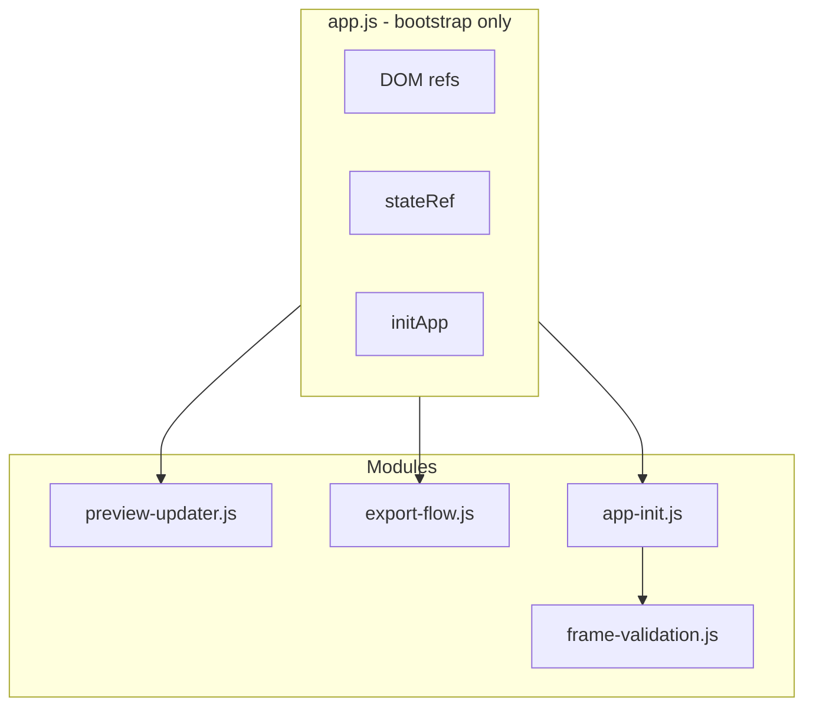

# app.js Modularization Plan (Revised)

## Status: Phases 1-5 Complete

Phases 1-5 have been implemented. Current state:

- **app.js**: ~373 lines (target: under 99)
- **Existing modules**: update-banner, template-storage, preview-renderer, photo-loader, grid-effects-settings (buildFormFromRefs), utils (debounce), frame-validation (setFrameInputInvalidState)

---

## Design and Coding Rules (from GRID_EFFECTS_SHARING_ANALYSIS.md)

- **Build-fast, fail-fast**: One logical change at a time. Full test suite after each change.
- **TDD first**: Failing tests first where feasible.
- **99-line rule**: Any file over 99 real-code lines MUST be split.
- **No hardcoding**: All magic values in config.js.
- **Bottom-up modules**: Small, cooperable units. One thing per module.
- **Non-breaking**: All tests must pass.
- **Reuse**: Extend existing modules before duplicating.

---

## Remaining Blocks in app.js (~373 lines)


| Block                                              | Lines (approx) | Responsibility             |
| -------------------------------------------------- | -------------- | -------------------------- |
| Imports, DOM refs, formRefs, buildForm             | 1-68           | Core wiring                |
| loadPhotos wrapper                                 | 70-84          | Delegates to photo-loader  |
| updatePreview                                      | 86-105         | Layout, renderGrid, resize |
| updateActionButtons, showUI                        | 107-115        | UI state                   |
| onExport                                           | 117-162        | Export + showExportOptions |
| clearAll                                           | 164-172        | Reset state                |
| File drop, i18n init                               | 174-188        | Basic events               |
| Form defaults (min/max/value)                      | 189-211        | Config to DOM              |
| validateFrameInput, onFrameInputDebounced          | 215-248        | Frame input validation     |
| Frame/gap listeners                                | 250-275        | Input listeners            |
| Undo/redo, applyRestoredState                      | 281-313        | State restore              |
| Settings listeners (wm, capture, vignette, filter) | 315-335        | Effect toggles             |
| Drag, context menu, keyboard nav                   | 336-354        | Grid interactions          |
| Offline banner, service worker                     | 355-372        | PWA                        |


---

## Implementation Phases (6-10)

### Phase 6: Extract frame input handling to frame-validation.js

**Extend:** [js/frame-validation.js](02product/01_coding/project/goja/js/frame-validation.js)

- Add `createFrameInputHandler(deps)` where `deps = { clampFrameValue, isFrameValueValid, setFrameInputInvalidState, showToast, t, debounce, FRAME_INPUT_DEBOUNCE_MS }`.
- Returns `{ validateFrameInput(el, options), onFrameInputDebounced(el), debouncedFrameInput }`.
- Move `frameToastShownThisSession` (Set) into the closure.
- app.js: Call `createFrameInputHandler(deps)` and use returned functions.

**Tests:** Extend [tests/unit/frame-validation.test.js](02product/01_coding/project/goja/tests/unit/frame-validation.test.js) for the factory and handlers.

**Est. reduction:** ~35 lines from app.js.

---

### Phase 7: Extract export-flow.js

**New file:** [js/export-flow.js](02product/01_coding/project/goja/js/export-flow.js)

- Export `runExport(refs, state, deps)` encapsulating the full onExport logic.
- `refs` = `{ frameW, frameH, exportFilename, exportUseDate, formatSelect, exportBtn }`
- `state` = `{ photos, currentLayout }` (getter/setter or mutable ref)
- `deps` = `{ clampFrameValue, showToast, t, buildForm, getGridEffectsOptions, handleExport, showExportOptions, downloadBlob, shareBlob, copyBlobToClipboard, formatDateTimeOriginal, getLocale }`
- Returns a promise; app.js calls `runExport(...)` on export click.
- Config: Add `EXPORT_URL_REVOKE_DELAY_MS = 60000` if not already in config (for the `setTimeout(..., 60000)` in onOpenInNewTab).

**Tests:** Unit test `runExport` with mocked handleExport, showExportOptions, etc.

**sw.js:** Add `./js/export-flow.js` to ASSETS.

**Est. reduction:** ~46 lines from app.js.

---

### Phase 8: Extract preview-updater.js

**New file:** [js/preview-updater.js](02product/01_coding/project/goja/js/preview-updater.js)

- Export `createPreviewUpdater(stateRef, refs, deps)`.
- `stateRef` = `{ photos, currentLayout, cleanupResize }` (mutable).
- `refs` = `{ previewGrid, preview, gapSlider, frameW, frameH, imageFit, templateSelect, dropZone, addBtn, clearBtn, exportBtn }`
- `deps` = `{ ensureTemplatesLoaded, populateTemplateSelect, getStoredTemplate, computeGridLayout, renderGrid, showUI, updateActionButtons, enableGridResize, ratiosToFrString, recomputePixelCells, pushState, buildForm, formatDateTimeOriginal, getLocale, t }`
- Returns `{ updatePreview, applyRestoredState, showUI, updateActionButtons }`.
- Encapsulates `updatePreview`, `applyRestoredState`, `showUI`, `updateActionButtons` (or `syncActionButtons` call).

**Tests:** Unit test `createPreviewUpdater` with mocked deps; verify updatePreview and applyRestoredState call the right deps.

**sw.js:** Add `./js/preview-updater.js` to ASSETS.

**Est. reduction:** ~55 lines from app.js.

---

### Phase 9: Extract app-init.js (event binding and form defaults)

**New file:** [js/app-init.js](02product/01_coding/project/goja/js/app-init.js)

- Export `initApp(refs, stateRef, handlers)`.
- Sets form defaults (gapSlider.min/max, wmOpacity, etc.) from config.
- Attaches all event listeners: file drop, lang change, frame inputs, template select, export, clear, undo/redo, watermark/capture/vignette/filter, settings panel, drag, context menu, keyboard nav.
- `handlers` = `{ loadPhotos, updatePreview, onExport, clearAll, applyRestoredState }` (or equivalents).

**Challenge:** Many listeners need `updatePreview`, `renderGrid`, etc. Those come from `createPreviewUpdater`. So `initApp` receives `handlers` object. app.js becomes:

```javascript
const updater = createPreviewUpdater(stateRef, refs, deps);
const handlers = {
  loadPhotos: (files) => loadPhotosFromFiles(files, { ... }),
  updatePreview: updater.updatePreview,
  onExport: () => runExport(refs, stateRef, exportDeps),
  clearAll,
  applyRestoredState: updater.applyRestoredState,
};
initApp(refs, stateRef, handlers);
```

**Tests:** Unit test `initApp` with mocked refs and handlers; verify addEventListener called for key elements. May be lightweight (smoke test).

**sw.js:** Add `./js/app-init.js` to ASSETS.

**Est. reduction:** ~80-100 lines from app.js.

---

### Phase 10: Trim app.js to under 99 lines

After Phases 6-9, app.js should be ~150-180 lines. Phase 10:

- Move `formRefs` and `buildForm` into [js/grid-effects-settings.js](02product/01_coding/project/goja/js/grid-effects-settings.js) as `createFormBuilder(refs)` returning `buildForm(includeFormat)`.
- Or extract a minimal `app-state.js` that holds `photos`, `currentLayout`, `cleanupResize` and DOM ref resolution.
- Consolidate remaining imports and leave app.js as a thin bootstrap: resolve refs, create state, create updater/export/init, call init.

**Target:** app.js under 99 real-code lines.

---

### Phase 11 (optional): Split preview-renderer.js

[js/preview-renderer.js](02product/01_coding/project/goja/js/preview-renderer.js) is ~124 lines (111 real-code), over 99.

- Extract `renderWatermarkOverlay(preview, layout, form, deps)` into same file or a small `preview-watermark.js`.
- Or extract cell rendering loop into `renderGridCells(container, photos, layout, form, deps)`.

---

## Revised Target Architecture




---

## Phase Completion Checklist (per phase)

- One logical change only
- TDD: tests first where feasible
- `npm run test` and `npm run test:e2e` pass
- No new magic numbers
- New modules in sw.js ASSETS
- 99-line rule satisfied for modified files

---

## Expected Result After Phases 6-10


| File                | Est. lines             |
| ------------------- | ---------------------- |
| app.js              | under 99               |
| preview-updater.js  | ~70                    |
| export-flow.js      | ~55                    |
| app-init.js         | ~95                    |
| frame-validation.js | +40                    |
| preview-renderer.js | 124 (Phase 11 to trim) |


