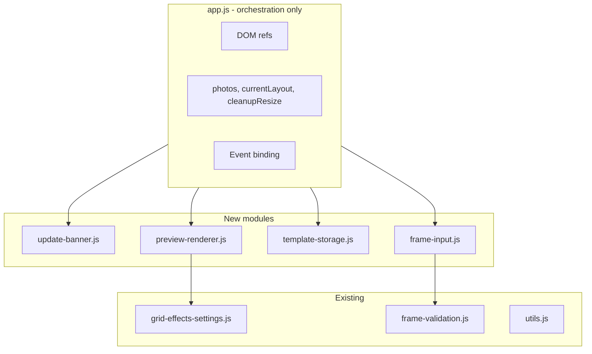

# app.js Modularization Plan

## Status

**Phases 1-5 complete.** app.js reduced from ~576 to ~373 lines. Extracted: update-banner, template-storage, preview-renderer, photo-loader; debounce in utils; setFrameInputInvalidState in frame-validation; buildFormFromRefs in grid-effects-settings.

**Phases 6-11** remain to bring app.js under the 99-line rule.

---

## Design and Coding Rules (from GRID_EFFECTS_SHARING_ANALYSIS.md)

These rules MUST be followed during implementation:

### Development Strategy

- **Build-fast, fail-fast**: Make exactly one logical change at a time. Run the full test suite after each change. If tests fail, fix before proceeding.
- **TDD first**: For any new behavior, write failing tests first. Implement only enough to make them pass.
- **99-line rule**: Any source file exceeding 99 real-code lines (excluding comments and blank lines) MUST be split into smaller modules.
- **No hardcoding**: All magic values MUST live in [js/config.js](02product/01_coding/project/goja/js/config.js). Import from config; never inline literals.
- **Bottom-up modules**: Build from small, cooperable units. Each module does one thing. Higher-level code composes these units.
- **Non-breaking changes**: New code MUST NOT break existing behavior. All existing tests MUST remain green.
- **Reuse code**: Check for existing similar behavior. Reuse or extend existing modules rather than duplicating.

### Coding Rules

- **Functional style**: Prefer pure functions, immutable data, higher-order functions. Isolate mutations.
- **Test location**: Unit tests in `tests/unit/`. E2E tests in `tests/e2e/`.
- **Module system**: ES modules only. Named exports.
- **Full test suite**: After every implementation phase, run `npm run test` and `npm run test:e2e`. All MUST pass.

### Verification (before each phase complete)

- All unit and E2E tests pass.
- No new magic numbers; constants from config.
- File length respects 99-line rule.
- Touch targets and mobile layout rules satisfied (unchanged by this refactor).

---

## Current State

[app.js](02product/01_coding/project/goja/js/app.js) is ~576 lines and violates the 99-line rule. Logical blocks:

| Block                          | Lines   | Responsibility                                                                 |
| ------------------------------ | ------- | ------------------------------------------------------------------------------ |
| Imports, DOM refs, state       | 1–75    | Core wiring                                                                    |
| loadPhotos                     | 77–103  | Photo loading with EXIF                                                        |
| Template storage / select      | 105–138 | localStorage + populateTemplateSelect                                          |
| updatePreview, showUI          | 140–169 | Layout computation, preview trigger                                            |
| renderGrid                     | 174–266 | ~93 lines – grid DOM construction                                              |
| onExport, clearAll             | 268–324 | Export flow                                                                    |
| Frame validation + debounce    | 365–412 | setFrameInputInvalidState, validateFrameInput, onFrameInputDebounced, debounce |
| Event binding                  | 326–461 | All listeners                                                                  |
| Offline banner                 | 416–424 | updateOfflineBanner                                                            |
| Service worker + update banner | 425–462 | showUpdateBanner, SW registration                                              |

---

## Target Architecture

---

## Implementation Phases

### Phase 1: Extract `update-banner.js` (lowest coupling)

**New file:** [js/update-banner.js](02product/01_coding/project/goja/js/update-banner.js)

- Move `showUpdateBanner(reg, onRefreshClick)` (~25 lines).
- Export `showUpdateBanner`.
- Move SW registration update logic (updatefound, statechange) into `initServiceWorkerUpdate(reg, onSkipWaiting)` or similar – keep registration in app.js, delegate "show banner on update" to the new module.
- app.js: import and call; remove local `showUpdateBanner`.

**Tests:** Unit test for `showUpdateBanner` (mock `document`, `reg.waiting`, verify banner created, buttons present).

**Config:** Consider `FRAME_DEBOUNCE_MS = 200` for Phase 2; no config changes in Phase 1.

**sw.js:** Add `./js/update-banner.js` to ASSETS.

---

### Phase 2: Add `debounce` to utils; extend `frame-validation.js`

**Reuse:** [js/utils.js](02product/01_coding/project/goja/js/utils.js) – add `export function debounce(fn, ms)` (pure, easily unit-tested).

**Config:** Add `FRAME_INPUT_DEBOUNCE_MS = 200` to [js/config.js](02product/01_coding/project/goja/js/config.js).

**Extend:** [js/frame-validation.js](02product/01_coding/project/goja/js/frame-validation.js)

- Add `setFrameInputInvalidState(el, invalid)` – pure DOM; no toast.
- Add `validateFrameInput(el, value, options)` – pure: returns `{ valid, value }`; app.js calls `showToast` when invalid.
- Add `onFrameInputDebounced(el, options)` – takes `{ clampFrameValue, isFrameValueValid, setFrameInputInvalidState, showToast }` as deps (or a `createFrameInputHandler(deps)` factory) so frame-validation stays testable without global `showToast`.

Alternative (simpler): Keep `validateFrameInput` and `onFrameInputDebounced` in app.js, but move only `setFrameInputInvalidState` and `debounce` out. That keeps toast coupling in app.js and minimizes change.

**Recommended:** Move `debounce` to utils, `setFrameInputInvalidState` to frame-validation. Keep `validateFrameInput` and `onFrameInputDebounced` in app.js (they depend on `showToast` and DOM). This is one small, safe extraction.

**Tests:** Unit test for `debounce` in `utils.test.js` (or new); extend `frame-validation.test.js` for `setFrameInputInvalidState`.

---

### Phase 3: Extract `template-storage.js`

**New file:** [js/template-storage.js](02product/01_coding/project/goja/js/template-storage.js)

- Move `getStoredTemplate(count)`, `setStoredTemplate(count, id)`.
- Move `populateTemplateSelect(templateSelect, templates, t, current)` – or `populateTemplateSelect(templateSelect, count, getTemplatesForCount, t)`.
- Config: Add `TEMPLATE_STORAGE_KEY = 'goja-template'` to config.js (no hardcoding).

**Tests:** Unit tests for `getStoredTemplate`, `setStoredTemplate` (mock localStorage), `populateTemplateSelect` (mock DOM).

**sw.js:** Add `./js/template-storage.js` to ASSETS.

---

### Phase 4: Extract `preview-renderer.js`

**New file:** [js/preview-renderer.js](02product/01_coding/project/goja/js/preview-renderer.js)

- Extract `renderGrid(container, photos, layout, form, deps)`.
- `deps` = `{ getWatermarkOptions, getCaptureDateOptions, getVignetteOptions, getFilterCss, formatDateTimeOriginal, getLocale, t, resolveWatermarkText, drawWatermark }`.
- Pure(ish) rendering: given container, photos, layout, form, and deps, populate DOM. No direct refs to app.js globals.
- app.js: build `form` via `buildForm()`, pass `photos`, `currentLayout`, and deps to `renderGrid`.

**Form building:** Move `buildForm` into [js/grid-effects-settings.js](02product/01_coding/project/goja/js/grid-effects-settings.js) as `buildFormFromRefs(refs, includeFormat)`. app.js creates `refs = { wmType, wmText, ... }` and calls `buildFormFromRefs(refs, includeFormat)`.

**Tests:** Unit test `renderGrid` with mocked container, photos, layout, form, deps – assert cell count, watermark overlay presence when enabled, etc. (may need JSDOM or similar for DOM).

**sw.js:** Add `./js/preview-renderer.js` to ASSETS.

---

### Phase 5: (Optional) Extract `photo-loader.js`

**New file:** [js/photo-loader.js](02product/01_coding/project/goja/js/photo-loader.js)

- Extract `loadPhotos(files, context)` where `context = { photos, maxPhotos, pushState, onProgress, onComplete }`. Or use callbacks: `onStateChange`, `onPreviewUpdate`.
- Higher coupling; only do if app.js still exceeds 99 lines after Phases 1–4.

---

## Detailed TODO List

### Phase 6: Frame input handling

- Add `createFrameInputHandler(deps)` to frame-validation.js (deps: clampFrameValue, isFrameValueValid, setFrameInputInvalidState, showToast, t, debounce, FRAME_INPUT_DEBOUNCE_MS)
- Return `{ validateFrameInput, onFrameInputDebounced, debouncedFrameInput }` from factory
- Move `frameToastShownThisSession` Set into closure
- app.js: replace local validate/onFrameInputDebounced with `createFrameInputHandler(deps)`
- Extend frame-validation.test.js for factory and handlers
- Run `npm run test` and `npm run test:e2e`

### Phase 7: Export flow

- Add `EXPORT_URL_REVOKE_DELAY_MS = 60000` to config.js
- Create js/export-flow.js with `runExport(refs, state, deps)`
- app.js: replace onExport body with `runExport(...)` call
- Add unit tests for runExport (mocked handleExport, showExportOptions)
- Add ./js/export-flow.js to sw.js ASSETS
- Run full test suite

### Phase 8: Preview updater

- Create js/preview-updater.js with `createPreviewUpdater(stateRef, refs, deps)`
- Return `{ updatePreview, applyRestoredState, showUI, updateActionButtons }`
- app.js: call createPreviewUpdater and use returned functions
- Add unit tests for createPreviewUpdater
- Add ./js/preview-updater.js to sw.js ASSETS
- Run full test suite

### Phase 9: App init

- Create js/app-init.js with `initApp(refs, stateRef, handlers)`
- Move form defaults (gapSlider, wmOpacity, captureDate, vignette min/max/value) into initApp
- Move all addEventListener calls into initApp
- app.js: call initApp with refs, stateRef, handlers
- Add unit test for initApp (smoke: addEventListener called)
- Add ./js/app-init.js to sw.js ASSETS
- Run full test suite

### Phase 10: Trim app.js

- Add `createFormBuilder(refs)` to grid-effects-settings.js or extract form building
- Consolidate app.js to thin bootstrap: refs, state, updater, export, init
- Verify app.js under 99 non-blank lines
- Run full test suite

### Phase 11 (optional): Split preview-renderer

- If preview-renderer.js still over 99 lines: extract `renderWatermarkOverlay` or `renderGridCells`
- Run full test suite

---

## Phase Completion Checklist (per phase)

- One logical change only
- TDD: tests written first where feasible
- `npm run test` passes
- `npm run test:e2e` passes
- No new magic numbers; config used
- New modules in sw.js ASSETS if needed
- 99-line rule satisfied for modified/new files

---

## Expected Result

After Phases 1–4:

| File                     | Est. lines                                                                                                          |
| ------------------------ | ------------------------------------------------------------------------------------------------------------------- |
| app.js                   | ~250–350 (orchestration, DOM refs, event wiring, loadPhotos, updatePreview, onExport, clearAll, applyRestoredState) |
| update-banner.js         | ~35                                                                                                                 |
| template-storage.js      | ~45                                                                                                                 |
| preview-renderer.js      | ~95                                                                                                                 |
| frame-validation.js      | +15                                                                                                                 |
| utils.js                 | +8                                                                                                                  |
| grid-effects-settings.js | +20 (buildFormFromRefs)                                                                                             |

If app.js still exceeds 99 lines after Phase 4, Phase 5 (photo-loader) or further extraction of `onExport`/export flow into a small module can be applied.

---

## Phases 6-10 (Remaining)

See **Detailed TODO List** above for actionable sub-tasks. Summary:

| Phase | Module                                         | Est. reduction |
| ----- | ---------------------------------------------- | -------------- |
| 6     | frame-validation.js: createFrameInputHandler   | ~35 lines      |
| 7     | export-flow.js: runExport                      | ~46 lines      |
| 8     | preview-updater.js: createPreviewUpdater       | ~55 lines      |
| 9     | app-init.js: initApp                           | ~80-100 lines  |
| 10    | Trim: createFormBuilder, consolidate bootstrap | to under 99    |

Phase 11 (optional): Split preview-renderer.js if still over 99 lines.

---

## File Additions to sw.js ASSETS

**Already added (Phases 1-5):**

- `./js/update-banner.js`
- `./js/template-storage.js`
- `./js/preview-renderer.js`
- `./js/photo-loader.js`

**To add (Phases 6-10):**

- `./js/export-flow.js`
- `./js/preview-updater.js`
- `./js/app-init.js`

(utils.js and frame-validation.js are loaded indirectly via app.js imports.)