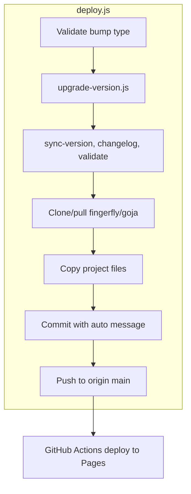

# Goja Deploy Utility Alignment with LangBuilderJS

## Current State

**goja** already has the same version utilities as LangBuilderJS:

- `scripts/upgrade-version.js`, `upgrade-version-lib.js`, `sync-version.js`, `validate-version.js`, `changelog-add-version-heading.js`
- `package.json` scripts: `sync-version`, `validate-version`, `changelog-add-version`, `upgrade-version`

**Key gap**: goja uses `publish.js` and `npm run publish`, while LangBuilderJS uses `deploy.js` and `npm run deploy`. The deploy flow differs:


| LangBuilderJS deploy.js    | goja publish.js                                      |
| -------------------------- | ---------------------------------------------------- |
| Takes bump type (required) | No arguments                                         |
| Runs upgrade-version first | Assumes version already bumped                       |
| Deploys to Firebase        | Clones repo, copies files, commits, pushes to GitHub |
| Non-interactive            | Prompts for commit message                           |


## Target Flow (matching LangBuilderJS naming and pattern)

```
npm run deploy -- patch
  └── deploy.js
        ├── Step 1: upgrade-version.js patch (bump, sync, changelog, validate)
        └── Step 2: push to GitHub (clone/copy, commit, push) → GitHub Actions deploys
```

## Implementation Plan

### 1. Rename and refactor publish.js to deploy.js

- **Rename**: [scripts/publish.js](02product/01_coding/project/goja/scripts/publish.js) → `scripts/deploy.js`
- **Add bump-type handling** (mirror [LangBuilderJS deploy.js](02product/01_coding/project/LangBuilderJS/scripts/deploy.js)):
  - Require first argument: `build`, `patch`, `minor`, or `major`
  - Validate and exit with usage message if missing/invalid
- **Step 1**: Call `execSync('node scripts/upgrade-version.js ' + bumpType)` before the push logic
- **Step 2**: Keep existing logic (clone fingerfly/goja, copy files, commit, push)
- **Commit message**: Auto-generate from bumped version (e.g. `Release v2.2.1 (2)`) for a non-interactive one-command flow, matching LangBuilderJS. Remove the interactive prompt. (Optional: add `--message "custom"` flag if manual override is needed later.)

### 2. Update package.json

- Change `"publish": "node scripts/publish.js"` to `"deploy": "node scripts/deploy.js"` in [package.json](02product/01_coding/project/goja/package.json)

### 3. Rename and update unit test

- **Rename**: [tests/unit/publish.test.js](02product/01_coding/project/goja/tests/unit/publish.test.js) → `tests/unit/deploy.test.js`
- **Update import**: `'../../scripts/publish.js'` → `'../../scripts/deploy.js'`
- **Update describe block**: `'publish git helpers'` → `'deploy git helpers'`
- Tests exercise `git` and `gitLive`; these remain exported from deploy.js

### 4. Documentation updates

- **[README.md](02product/01_coding/project/goja/README.md)**: Add a "Deploy" or "Release" subsection under Development documenting:
  - `npm run deploy -- <build|patch|minor|major>`
  - That it bumps version, syncs files, updates CHANGELOG, and pushes to GitHub (Pages deploys via Actions)
- **[CHANGELOG.md](02product/01_coding/project/goja/CHANGELOG.md)**: Under `[Unreleased]`, add entries for the rename: `publish.js` → `deploy.js`, `publish.test.js` → `deploy.test.js`, `npm run publish` → `npm run deploy`, and that deploy now accepts bump type and runs upgrade-version first.

### 5. Files to remove

- Delete `scripts/publish.js` after creating `scripts/deploy.js` (or keep as single rename operation).

---

## Script Names Summary (aligned with LangBuilderJS)


| Utility              | LangBuilderJS                      | goja (after)                         |
| -------------------- | ---------------------------------- | ------------------------------------ |
| Version bump entry   | `upgrade-version.js`               | `upgrade-version.js` ✓               |
| Version bump lib     | `upgrade-version-lib.js`           | `upgrade-version-lib.js` ✓           |
| Sync to files        | `sync-version.js`                  | `sync-version.js` ✓                  |
| Validate consistency | `validate-version.js`              | `validate-version.js` ✓              |
| Changelog heading    | `changelog-add-version-heading.js` | `changelog-add-version-heading.js` ✓ |
| Deploy to hosting    | `deploy.js`                        | `deploy.js` (rename from publish.js) |
| npm script           | `npm run deploy -- patch`          | `npm run deploy -- patch`            |


---

## Flow Diagram




---

## Verification

- Run `npm run deploy -- patch` (or build/minor/major) and confirm: version bumps, CHANGELOG updates, push succeeds
- Run `npm run test:unit` — deploy.test.js passes
- Run full test suite per user rules before considering changes complete

