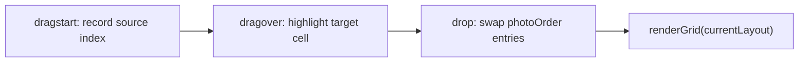

# Goja: Drag-and-Drop Rearrangement + Watermark

## Strategy: Build-Fast-and-Fail-Fast

**Principle**: For every change -- bug fix, refactoring, or new feature -- make the smallest possible change first, run the relevant test suite immediately, and fail visibly if something breaks. Do not batch changes. Do not accumulate broken state.

- **New features**: Build one function at a time. Write a failing test first (TDD). Implement to pass. Run the full suite. Move on.
- **Refactoring**: Extract one module at a time. Run tests after each extraction. If a test breaks, fix it before the next extraction. Never refactor two files simultaneously.
- **New tests**: Write tests for one untested module at a time. If writing the test reveals a bug, fix the bug immediately rather than deferring it.
- **One change, one test**: After each atomic change, run the relevant test suite. If it passes, proceed. If it fails, fix immediately.
- **Console.log before polish**: When investigating a bug, log intermediate values. Delete the logs after the fix is proven.
- **Fail visibly**: Prefer `console.warn` over silent swallowing. Catch blocks must at least log.

---

## Coding Rules

These rules govern ALL changes in this project:

- **TDD First**: Write failing tests before implementation. Every new function gets a unit test.
- **99-Line Rule**: No source file may exceed 99 real lines of code (excluding comments and blanks). If a module grows beyond this, split it.
- **Single Responsibility**: One module, one purpose. If a module has two responsibilities, split it.
- **Functional Programming**: Prefer pure functions, immutable data, composition over mutation. Isolate side effects at module boundaries.
- **No Hardcoding**: Use configuration objects or constants for all magic numbers, breakpoints, timeouts, colors.
- **Bottom-Up Modular**: Build small cooperating modules. Each module testable in isolation.
- **ES Module Pattern**: Each module exports named functions. No monolithic files.
- **Test Location**: All tests in `tests/` (unit in `tests/unit/`, E2E in `tests/e2e/`).
- **Clean Codebase**: No temporary files left behind.
- **Run All Tests**: After every phase, run full test suite to catch regressions.

---

## Responsive UI and CSS Rules

### Breakpoints

- `<= 480px` -- small phone (iPhone SE, older iPhones)
- `<= 768px` -- large phone / small tablet (iPhone Pro Max, iPad Mini)
- `<= 1024px` -- tablet (iPad, iPad Air)
- `> 1024px` -- desktop (Mac, PC)
- `max-height <= 600px` -- landscape phone mode

### Layout Behavior

- **Phone (<=768px)**: Single-column, controls stacked below preview, full-width photo grid, bottom-sheet style controls
- **Tablet (<=1024px)**: Preview takes 2/3 width, controls panel on the side
- **Desktop (>1024px)**: Spacious layout, drag-and-drop zone prominent, side-by-side controls and full preview

### Cross-Platform Rules

- Touch targets minimum 44x44px on all touch devices (iPhone, iPad).
- No horizontal overflow on any device.
- Use CSS custom properties in `variables.css` -- no hardcoded colors, spacing, or sizes.
- `!important` only as last resort; prefer specificity instead.
- Mobile-first: base styles target phone, `@media` queries scale up for tablet and desktop.
- All interactive controls must be thumb-reachable on phone screens.
- Test on Safari (iOS/macOS) and Chrome (desktop) -- these are the primary browsers for the target platforms.
- Use `-webkit-` prefixes where needed for Safari compatibility (e.g., `-webkit-touch-callout`, `-webkit-overflow-scrolling`).
- Respect `prefers-color-scheme` for light/dark mode support across all platforms.
- Use `viewport` meta tag with `viewport-fit=cover` for iPhone notch/Dynamic Island support.

---

## Feature A: Drag-and-Drop Photo Rearrangement

### How it works

After photos are loaded and the grid is rendered, the user can drag any photo and drop it onto another cell. The two photos swap positions. The grid template (spanning layout) stays unchanged -- only `layout.photoOrder` is mutated.

### Architecture

The swap only affects the `photoOrder` array. No layout recomputation. No template change.




### New file: `js/drag-handler.js`

Pure module with two exports:

- `swapOrder(photoOrder, sourceIdx, targetIdx)` -- returns a new array with the two indices swapped (pure function, unit-testable)
- `enableDragAndDrop(gridElement, onSwap)` -- attaches HTML5 drag events (`dragstart`, `dragover`, `dragleave`, `drop`) to the grid container using event delegation. On drop, calls `onSwap(sourceIdx, targetIdx)`.

Touch support (iPhone/iPad): use `touchstart` / `touchmove` / `touchend` as a fallback, since HTML5 Drag & Drop has poor mobile support.

### Changes to existing files

- [app.js](02product/01_coding/project/goja/js/app.js): after `renderGrid()`, call `enableDragAndDrop(previewGrid, onSwap)`. The `onSwap` callback swaps `currentLayout.photoOrder`, then calls `renderGrid(currentLayout)`.
- [style.css](02product/01_coding/project/goja/css/style.css): add `.drag-source` (opacity: 0.4) and `.drag-target` (outline highlight) classes for visual feedback.

### Test file: `tests/unit/drag-handler.test.js`

- `swapOrder([0,1,2], 0, 2)` returns `[2,1,0]`
- `swapOrder` with same index returns identical array
- `swapOrder` does not mutate input

---

## Feature B: Watermark

### How it works

The user configures a watermark via the controls panel. When exporting, the watermark is drawn on top of the final canvas. If no watermark text is entered, nothing is drawn. The watermark is only applied to the exported image, not the live preview (keeps the preview clean).

### Watermark Type dropdown options

- **None** -- no watermark (default)
- **Center** -- single centered watermark text (large, semi-transparent, slightly rotated)
- **Bottom-right** -- small text in the bottom-right corner (common for copyright)
- **Tiled** -- repeating diagonal pattern across the entire grid (strong protection)

### UI controls (added to controls panel in [index.html](02product/01_coding/project/goja/index.html))

```html
<div class="control-group">
  <label for="watermarkType">Watermark</label>
  <select id="watermarkType">
    <option value="none">None</option>
    <option value="center">Center</option>
    <option value="bottom-right">Bottom-right</option>
    <option value="tiled">Tiled</option>
  </select>
</div>
<div class="control-group" id="watermarkTextGroup">
  <label for="watermarkText">Text</label>
  <input type="text" id="watermarkText" placeholder="e.g. © Your Name" maxlength="50">
</div>
```

The text input is hidden when type is "None" and shown otherwise.

### New file: `js/watermark.js`

Pure Canvas rendering module:

- `drawWatermark(ctx, canvasWidth, canvasHeight, options)` -- draws the watermark based on `options.type` and `options.text`. Uses `ctx.globalAlpha`, `ctx.font`, `ctx.fillText`, `ctx.rotate` as needed.
  - `type: 'none'` -- no-op
  - `type: 'center'` -- large text centered, ~30% opacity, rotated -30deg
  - `type: 'bottom-right'` -- small text at bottom-right, ~50% opacity
  - `type: 'tiled'` -- text repeated diagonally every ~200px, ~15% opacity, rotated -30deg
- All font sizes scale proportionally to `canvasWidth` (so watermarks look correct on any export resolution).

### Changes to existing files

- [export-handler.js](02product/01_coding/project/goja/js/export-handler.js): after drawing all photos, call `drawWatermark(ctx, canvas.width, canvas.height, watermarkOptions)` if type is not "none". The `watermarkOptions` object is passed from `app.js` through `handleExport`.
- [app.js](02product/01_coding/project/goja/js/app.js): read `watermarkType` and `watermarkText` from the new controls, pass them in the export options.
- [style.css](02product/01_coding/project/goja/css/style.css): style the watermark text input (same pattern as existing `.control-group` inputs), hide `#watermarkTextGroup` when type is "none".

### Test file: `tests/unit/watermark.test.js`

- `drawWatermark` with type "none" makes zero draw calls
- `drawWatermark` with type "center" calls `fillText` once with the watermark text
- `drawWatermark` with type "bottom-right" calls `fillText` once positioned near bottom-right
- `drawWatermark` with type "tiled" calls `fillText` multiple times
- Font size scales with canvas width

---

## Implementation Order (TDD)

1. **Drag-and-drop** (simpler, no Canvas work):
  - Write tests for `swapOrder`
  - Implement `drag-handler.js`
  - Wire into `app.js` + add CSS
  - Run full suite
2. **Watermark** (Canvas rendering):
  - Write tests for `drawWatermark`
  - Implement `watermark.js`
  - Add UI controls to `index.html`
  - Wire into `export-handler.js` and `app.js`
  - Run full suite
3. **Full regression**: unit + E2E tests

