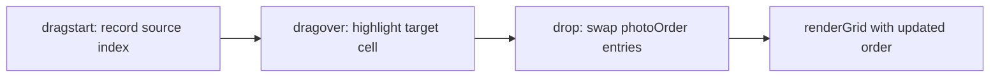

# Goja: Drag-and-Drop Rearrangement + Watermark

## Strategy: Build-Fast-and-Fail-Fast

**Principle**: For every change -- bug fix, refactoring, or new feature -- make the smallest possible change first, run the relevant test suite immediately, and fail visibly if something breaks. Do not batch changes. Do not accumulate broken state.

- **New features**: Build one function at a time. Write a failing test first (TDD). Implement to pass. Run the full suite. Move on.
- **Refactoring**: Extract one module at a time. Run tests after each extraction. If a test breaks, fix it before the next extraction. Never refactor two files simultaneously.
- **New tests**: Write tests for one untested module at a time. If writing the test reveals a bug, fix the bug immediately rather than deferring it.
- **One change, one test**: After each atomic change, run the relevant test suite. If it passes, proceed. If it fails, fix immediately.
- **Console.log before polish**: When investigating a bug, log intermediate values. Delete the logs after the fix is proven.
- **Fail visibly**: Prefer `console.warn` over silent swallowing. Catch blocks must at least log.

---

## Coding Rules

These rules govern ALL changes in this project:

- **TDD First**: Write failing tests before implementation. Every new function gets a unit test.
- **99-Line Rule**: No source file may exceed 99 real lines of code (excluding comments and blanks). If a module grows beyond this, split it.
- **Single Responsibility**: One module, one purpose. If a module has two responsibilities, split it.
- **Functional Programming**: Prefer pure functions, immutable data, composition over mutation. Isolate side effects at module boundaries.
- **No Hardcoding**: Use configuration objects or constants for all magic numbers, breakpoints, timeouts, colors.
- **Bottom-Up Modular**: Build small cooperating modules. Each module testable in isolation.
- **ES Module Pattern**: Each module exports named functions. No monolithic files.
- **Test Location**: All tests in `tests/` (unit in `tests/unit/`, E2E in `tests/e2e/`).
- **Clean Codebase**: No temporary files left behind.
- **Run All Tests**: After every phase, run full test suite to catch regressions.

---

## Responsive UI and CSS Rules

### Breakpoints

- `<= 480px` -- small phone (iPhone SE, older iPhones)
- `<= 768px` -- large phone / small tablet (iPhone Pro Max, iPad Mini)
- `<= 1024px` -- tablet (iPad, iPad Air)
- `> 1024px` -- desktop (Mac, PC)
- `max-height <= 600px` -- landscape phone mode

### Layout Behavior

- **Phone (<=768px)**: Single-column, controls stacked below preview, full-width photo grid, bottom-sheet style controls
- **Tablet (<=1024px)**: Preview takes 2/3 width, controls panel on the side
- **Desktop (>1024px)**: Spacious layout, drag-and-drop zone prominent, side-by-side controls and full preview

### Cross-Platform Rules

- Touch targets minimum 44x44px on all touch devices (iPhone, iPad).
- No horizontal overflow on any device.
- Use CSS custom properties in `variables.css` -- no hardcoded colors, spacing, or sizes.
- `!important` only as last resort; prefer specificity instead.
- Mobile-first: base styles target phone, `@media` queries scale up for tablet and desktop.
- All interactive controls must be thumb-reachable on phone screens.
- Test on Safari (iOS/macOS) and Chrome (desktop) -- these are the primary browsers for the target platforms.
- Use `-webkit-` prefixes where needed for Safari compatibility (e.g., `-webkit-touch-callout`, `-webkit-overflow-scrolling`).
- Respect `prefers-color-scheme` for light/dark mode support across all platforms.
- Use `viewport` meta tag with `viewport-fit=cover` for iPhone notch/Dynamic Island support.

---

## Feature 1: Drag-and-Drop Photo Rearrangement

### How it works

After the grid renders, the user can drag any photo and drop it onto another cell. The two photos swap positions. The grid template (spanning layout) stays the same -- only which photo sits in which slot changes.

### Architecture

The current [app.js](02product/01_coding/project/goja/js/app.js) already uses `layout.photoOrder` to map photos to slots. Swapping is just swapping two indices in that array and calling `renderGrid()` again.




### New file: `js/drag-handler.js`

Pure module handling drag-and-drop logic:

- `enableDrag(previewGrid, layout, onSwap)` -- attaches drag/drop listeners to grid images
- `swapOrder(photoOrder, indexA, indexB)` -- pure function, returns new array with two entries swapped
- Touch support via `touchstart`/`touchmove`/`touchend` for iPhone/iPad (the HTML Drag & Drop API has poor mobile support)

### Changes to existing files

- [app.js](02product/01_coding/project/goja/js/app.js) `renderGrid()`: set `draggable="true"` on images, call `enableDrag()` after rendering, pass a callback that updates `currentLayout.photoOrder` and re-renders
- [css/style.css](02product/01_coding/project/goja/css/style.css): add `.dragging` (opacity reduction) and `.drag-target` (highlight border) classes for visual feedback

---

## Feature 2: Watermark

### How it works

The user can optionally define a watermark that is stamped onto the exported grid image. The watermark is rendered on the Canvas during export, **after** all photos are drawn. The preview grid shows a CSS overlay of the watermark text for a live preview.

### Watermark type dropdown options

- **None** -- no watermark (default)
- **Text** -- user types custom text (e.g., name, brand, copyright)
- **Timestamp** -- auto-generated date/time string (e.g., "2026-02-20")
- **Copyright** -- auto-prefixed with copyright symbol (user provides name, rendered as "(C) Name")

### Watermark configuration

- **Type**: dropdown (None / Text / Timestamp / Copyright)
- **Content**: text input (disabled when type is None or Timestamp)
- **Position**: dropdown (Bottom-right / Bottom-left / Top-right / Top-left / Center)
- **Opacity**: range slider (10%-100%, default 50%)

### Data structure

```javascript
{
  type: 'text' | 'timestamp' | 'copyright' | 'none',
  content: 'My Brand',
  position: 'bottom-right',
  opacity: 0.5,
}
```

### New file: `js/watermark.js`

Pure module for watermark rendering:

- `buildWatermarkText(config)` -- returns the final string (handles copyright prefix, timestamp formatting, raw text)
- `drawWatermark(ctx, canvasWidth, canvasHeight, config)` -- draws the watermark text on a Canvas context at the specified position with the specified opacity
- `computeWatermarkPosition(canvasWidth, canvasHeight, textMetrics, position, padding)` -- computes x/y for the chosen corner/center

### Changes to existing files

- [index.html](02product/01_coding/project/goja/index.html): add watermark controls inside `#controls` (type dropdown, content input, position dropdown, opacity slider)
- [app.js](02product/01_coding/project/goja/js/app.js): read watermark settings, pass to export, show CSS text overlay on preview
- [export-handler.js](02product/01_coding/project/goja/js/export-handler.js): after drawing all photos, call `drawWatermark()` on the canvas context
- [css/style.css](02product/01_coding/project/goja/css/style.css): style for watermark preview overlay (positioned text on top of the grid)

---

## Files Changed Summary

- **New**: `js/drag-handler.js` -- drag-and-drop + touch swap logic
- **New**: `js/watermark.js` -- watermark text building and Canvas rendering
- **New**: `tests/unit/drag-handler.test.js` -- tests for swap logic
- **New**: `tests/unit/watermark.test.js` -- tests for text building, position computation, draw calls
- **Modified**: `index.html` -- watermark UI controls
- **Modified**: `app.js` -- integrate drag-handler, read watermark config, preview overlay
- **Modified**: `export-handler.js` -- call drawWatermark after photos
- **Modified**: `css/style.css` -- drag feedback classes, watermark overlay styles

## Implementation Order (TDD)

1. **drag-handler**: Write tests for `swapOrder`, implement `drag-handler.js`, integrate into `app.js`
2. **watermark-logic**: Write tests for `buildWatermarkText` and `computeWatermarkPosition`, implement `watermark.js`
3. **watermark-ui**: Add HTML controls, wire up `app.js` to read config and show preview overlay
4. **watermark-export**: Update `export-handler.js` to call `drawWatermark` on canvas
5. **css**: Add drag feedback and watermark overlay styles
6. **regression**: Run full test suite (unit + E2E), fix any regressions

