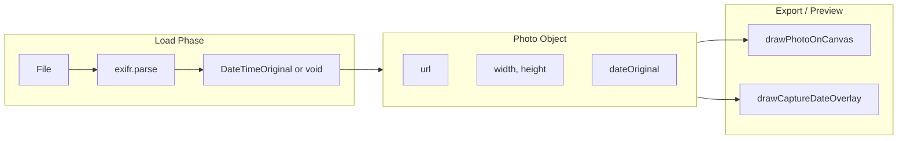

# Goja EXIF Capture Date-Time Overlay

## 1. Rules (Mandatory)

These rules MUST be followed during implementation. Violation means the implementation is incomplete. Source: [goja_settings_polish_381858f4.plan.md](), [goja_export_options_enhancement_53bc6353.plan.md](), [goja_improvement_proposals_9895157a.plan.md]().

### 1.1 Development Strategy (Rules)


| Rule                      | Requirement                                                                                                                                                                                   |
| ------------------------- | --------------------------------------------------------------------------------------------------------------------------------------------------------------------------------------------- |
| **Build-fast, fail-fast** | Make exactly one logical change at a time. Run the full test suite after each change. If tests fail, fix before proceeding. Do not batch unrelated changes.                                   |
| **TDD first**             | For any new behavior, write failing tests first. Implement only enough to make them pass. Do not skip this step where tests are feasible.                                                     |
| **99-line rule**          | Any source file exceeding 99 real-code lines (excluding comments and blank lines) MUST be split into smaller modules. Do this proactively before adding more logic.                           |
| **No hardcoding**         | All magic values (numeric constants, config strings) MUST live in [js/config.js](02product/01_coding/project/goja/js/config.js). Import from config; never inline literals for configuration. |
| **Bottom-up modules**     | Build from small, cooperable units. Each module does one thing. Higher-level code composes these units. No monolithic blocks.                                                                 |
| **Non-breaking changes**  | New code MUST NOT break existing behavior. All existing tests MUST remain green. Breaking changes require explicit user approval first.                                                       |
| **Reuse code**            | Before adding new logic, check for existing similar behavior. Reuse or extend existing modules rather than duplicating.                                                                       |


### 1.2 Coding Rules


| Rule                 | Requirement                                                                                                                               |
| -------------------- | ----------------------------------------------------------------------------------------------------------------------------------------- |
| **Functional style** | Prefer pure functions, immutable data, higher-order functions. Avoid side effects in pure logic; isolate mutations.                       |
| **Test location**    | Unit tests in `tests/unit/`. E2E tests in `tests/e2e/`. No tests elsewhere.                                                               |
| **Module system**    | Use ES modules only. Use named exports. No default exports except for locales or legacy compatibility.                                    |
| **Full test suite**  | After every implementation phase, run the full test suite (`npm run test` and `npm run test:e2e`). All tests MUST pass before proceeding. |


### 1.3 Responsive / Mobile UI Rules


| Rule                 | Requirement                                                                                                                                                                                            |
| -------------------- | ------------------------------------------------------------------------------------------------------------------------------------------------------------------------------------------------------ |
| **Touch targets**    | Interactive elements (buttons, checkboxes, labels, etc.) MUST have minimum 44×44px touch target. Use `min-height: var(--touch-min)` or equivalent.                                                     |
| **Mobile-first**     | Base styles for phone; use `@media (min-width: 768px)` (or `var(--bp-md)`) for tablet/desktop enhancements.                                                                                            |
| **Settings pattern** | Settings panel: bottom sheet (60vh) on mobile; side panel (320px) on tablet/desktop. Use `--settings-sheet-height` and `--settings-panel-width`.                                                       |
| **CSS variables**    | All layout, spacing, colors, and breakpoints MUST use CSS custom properties from [css/variables.css](02product/01_coding/project/goja/css/variables.css). Do not introduce new magic values in styles. |


### 1.4 Verification

Before considering a phase complete:

- All unit and E2E tests pass.
- No new magic numbers introduced; constants used from config.
- File length respects the 99-line rule where applicable.
- Touch targets and mobile layout rules are satisfied.

---

## 2. Data Flow




---

## 3. Architecture

### 3.0 Feature: Date-Time (Not Date-Only)

**We extract and display full date-time via exifr, not date-only.** The EXIF tag `DateTimeOriginal` contains both date and time (e.g. `2025:02:22 14:30:00`). The overlay shows the full capture datetime in locale format (e.g. "Feb 22, 2025, 2:30 PM"), consistent with the watermark "Date/time" option which uses `toLocaleString`. No date-only truncation.

### 3.1 New Module: `js/exif.js`

- `**readDateTimeOriginal(file)`** → `Promise<Date | null>`
  - Uses `exifr.parse(file, ['DateTimeOriginal'])` (parse only this tag for speed).
  - Returns raw `Date` or `null` if no EXIF / no DateTimeOriginal.
  - Pure, testable (mock exifr in unit tests).
  - Store raw `Date` in photo so locale changes can re-format without re-parsing.
- `**formatDateTimeOriginal(value, locale)`** → `string`
  - Converts `Date` or ISO string to locale-formatted **date and time** string (not date-only).
  - Use `Date.prototype.toLocaleString(locale, options)` with `dateStyle` and `timeStyle` (or equivalent) for full datetime, consistent with watermark `datetime` type which uses `toLocaleString`.
  - Display example: "Feb 22, 2025, 2:30 PM" (locale-dependent).
- Config constant: `EXIF_TAG_SET = ['DateTimeOriginal']` in [js/config.js](02product/01_coding/project/goja/js/config.js).

### 3.2 New Module: `js/capture-date-overlay.js`

- `**drawCaptureDateOverlay(ctx, cell, text, options)`**
  - Draws text in a fixed corner of the cell with semi-transparent background or text shadow for readability.
  - Options: `position`, `opacity`, `fontScale`, `backgroundColor`, `locale`.
  - Reuse corner-drawing logic from [js/watermark.js](02product/01_coding/project/goja/js/watermark.js) (`drawBottomLeft`, `drawCorner`, etc.) — extract shared `drawCornerText(ctx, w, h, text, opts)` or import and adapt.
  - Cell dimensions: `cell.x`, `cell.y`, `cell.width`, `cell.height` (from [js/layout-engine.js](02product/01_coding/project/goja/js/layout-engine.js) `computePixelCells`).
- **Constants:** `CAPTURE_DATE_POSITION_DEFAULT`, `CAPTURE_DATE_OPACITY`_*, `CAPTURE_DATE_FONT_RATIO` in config.
- If `text` is empty or void, do nothing.

### 3.3 Settings UI

Add to **Export** section in [index.html](02product/01_coding/project/goja/index.html) (after "Add date to filename"):

- Checkbox: "Show capture date & time on photos" — `#showCaptureDate` (unchecked by default)
- Conditional group `#captureDateOptionsGroup` (hidden by default, shown when checked):
  - Select: Position — `#captureDatePos` (bottom-left, bottom-right, top-left, top-right)
  - Range: Opacity — `#captureDateOpacity`
  - Select: Font size — `#captureDateFontSize` (values 0.8, 1, 1.2 like watermark)

Use existing patterns: `.hidden` class, `classList.toggle`, control-group touch targets.

**Event handling:** Add `showCaptureDate.addEventListener('change', ...)` to toggle `#captureDateOptionsGroup` visibility (same pattern as `wmType` for watermark groups). Wire `showCaptureDate` and capture-date controls to `updatePreview` so the grid updates when settings change.

**Init from config:** On load, set `captureDatePos.value`, `captureDateOpacity.min/max/value`, `captureDateFontSize` options from config constants (same pattern as `gapSlider`, `watermarkOpacity`).

### 3.4 Photo Object Extension

In [js/app.js](02product/01_coding/project/goja/js/app.js) `loadPhotos`:

- Run `readDateTimeOriginal(accepted[i])` in parallel with `readImageDimensions` (e.g. `Promise.all`).
- Parse EXIF during load; if no DateTimeOriginal or parse error, set `dateOriginal: null`.
- Photo object: `{ file, url, width, height, dateOriginal }` where `dateOriginal` is `Date | null`.
- Do **not** block loading on EXIF parse failure; treat missing/invalid EXIF as void.
- Format at point of use: `formatDateTimeOriginal(photo.dateOriginal, getLocale())` when drawing.

### 3.5 Export Integration

- [js/app.js](02product/01_coding/project/goja/js/app.js) `onExport`: Build `dateOriginals = photos.map(p => (p.dateOriginal ? formatDateTimeOriginal(p.dateOriginal, getLocale()) : null))` and pass with `showCaptureDate`, `captureDatePos`, `captureDateOpacity`, `captureDateFontScale`, `locale` in options to `handleExport`.
- [js/export-handler.js](02product/01_coding/project/goja/js/export-handler.js): Pass options through to main thread and worker; insert `drawCaptureDateOverlay` loop between `drawPhotoOnCanvas` and `drawWatermark`.
- [js/export-worker.js](02product/01_coding/project/goja/js/export-worker.js): Receive `dateOriginals`, `photoOrder` in options; for each cell `i`, if `showCaptureDate` and `dateOriginals[photoOrder[i]]` is non-null, call `drawCaptureDateOverlay(ctx, layout.cells[i], dateOriginals[photoOrder[i]], options)`.
- Draw order: `drawPhotoOnCanvas` → `drawCaptureDateOverlay` (per cell) → `drawWatermark` (global).

### 3.6 Preview Integration (Setting-Controlled, Optional)

**Decision:** The preview overlay is controlled by the same Settings option (`#showCaptureDate`) as the export overlay. When the user enables "Show capture date on photos" in Settings, the preview grid shows dates; when disabled, it does not. This gives users a live preview before export.

#### Scope

- **Where:** DOM preview in [js/app.js](02product/01_coding/project/goja/js/app.js) `renderGrid`.
- **When:** Only when `#showCaptureDate` checkbox is checked.
- **What:** Per-photo capture date overlay in each grid cell, aligned with the configured position (bottom-left, bottom-right, etc.).

#### Implementation Details

1. **Cell structure**
  - For each cell, create a wrapper `div` (e.g. `div.preview-cell`) with `position: relative` and grid positioning (`gridRow`, `gridColumn`). The wrapper is the grid child; assign layout styles to it.
  - The `img` lives inside the wrapper and keeps its current behavior (no grid styles on img).
  - Add a `span.capture-date-overlay` when `showCaptureDate.checked` and `photos[order[i]].dateOriginal` is non-null. Position it with `position: absolute` and placement modifier classes (e.g. `capture-date-overlay--bottom-left`) derived from `#captureDatePos`.
  - **Compatibility:** [drag-handler.js](02product/01_coding/project/goja/js/drag-handler.js) and [cell-context-menu.js](02product/01_coding/project/goja/js/cell-context-menu.js) use `querySelectorAll('img')` and `closest('img')`; they still work with nested imgs. Verify drag-and-drop, context menu, and keyboard nav after the wrapper change.
2. **Styling**
  - Use CSS variables for font size, opacity, padding. Mirror the export overlay style (semi-transparent background or text shadow) for readability.
  - Add styles in [css/style.css](02product/01_coding/project/goja/css/style.css) for `.capture-date-overlay`, `.capture-date-overlay--bottom-left`, etc.
  - Font size should scale with cell size or use a fixed readable size (e.g. `--font-size-sm` or config-driven).
3. **Data flow**
  - `renderGrid` reads `showCaptureDate?.checked`, `captureDatePos?.value`, `captureDateOpacity?.value`, `captureDateFontSize?.value`.
  - For each cell index `i`, photo index `pidx = order[i]`. If `photos[pidx].dateOriginal` is a `Date`, format with `formatDateTimeOriginal(photos[pidx].dateOriginal, getLocale())` and render the span.
  - If `dateOriginal` is null, render no span (cell shows only the image).
4. **Reactivity**
  - When the user toggles `#showCaptureDate` or changes position/opacity/font size, call `updatePreview()` so `renderGrid` re-runs with the new values. Wire `showCaptureDate` (and optionally the capture-date controls) to `updatePreview` in [js/app.js](02product/01_coding/project/goja/js/app.js).
5. **Accessibility**
  - The overlay is decorative. Use `aria-hidden="true"` on the span so screen readers focus on the image, not the date.
  - Alternatively, include the date in the image `alt` when overlay is shown (e.g. `alt="Photo 1, taken Feb 22, 2025"`). Prefer `aria-hidden` if the date is redundant with the image semantics.

#### Files to Modify

- [js/app.js](02product/01_coding/project/goja/js/app.js): Update `renderGrid` to optionally create wrapper + overlay span; add event listeners for `#showCaptureDate` and capture-date controls to trigger `updatePreview`.
- [css/style.css](02product/01_coding/project/goja/css/style.css): Add `.capture-date-overlay` and placement variants; use `--touch-min`, `--font-size-`*, opacity from config.

#### Tests

- E2E: With photos that have EXIF, enable "Show capture date on photos" in Settings; verify date text appears in the preview grid. Disable; verify overlay disappears.
- E2E: With photos without EXIF, enable the setting; verify no overlay (or no crash).
- **Fixture note:** [generate-fixtures.js](02product/01_coding/project/goja/scripts/generate-fixtures.js) produces JPEGs without EXIF. For E2E testing with EXIF, either: (a) add a committed fixture (e.g. `tests/fixtures/with-exif.jpg`) with embedded DateTimeOriginal, or (b) extend the generate script to inject EXIF, or (c) document manual verification for the EXIF path and run E2E only for the no-EXIF / toggle behavior.

---

## 4. Config Constants ([js/config.js](02product/01_coding/project/goja/js/config.js))

```javascript
// EXIF
export const EXIF_TAG_SET = ['DateTimeOriginal'];

// Capture date overlay
export const CAPTURE_DATE_POSITION_DEFAULT = 'bottom-left';
export const CAPTURE_DATE_OPACITY_MIN = 0.3;
export const CAPTURE_DATE_OPACITY_MAX = 0.9;
export const CAPTURE_DATE_OPACITY_DEFAULT = 0.7;
export const CAPTURE_DATE_FONT_RATIO = 0.025;  // relative to cell width (canvas)
export const CAPTURE_DATE_FONT_SCALE_DEFAULT = 1;  // matches watermark "Medium"
```

---

## 5. i18n Keys

Add to all 11 locale files ([js/locales/*.js](02product/01_coding/project/goja/js/locales/)):

- `showCaptureDate`: "Show capture date & time on photos"
- `captureDatePos`: "Position" (can reuse `watermarkPos` labels or add `captureDatePos`* if different)
- `captureDateOpacity`: "Opacity"
- `captureDateFontSize`: "Font size"

Reuse position options from watermark: `posBottomLeft`, `posBottomRight`, etc.

---

## 6. exifr Integration

- **Option A (recommended):** Add `exifr` as devDependency. Create `scripts/copy-exifr.js` to copy `node_modules/exifr/dist/full.esm.mjs` → `js/vendor/exifr.mjs`. Add `"copy:vendor": "node scripts/copy-exifr.js"` and `"postinstall": "npm run copy:vendor"` to [package.json](02product/01_coding/project/goja/package.json) so the vendor file is created after `npm install`. Commit `js/vendor/exifr.mjs` to the repo; add to [sw.js](02product/01_coding/project/goja/sw.js) ASSETS. Deploy copies the committed vendor file (no node_modules in production). No CSP change; fully offline.
- **Option B:** Import from ESM CDN (`https://cdn.jsdelivr.net/npm/exifr@7/+esm`); update CSP `script-src` to allow `cdn.jsdelivr.net`. Simpler but external dependency.

---

## 7. Implementation Order (TDD)


| Phase | Task                                                 | Tests                                                   |
| ----- | ---------------------------------------------------- | ------------------------------------------------------- |
| 1     | Add exifr (vendor or CDN); config constants          | `config.test.js` (add tests for EXIF_*, CAPTURE_DATE_*) |
| 2     | `exif.js`: `readDateTimeOriginal` (Date              | null), `formatDateTimeOriginal`                         |
| 3     | `capture-date-overlay.js`: `drawCaptureDateOverlay`  | `capture-date-overlay.test.js`                          |
| 4     | Wire EXIF read in `loadPhotos`; extend photo object  | Manual / E2E                                            |
| 5     | Settings UI (checkbox, position, opacity, font size) | E2E: settings visibility                                |
| 6     | Export: `drawCaptureDateOverlay` in main + worker    | `export-handler.test.js`                                |
| 7     | i18n all locales                                     | `i18n.test.js`                                          |
| 8     | Preview overlay (setting-controlled)                 | E2E                                                     |


---

## 8. Files to Create

- [js/exif.js](02product/01_coding/project/goja/js/exif.js) — EXIF parsing
- [js/capture-date-overlay.js](02product/01_coding/project/goja/js/capture-date-overlay.js) — Per-cell date drawing
- [js/vendor/exifr.mjs](02product/01_coding/project/goja/js/vendor/exifr.mjs) — Vendored exifr (if Option A)
- [scripts/copy-exifr.js](02product/01_coding/project/goja/scripts/copy-exifr.js) — Copies exifr dist to vendor (Option A)
- [tests/unit/exif.test.js](02product/01_coding/project/goja/tests/unit/exif.test.js)
- [tests/unit/capture-date-overlay.test.js](02product/01_coding/project/goja/tests/unit/capture-date-overlay.test.js)

---

## 9. Files to Modify

- [js/config.js](02product/01_coding/project/goja/js/config.js) — EXIF and overlay constants
- [js/app.js](02product/01_coding/project/goja/js/app.js) — loadPhotos, settings binding, options to export
- [js/export-handler.js](02product/01_coding/project/goja/js/export-handler.js) — options, drawCaptureDateOverlay
- [js/export-worker.js](02product/01_coding/project/goja/js/export-worker.js) — options, drawCaptureDateOverlay
- [index.html](02product/01_coding/project/goja/index.html) — Settings UI, optional import map
- [css/style.css](02product/01_coding/project/goja/css/style.css) — `.capture-date-overlay` styles
- [sw.js](02product/01_coding/project/goja/sw.js) — ASSETS for new files
- [package.json](02product/01_coding/project/goja/package.json) — exifr dep, copy script
- All [js/locales/*.js](02product/01_coding/project/goja/js/locales/) — i18n keys

---

## 10. Fallback for Missing EXIF

- `readDateTimeOriginal` returns `null` on parse error or missing tag.
- `dateOriginal: null` → `drawCaptureDateOverlay` does nothing for that cell; preview shows no overlay span.
- No fallback to file modification date; user sees no overlay when EXIF is void.

---

## 11. State / Undo

- Photos in state include `dateOriginal` (a `Date` object or `null`). [js/state.js](02product/01_coding/project/goja/js/state.js) uses `snapshot(photos, layout)` which shallow-copies each photo with `{ ...p }`; state is in-memory only (no localStorage). The `Date` is preserved by reference in the copy. Undo/redo will restore photos with their `dateOriginal` intact. No special handling required.

---

## 12. GATE Checkpoint

- All unit and E2E tests pass.
- Photos with EXIF show capture date when enabled; photos without EXIF show no overlay.
- Settings: checkbox, position, opacity, font size; touch targets compliant.
- No magic numbers; config constants used.
- Locale-aware date-time format (date and time, not date-only).
- 99-line rule and module structure respected.

