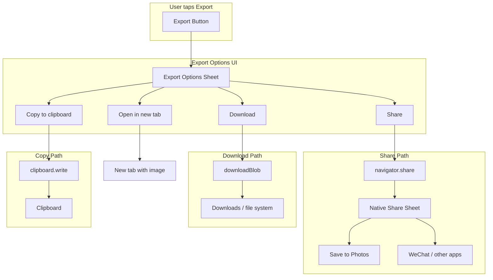

# Goja Export Options Enhancement

## 1. Guiding Principles (from Improvement Proposals)

Apply these throughout implementation.

### 1.1 Development Strategy

- **Build-fast, fail-fast:** One change at a time; run tests after each.
- **TDD first:** Write failing tests before implementation where possible.
- **99-line rule:** Split a source file exceeding 99 real-code lines into smaller files for modularity.
- **No hardcoding:** ALWAYS Use config/constants for all magic values.
- **Bottom-up modules:** Small cooperating units, testable in isolation.
- **Non-breaking changes:** New code must not break existing behavior without explicit approval.
- Reuse code: always consider reusing code at the beginning time or in the design phase

### 1.2 Coding Rules

- Prefer the functional programming paradigm: pure functions, immutable data, higher-order functions.
- Tests in `tests/` (unit: `tests/unit/`, E2E: `tests/e2e/`).
- ES modules, named exports.
- Run full test suite after every phase.

### 1.3 Responsive / Mobile UI

- Touch targets ≥ 44×44px (`--touch-min`).
- Mobile-first: base styles for phone, `@media` for tablet/desktop.
- Use bottom sheet (60vh) on phone for modal-like UI; side panel pattern for settings.
- Use CSS custom properties from [css/variables.css](02product/01_coding/project/goja/css/variables.css).

---

## 2. Current State

- **Export flow:** [js/app.js](02product/01_coding/project/goja/js/app.js) `onExport()` → [js/export-handler.js](02product/01_coding/project/goja/js/export-handler.js) `handleExport()` + `downloadBlob()` → direct download.
- **No options UI:** Export button triggers immediate download.
- **Mobile gap:** On iOS/Android, `downloadBlob` saves to Downloads; users cannot easily save to Photos or share to WeChat.

---

## 3. Export Options (Expanded)

When the Export button is pressed, present these options (visibility depends on API support):


| Option                | API                                       | Mobile                             | Desktop            | Primary use                              |
| --------------------- | ----------------------------------------- | ---------------------------------- | ------------------ | ---------------------------------------- |
| **Share**             | Web Share API                             | Yes (Save to Photos, WeChat, etc.) | Yes (if supported) | Save to Photos, share to apps            |
| **Download**          | `downloadBlob` (anchor)                   | Yes                                | Yes                | Save to file system                      |
| **Copy to clipboard** | Clipboard API `navigator.clipboard.write` | Yes                                | Yes                | Paste into WeChat chat, Notes, documents |
| **Open in new tab**   | `window.open` with blob URL               | Yes                                | Yes                | Preview and manual save/share            |


### 3.1 Share (Web Share API)

The [Web Share API](https://developer.mozilla.org/en-US/docs/Web/API/Web_Share_API) with `files` opens the native share sheet on mobile:

- **iOS Safari:** Share sheet includes "Save Image", "Add to Photos", WeChat, WhatsApp, etc.
- **Android Chrome:** Share sheet includes "Save to device", WeChat, and other apps.
- **Desktop:** Supported in Chrome/Edge; fewer targets.

```javascript
const file = new File([blob], filename, { type: blob.type });
if (navigator.canShare?.({ files: [file] })) {
  await navigator.share({ files: [file], title: 'Goja grid' });
}
```

**Requirements:** HTTPS, user-triggered (click). Must be invoked from a user gesture.

**Visibility:** Shown only when `navigator.canShare({ files: [...] })` returns true.

### 3.2 Copy to Clipboard

The [Clipboard API](https://developer.mozilla.org/en-US/docs/Web/API/Clipboard) allows copying the image for paste into chat (WeChat), Notes, documents:

```javascript
await navigator.clipboard.write([new ClipboardItem({ [blob.type]: blob })]);
```

**Requirements:** Secure context (HTTPS). Use `ClipboardItem.supports(blob.type)` for feature detection.

**Visibility:** Shown when `navigator.clipboard?.write` and `ClipboardItem` exist. Supported in Chrome, Edge, Safari 13.1+.

### 3.3 Open in New Tab

Open the image in a new tab; user can long-press/right-click to save or share. Useful as fallback when share is unavailable.

**Visibility:** Always shown.

### 3.4 Export Options Flow




---

## 4. Implementation Plan

### 4.1 New Module: `js/export-options.js`

Create a small module that:

- `showExportOptions(blob, filename, format, callbacks)` — shows the options UI and invokes the chosen action. Callbacks: `{ onShare, onDownload, onCopy, onOpenInNewTab }`.
- `canShareFiles()` — returns `navigator.canShare?.({ files: [new File([], 'x.png', { type: 'image/png' })]) })` (or a minimal File) to detect support.
- `canCopyImage()` — returns `!!(navigator.clipboard?.write && typeof ClipboardItem !== 'undefined')` and optionally `ClipboardItem.supports(blob.type)`.
- Renders the export options sheet (bottom sheet on mobile, compact modal on tablet/desktop).
- Handles backdrop click to close; focus management (focus first button on open, restore to Export button on close).

**Options presented (each shown only when API is supported, except Download and Open in new tab):**

- **Share** (when `canShareFiles()`): Opens native share sheet. On mobile, user can "Save Image" / "Add to Photos" or share to WeChat, etc.
- **Download**: Calls `downloadBlob(blob, format, filename)` — current behavior. Always shown.
- **Copy to clipboard** (when `canCopyImage()`): Copies image for paste into WeChat, Notes, documents.
- **Open in new tab**: Opens blob URL in new tab. Always shown.

### 4.2 Export Options UI

**Mobile (phone):** Bottom sheet similar to settings panel:

- Height: `var(--settings-sheet-height)` (60vh) or a smaller `--export-sheet-height: 40vh`.
- Drag handle at top.
- Four actions (each visible when supported): Share, Download, Copy to clipboard, Open in new tab.
- Touch targets ≥ `--touch-min` (44px).

**Desktop (tablet+):** Compact modal or dropdown:

- Centered modal or anchored near Export button.
- Same options: Share (if supported), Download, Copy (if supported), Open in new tab.

**Z-index:** New variable `--z-export-sheet: 350` (above settings panel 300).

### 4.3 Changes to `js/app.js`

- **Current:** `exportBtn` click → `onExport()` → `handleExport` → `downloadBlob` → toast.
- **New:** `exportBtn` click → `onExport()` → `handleExport` → **show export options** with blob → user picks Share / Download / Copy / Open in new tab → execute chosen action → toast.

Flow:

1. Generate blob (unchanged).
2. Call `showExportOptions(blob, filename, format, { onShare, onDownload, onCopy, onOpenInNewTab })`.
3. `onShare`: `shareBlob(blob, filename)`; on success → `showToast(t('exportSuccess'), 'success')`.
4. `onDownload`: `downloadBlob(...)`; `showToast(t('exportSuccess'), 'success')`.
5. `onCopy`: `copyBlobToClipboard(blob)`; on success → `showToast(t('exportCopySuccess'), 'success')`.
6. `onOpenInNewTab`: `window.open(URL.createObjectURL(blob))`; optional toast.
7. On cancel (backdrop): close sheet, no toast.

### 4.4 Changes to `js/export-handler.js`

- Add `shareBlob(blob, filename)` — wraps blob in `File`, checks `navigator.canShare`, calls `navigator.share`. Returns `Promise<void>`.
- Add `copyBlobToClipboard(blob)` — uses `navigator.clipboard.write([new ClipboardItem({ [blob.type]: blob })])`. Returns `Promise<void>`.
- Keep `downloadBlob` unchanged.

### 4.5 i18n Keys

Add to all [js/locales/*.js](02product/01_coding/project/goja/js/locales/):

- `exportOptionsTitle`: "Export options" / "导出选项" / etc.
- `exportShare`: "Save / Share" or "Share" (for share sheet — on mobile includes Save to Photos)
- `exportDownload`: "Download"
- `exportCopy`: "Copy to clipboard"
- `exportOpenInNewTab`: "Open in new tab"
- `exportShareSuccess`: "Shared successfully" (or reuse `exportSuccess`)
- `exportShareFailed`: "Share failed"
- `exportCopySuccess`: "Copied to clipboard"
- `exportCopyFailed`: "Copy failed"

### 4.6 HTML and CSS

**index.html:**

- Add export options sheet markup (hidden by default), similar to settings panel structure.

**css/style.css:**

- `.export-options-sheet` — bottom sheet on mobile, modal on `@media (min-width: 768px)`.
- Use `--touch-min`, `--z-export-sheet`, `--settings-sheet-height` or new `--export-sheet-height`.
- Buttons: `min-height: var(--touch-min)`.

**css/variables.css:**

- `--z-export-sheet: 350`
- `--export-sheet-height: 40vh` (optional, or reuse 60vh)

---

## 5. GATE Checkpoints


| GATE       | Scope                                                                 | Verification                                                                          |
| ---------- | --------------------------------------------------------------------- | ------------------------------------------------------------------------------------- |
| **GATE 1** | `shareBlob`, `copyBlobToClipboard`, `canShareFiles` in export-handler | Unit tests pass; both return/reject correctly                                         |
| **GATE 2** | Export options module + UI                                            | Sheet opens on Export; Share/Download/Copy/Open buttons visible; touch targets ≥ 44px |
| **GATE 3** | Integration in app.js                                                 | Export → options → Share/Copy/Download/Open work; toasts correct                      |
| **GATE 4** | i18n + E2E                                                            | All locales have new keys; E2E covers export options flow                             |


---

## 6. Testing Strategy (TDD)

### Unit tests

- `export-handler.test.js`: Add tests for `shareBlob` and `copyBlobToClipboard` (mock `navigator.share`, `navigator.canShare`, `navigator.clipboard.write`, `ClipboardItem`).
- `export-options.test.js`: Test `canShareFiles()`, `canCopyImage()`, `showExportOptions` renders and calls correct callbacks.

### E2E tests

- Export button opens options sheet.
- Download option triggers download and toast.
- Share option (when supported) triggers share; handle `AbortError` on cancel gracefully.
- Copy option (when supported) triggers copy and toast.
- Open in new tab opens image in new tab.

### Manual testing

- iOS Safari: Export → Share → verify "Save Image" and WeChat appear; Copy works for paste in WeChat.
- Android Chrome: Same.
- Desktop: Download, Copy, Open in new tab work; Share appears if supported.

---

## 7. File Summary


| Action | File                                | Changes                                                                          |
| ------ | ----------------------------------- | -------------------------------------------------------------------------------- |
| Create | `js/export-options.js`              | Export options sheet logic, `showExportOptions`, `canShareFiles`, `canCopyImage` |
| Modify | `js/export-handler.js`              | Add `shareBlob(blob, filename)`, `copyBlobToClipboard(blob)`                     |
| Modify | `js/app.js`                         | Replace direct download with options flow; wire Share/Download/Copy/Open         |
| Modify | `index.html`                        | Export options sheet markup                                                      |
| Modify | `css/style.css`                     | Export sheet styles (mobile bottom sheet, desktop modal)                         |
| Modify | `css/variables.css`                 | `--z-export-sheet`, optional `--export-sheet-height`                             |
| Modify | `js/locales/*.js`                   | New i18n keys (`exportCopy`, `exportOpenInNewTab`, `exportCopySuccess`, etc.)    |
| Create | `tests/unit/export-options.test.js` | Unit tests for export options                                                    |
| Modify | `tests/unit/export-handler.test.js` | Tests for `shareBlob`, `copyBlobToClipboard`                                     |
| Modify | `tests/e2e/goja.spec.js`            | E2E for export options flow                                                      |


---

## 8. Edge Cases

- **Share not supported:** Hide Share option.
- **Copy not supported:** Hide Copy option (e.g. older Safari, no `ClipboardItem`).
- **User cancels share sheet:** Catch `AbortError`; close sheet, no error toast.
- **Copy fails:** Toast `exportCopyFailed`; close sheet.
- **HTTPS:** Web Share API and Clipboard API require secure context; already satisfied for PWA.
- **Large blobs:** Same as current export; no new constraints.

---

## 9. Reference: Mobile/CSS Rules

From [goja_improvement_proposals_9895157a.plan.md]():

- Touch targets ≥ 44×44px (`--touch-min`).
- Mobile-first: base styles for phone, `@media (min-width: 768px)` for tablet/desktop.
- Settings: bottom sheet (60vh) on phone, side panel (320px) on tablet.
- Use `css/variables.css` for all layout/spacing values.

