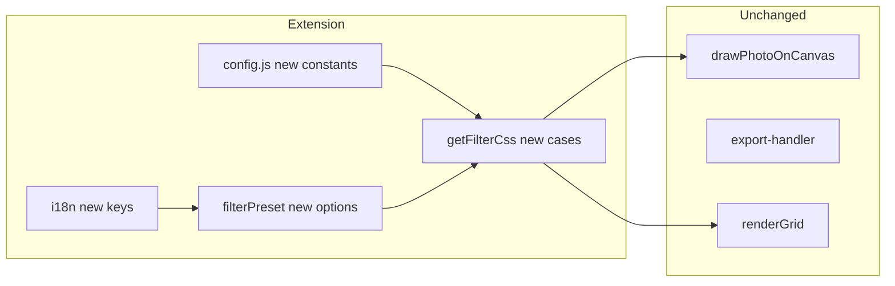

# Goja Filter Effect Extension (Revised Plan)

This plan extends the **completed** [Goja Filter Effect Prototype](). Phase 1 (grayscale, sepia, vignette, live preview) is done. Phase 2 adds six new filter presets via the same `ctx.filter` and `getFilterCss` path.

---

## 1. Rules (Mandatory)

These rules MUST be followed during implementation. Source: [goja_settings_polish_381858f4.plan.md](), [goja_export_options_enhancement_53bc6353.plan.md](), [goja_improvement_proposals_9895157a.plan.md]().

### 1.1 Development Strategy


| Rule                      | Requirement                                                                 |
| ------------------------- | --------------------------------------------------------------------------- |
| **Build-fast, fail-fast** | One logical change at a time. Run full test suite after each.               |
| **TDD first**             | Write failing tests first. Implement only enough to pass.                   |
| **99-line rule**          | Split files exceeding 99 real-code lines.                                   |
| **No hardcoding**         | Constants in [js/config.js](02product/01_coding/project/goja/js/config.js). |
| **Bottom-up modules**     | Small cooperable units. No monolithic blocks.                               |
| **Non-breaking changes**  | All existing tests MUST remain green.                                       |
| **Reuse code**            | Extend `getFilterCss`; do not duplicate.                                    |


### 1.2 Coding Rules


| Rule                 | Requirement                                       |
| -------------------- | ------------------------------------------------- |
| **Functional style** | Pure functions; isolate mutations.                |
| **Test location**    | Unit tests in `tests/unit/`. E2E in `tests/e2e/`. |
| **Module system**    | ES modules; named exports.                        |
| **Full test suite**  | `npm run test` and `npm run test:e2e` must pass.  |


### 1.3 Responsive / Mobile UI Rules


| Rule                 | Requirement                                                                  |
| -------------------- | ---------------------------------------------------------------------------- |
| **Touch targets**    | Min 44x44px. Use `min-height: var(--touch-min)`.                             |
| **Mobile-first**     | Base styles for phone; `@media (min-width: 768px)` for tablet.               |
| **Settings pattern** | Bottom sheet / side panel. Use CSS variables.                                |
| **CSS variables**    | Use [css/variables.css](02product/01_coding/project/goja/css/variables.css). |


### 1.4 Verification

- All unit and E2E tests pass.
- No magic numbers; use config.
- 99-line rule respected.
- Touch targets compliant.

---

## 2. Phase 2 Scope: New Filter Presets

Add six exportable filters via `ctx.filter`. Same Safari fallback (graceful no-effect).


| Preset         | CSS Filter                                   | Effect              |
| -------------- | -------------------------------------------- | ------------------- |
| **brightness** | `brightness(1.15)`                           | Slightly brighter   |
| **contrast**   | `contrast(1.2)`                              | Higher contrast     |
| **saturated**  | `saturate(1.4)`                              | More vibrant colors |
| **faded**      | `saturate(0.65) brightness(1.05)`            | Desaturated, soft   |
| **vintage**    | `sepia(0.35) brightness(1.05) contrast(1.1)` | Warm, aged look     |
| **blur**       | `blur(1.5px)`                                | Soft focus (subtle) |


All values from config. Preview: same as Phase 1—`img.style.filter` in [js/app.js](02product/01_coding/project/goja/js/app.js) `renderGrid`.

---

## 3. Architecture




---

## 4. Implementation Details

### 4.1 Config Constants ([js/config.js](02product/01_coding/project/goja/js/config.js))

```javascript
// New presets
export const FILTER_PRESET_BRIGHTNESS = 'brightness';
export const FILTER_PRESET_CONTRAST = 'contrast';
export const FILTER_PRESET_SATURATED = 'saturated';
export const FILTER_PRESET_FADED = 'faded';
export const FILTER_PRESET_VINTAGE = 'vintage';
export const FILTER_PRESET_BLUR = 'blur';
// New values (from config, no magic numbers)
export const FILTER_BRIGHTNESS_VALUE = 1.15;
export const FILTER_CONTRAST_VALUE = 1.2;
export const FILTER_SATURATE_VALUE = 1.4;
export const FILTER_FADED_SATURATE = 0.65;
export const FILTER_FADED_BRIGHTNESS = 1.05;
export const FILTER_VINTAGE_SEPIA = 0.35;
export const FILTER_VINTAGE_BRIGHTNESS = 1.05;
export const FILTER_VINTAGE_CONTRAST = 1.1;
export const FILTER_BLUR_PX = 1.5;
```

### 4.2 Extend `getFilterCss` ([js/image-effects.js](02product/01_coding/project/goja/js/image-effects.js))

Add cases for each new preset; build CSS string from config constants. Combo filters (faded, vintage) concatenate multiple filter functions.

### 4.3 Settings UI ([index.html](02product/01_coding/project/goja/index.html))

Add six `<option>` elements to `#filterPreset`:

- `brightness`, `contrast`, `saturated`, `faded`, `vintage`, `blur`

### 4.4 i18n

Add to all 11 locales:

- `filterBrightness`, `filterContrast`, `filterSaturated`, `filterFaded`, `filterVintage`, `filterBlur`

---

## 5. Implementation Order (TDD)


| Phase | Task                                         | Tests                              |
| ----- | -------------------------------------------- | ---------------------------------- |
| 1     | Config constants for new presets             | `config.test.js`                   |
| 2     | Extend `getFilterCss` with new presets       | `image-effects.test.js`            |
| 3     | Add options to `#filterPreset` in index.html | —                                  |
| 4     | i18n all 11 locales                          | `i18n.test.js` if key check exists |
| 5     | Run full test suite                          | `npm run test`, `npm run test:e2e` |


---

## 6. Files to Modify

- [js/config.js](02product/01_coding/project/goja/js/config.js) — new preset constants
- [js/image-effects.js](02product/01_coding/project/goja/js/image-effects.js) — extend `getFilterCss`
- [tests/unit/image-effects.test.js](02product/01_coding/project/goja/tests/unit/image-effects.test.js) — tests for new presets
- [tests/unit/config.test.js](02product/01_coding/project/goja/tests/unit/config.test.js) — tests for new constants
- [index.html](02product/01_coding/project/goja/index.html) — six new `<option>` elements
- All [js/locales/*.js](02product/01_coding/project/goja/js/locales/) — six new i18n keys

---

## 7. Future Extensions (Out of Scope)

- Per-photo filters (different filter per cell)
- Adjustable sliders for brightness/contrast/saturate (would add UI complexity)
- Pixel-level effects (getImageData/putImageData)

