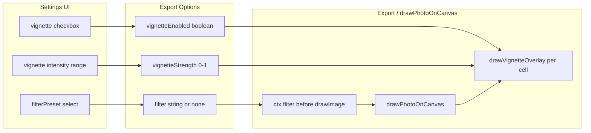

# Goja Filter and Effect Prototype

## 1. Rules (Mandatory)

These rules MUST be followed during implementation. Violation means the implementation is incomplete. Source: [goja_settings_polish_381858f4.plan.md](), [goja_export_options_enhancement_53bc6353.plan.md](), [goja_improvement_proposals_9895157a.plan.md]().

### 1.1 Development Strategy (Rules)


| Rule                      | Requirement                                                                                                                                                                                   |
| ------------------------- | --------------------------------------------------------------------------------------------------------------------------------------------------------------------------------------------- |
| **Build-fast, fail-fast** | Make exactly one logical change at a time. Run the full test suite after each change. If tests fail, fix before proceeding. Do not batch unrelated changes.                                   |
| **TDD first**             | For any new behavior, write failing tests first. Implement only enough to make them pass. Do not skip this step where tests are feasible.                                                     |
| **99-line rule**          | Any source file exceeding 99 real-code lines (excluding comments and blank lines) MUST be split into smaller modules. Do this proactively before adding more logic.                           |
| **No hardcoding**         | All magic values (numeric constants, config strings) MUST live in [js/config.js](02product/01_coding/project/goja/js/config.js). Import from config; never inline literals for configuration. |
| **Bottom-up modules**     | Build from small, cooperable units. Each module does one thing. Higher-level code composes these units. No monolithic blocks.                                                                 |
| **Non-breaking changes**  | New code MUST NOT break existing behavior. All existing tests MUST remain green. Breaking changes require explicit user approval first.                                                       |
| **Reuse code**            | Before adding new logic, check for existing similar behavior. Reuse or extend existing modules rather than duplicating.                                                                       |


### 1.2 Coding Rules


| Rule                 | Requirement                                                                                                                               |
| -------------------- | ----------------------------------------------------------------------------------------------------------------------------------------- |
| **Functional style** | Prefer pure functions, immutable data, higher-order functions. Avoid side effects in pure logic; isolate mutations.                       |
| **Test location**    | Unit tests in `tests/unit/`. E2E tests in `tests/e2e/`. No tests elsewhere.                                                               |
| **Module system**    | Use ES modules only. Use named exports. No default exports except for locales or legacy compatibility.                                    |
| **Full test suite**  | After every implementation phase, run the full test suite (`npm run test` and `npm run test:e2e`). All tests MUST pass before proceeding. |


### 1.3 Responsive / Mobile UI Rules


| Rule                 | Requirement                                                                                                                                                                                            |
| -------------------- | ------------------------------------------------------------------------------------------------------------------------------------------------------------------------------------------------------ |
| **Touch targets**    | Interactive elements (buttons, checkboxes, labels, etc.) MUST have minimum 44x44px touch target. Use `min-height: var(--touch-min)` or equivalent.                                                     |
| **Mobile-first**     | Base styles for phone; use `@media (min-width: 768px)` (or `var(--bp-md)`) for tablet/desktop enhancements.                                                                                            |
| **Settings pattern** | Settings panel: bottom sheet (60vh) on mobile; side panel (320px) on tablet/desktop. Use `--settings-sheet-height` and `--settings-panel-width`.                                                       |
| **CSS variables**    | All layout, spacing, colors, and breakpoints MUST use CSS custom properties from [css/variables.css](02product/01_coding/project/goja/css/variables.css). Do not introduce new magic values in styles. |


### 1.4 Verification

Before considering a phase complete:

- Apply TDD to all changes as long as it is possible
- All unit and E2E tests pass.
- No new magic numbers introduced; constants used from config.
- File length respects the 99-line rule where applicable.
- Touch targets and mobile layout rules are satisfied.

---

## 2. Prototype Scope

Implement **three exportable effects** for validation:


| Effect        | Implementation                                                                  | Browser support                                                 |
| ------------- | ------------------------------------------------------------------------------- | --------------------------------------------------------------- |
| **Grayscale** | `ctx.filter = 'grayscale(100%)'` before `drawImage`                             | Chrome, Firefox, Edge (Safari: graceful fallback to unfiltered) |
| **Sepia**     | `ctx.filter = 'sepia(80%)'` before `drawImage`                                  | Same as above                                                   |
| **Vignette**  | Radial gradient overlay (`createRadialGradient`) drawn after each photo in cell | All browsers                                                    |


**Filter preset**: dropdown (none, grayscale, sepia).  
**Vignette**: checkbox + intensity slider (0–100%). Vignette uses radial gradient (black at edges, transparent center); intensity controls opacity of the gradient.

---

## 3. Architecture




### 3.1 New Module: `js/image-effects.js`

- `**getFilterCss(filterPreset)**` returns CSS filter string or `'none'`
  - Input: `'none' | 'grayscale' | 'sepia'`
  - Output: `'none'`, `'grayscale(100%)'`, `'sepia(0.8)'` (values from config)
  - Pure function, easily unit-tested.
- `**drawVignetteOverlay(ctx, cell, options)**`
  - Draws a radial gradient overlay on the cell region: center transparent, edges dark (black with alpha).
  - `options`: `{ strength: 0–1 }` (from config range).
  - Uses `createRadialGradient` with `cell.x`, `cell.y`, `cell.width`, `cell.height`.
  - Does nothing if `strength <= 0`.
- `**isFilterSupported(ctx)**` optional helper: check if `ctx.filter` is writable (Safari fallback).
  - Try `ctx.filter = 'grayscale(0%)'`; restore `'none'`; return success.
  - Or: `'filter' in ctx && typeof ctx.filter !== 'undefined'` (simpler but may give false positive on Safari).

### 3.2 Integration Points

**drawPhotoOnCanvas** ([js/image-processor.js](02product/01_coding/project/goja/js/image-processor.js)):

- Accept new `filter` option in `options`.
- Before `ctx.drawImage`, set `ctx.filter = options.filter ?? 'none'`.
- After `ctx.drawImage`, reset `ctx.filter = 'none'` to avoid affecting subsequent draws (watermark, capture date).
- If `isFilterSupported(ctx) === false`, skip setting filter (graceful degradation).

**Export flow** ([js/export-handler.js](02product/01_coding/project/goja/js/export-handler.js), [js/export-worker.js](02product/01_coding/project/goja/js/export-worker.js)):

- For each cell: `drawPhotoOnCanvas` → optional `drawVignetteOverlay` → `drawCaptureDateOverlay` (existing order).
- Pass `filter`, `vignetteEnabled`, `vignetteStrength` from options.

### 3.3 Settings UI

Add a new fieldset **"Effects"** in [index.html](02product/01_coding/project/goja/index.html) (between Grid and Export, or after Export before Watermark):

- **Filter preset**: `<select id="filterPreset">`
  - `none`, `grayscale`, `sepia` (values from config)
- **Vignette**:
  - Checkbox: "Vignette" — `#vignetteEnabled` (unchecked by default)
  - Conditional group `#vignetteOptionsGroup` (hidden when unchecked):
    - Range: "Intensity" — `#vignetteStrength` (config min/max/default, e.g. 0.2–0.8, default 0.5)

Use existing patterns: `.hidden` class, `classList.toggle`, `control-group`, touch targets.

**Event handling** ([js/app.js](02product/01_coding/project/goja/js/app.js)):

- `filterPreset.addEventListener('change', updatePreview)`
- `vignetteEnabled.addEventListener('change', () => { toggle vignetteOptionsGroup; updatePreview() })`
- `vignetteStrength.addEventListener('input', updatePreview)`

**Preview**: Effects apply only on **export** in this prototype. Preview grid remains unchanged (no CSS filter on img) to keep prototype minimal. If you want live preview, we can add CSS `filter` on preview `` elements in a follow-up.

**Export options** ([js/app.js](02product/01_coding/project/goja/js/app.js) `onExport`):

- Build `filter: getFilterCss(filterPreset.value)`, `vignetteEnabled: vignetteEnabled.checked`, `vignetteStrength: parseFloat(vignetteStrength.value)` and pass to `handleExport`.

---

## 4. Config Constants ([js/config.js](02product/01_coding/project/goja/js/config.js))

```javascript
// Image effects (filter + vignette)
export const FILTER_PRESET_NONE = 'none';
export const FILTER_PRESET_GRAYSCALE = 'grayscale';
export const FILTER_PRESET_SEPIA = 'sepia';
export const FILTER_GRAYSCALE_VALUE = 1;      // 0-1 for grayscale(100%)
export const FILTER_SEPIA_VALUE = 0.8;        // 0-1 for sepia(80%)
export const VIGNETTE_STRENGTH_MIN = 0.2;
export const VIGNETTE_STRENGTH_MAX = 0.8;
export const VIGNETTE_STRENGTH_DEFAULT = 0.5;
```

---

## 5. i18n Keys

Add to all 11 locale files ([js/locales/*.js](02product/01_coding/project/goja/js/locales/)):

- `effectsSection`: "Effects"
- `filterPreset`: "Filter"
- `filterNone`: "None"
- `filterGrayscale`: "Grayscale"
- `filterSepia`: "Sepia"
- `vignetteEnabled`: "Vignette"
- `vignetteStrength`: "Intensity"

---

## 6. Safari Fallback

`ctx.filter` is not supported in Safari (stable). Strategy:

- Detect: `ctx.filter` property exists and is writable. If not, `getFilterCss` result is ignored in `drawPhotoOnCanvas`.
- User still gets vignette (radial gradient works everywhere).
- No error; exported image simply has no filter applied on Safari.

---

## 7. Implementation Order (TDD)


| Phase | Task                                                                                          | Tests                                          |
| ----- | --------------------------------------------------------------------------------------------- | ---------------------------------------------- |
| 1     | Config constants for filter + vignette                                                        | `config.test.js` (if exists) or new assertions |
| 2     | `image-effects.js`: `getFilterCss`, `drawVignetteOverlay`, `isFilterSupported`                | `tests/unit/image-effects.test.js`             |
| 3     | `image-processor.js`: add `filter` option to `drawPhotoOnCanvas`                              | `image-processor.test.js` (extend existing)    |
| 4     | `image-processor.js` or export: call `drawVignetteOverlay` per cell after `drawPhotoOnCanvas` | Unit test for draw order / vignette            |
| 5     | Settings UI in index.html + app.js event wiring                                               | E2E: settings visibility, export with effect   |
| 6     | Export integration: pass options to handler + worker                                          | `export-handler.test.js`                       |
| 7     | i18n all locales                                                                              | i18n test if present                           |
| 8     | Run full test suite, verify no regressions                                                    | `npm run test`, `npm run test:e2e`             |


---

## 8. Files to Create

- [js/image-effects.js](02product/01_coding/project/goja/js/image-effects.js) — `getFilterCss`, `drawVignetteOverlay`, `isFilterSupported`
- [tests/unit/image-effects.test.js](02product/01_coding/project/goja/tests/unit/image-effects.test.js)

---

## 9. Files to Modify

- [js/config.js](02product/01_coding/project/goja/js/config.js) — filter and vignette constants
- [js/image-processor.js](02product/01_coding/project/goja/js/image-processor.js) — `filter` option in `drawPhotoOnCanvas`
- [js/export-handler.js](02product/01_coding/project/goja/js/export-handler.js) — options, `drawVignetteOverlay` per cell
- [js/export-worker.js](02product/01_coding/project/goja/js/export-worker.js) — options, `drawVignetteOverlay` per cell
- [index.html](02product/01_coding/project/goja/index.html) — Effects fieldset, `#filterPreset`, `#vignetteEnabled`, `#vignetteOptionsGroup`, `#vignetteStrength`
- [js/app.js](02product/01_coding/project/goja/js/app.js) — read settings, pass to `handleExport`, event listeners
- [sw.js](02product/01_coding/project/goja/sw.js) — ASSETS for new file (if any new HTML/JS asset)
- All [js/locales/*.js](02product/01_coding/project/goja/js/locales/) — i18n keys

---

## 10. Future Extensions (Out of Prototype Scope)

- Preview: CSS `filter` on grid images when effects enabled
- More filters: brightness, contrast, vintage preset, blur
- Per-photo filters (different filter per cell) — would require UI rethink

