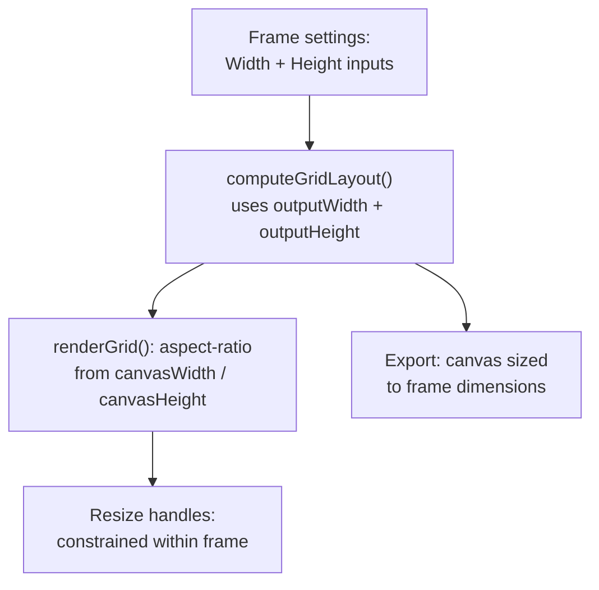

# Goja Grid Cell Resizing -- Revised Plan

## Bugs and Issues Found

### Bug: Row resize handles are unusable

In [resize-handler.js](02product/01_coding/project/goja/js/resize-handler.js) line 43, the `makeHandle` call for row handles has the last two arguments swapped:

```javascript
// CURRENT (broken) — extent = layout.gap (4px width!)
const handle = makeHandle('row', padLeft, padTop + pos, innerW, layout.gap);

// CORRECT — extent = innerW (full grid width)
const handle = makeHandle('row', padLeft, padTop + pos, layout.gap, innerW);
```

The `makeHandle` function uses the `extent` parameter as the width for row handles. Currently it receives `layout.gap` (4px), making the handle too narrow to interact with. It should receive `innerW` (full grid width).

### Issue: Grid preview ignores frame dimensions

The grid preview stretches to `width: 100%` of its container regardless of the intended output dimensions. There is no user control over the frame size. The `canvasHeight` is always derived from `canvasWidth` using `rowUnit = colUnit`, preventing independent control of width and height.

---

## Plan

### 1. Fix row resize handle bug in `resize-handler.js`

Swap the last two arguments in the row handle `makeHandle` call (line 43):

```javascript
const handle = makeHandle('row', padLeft, padTop + pos, layout.gap, innerW);
```

### 2. Add Frame Size setting to `index.html`

Add two number inputs (Width, Height) to the Grid section of Settings, before the existing Gap slider:

```html
<div class="control-group">
  <label for="frameWidth">Width</label>
  <input type="number" id="frameWidth" value="1080" min="320" max="4096" step="1">
</div>
<div class="control-group">
  <label for="frameHeight">Height</label>
  <input type="number" id="frameHeight" value="1350" min="320" max="4096" step="1">
</div>
```

Default: **1080 x 1350 (4:5 portrait)**. This is the 2026 gold standard for mobile-first photo grids:

- Maximizes screen real estate in Instagram/Facebook feeds (4:5 is the tallest ratio feeds display without cropping).
- 1080px width is the universal standard across all major social platforms.
- Portrait orientation outperforms square and landscape for visual impact on phones.
- Min 320px (smallest useful social media size), max 4096px (high-res print capable).

### 3. Style number inputs in `style.css`

Extend the existing `input[type="text"]` rule to also cover `input[type="number"]`:

```css
.control-group input[type="text"],
.control-group input[type="number"] {
  /* existing text input styles */
}
```

### 4. Update `layout-engine.js` to accept independent height

Currently `rowUnit = colUnit` (line 52), forcing the canvas height to be derived from the width. Change `computePixelCells` to accept an optional `outputHeight`:

```javascript
function computePixelCells(template, indices, photos, outputWidth, gap, outputHeight) {
  const { baseRows, baseCols } = template;
  const colUnit = (outputWidth - gap * (baseCols - 1)) / baseCols;
  const rowUnit = outputHeight
    ? (outputHeight - gap * (baseRows - 1)) / baseRows
    : colUnit;
  // ... rest unchanged
}
```

And in `computeGridLayout`:

```javascript
const outputHeight = options.outputHeight;
const cells = computePixelCells(best, indices, photos, outputWidth, gap, outputHeight);
const totalH = outputHeight || Math.round(best.baseRows * colUnitFormula + gap * (best.baseRows - 1));
```

Also update the default constant in `layout-engine.js`:

```javascript
const DEFAULT_OUTPUT_WIDTH = 1080;
const DEFAULT_OUTPUT_HEIGHT = 1350;
```

This means:

- When user provides both width and height: cells are non-square, frame is exactly as specified.
- When height is omitted: falls back to `DEFAULT_OUTPUT_HEIGHT` (1350).
- Backward-compatible: existing tests that omit `outputHeight` will use the new default.

### 5. Simplify `recomputePixelCells` in `resize-engine.js`

Replace the indirect `totalRowPx` derivation (lines 52-53) with direct use of `canvasHeight`:

```javascript
// BEFORE (derives from colUnit — wrong for independent height)
const colUnit = (canvasWidth - gap * (baseCols - 1)) / baseCols;
const totalRowPx = baseRows * colUnit + (baseRows - 1) * gap;

// AFTER (uses canvasHeight directly — correct for any frame)
const totalRowPx = layout.canvasHeight;
```

This works because `canvasHeight` now always reflects the correct total row space, whether user-defined or auto-computed.

### 6. Wire frame inputs in `app.js`

- Add `frameW, frameH` to existing DOM ref destructuring.
- Pass `outputWidth` and `outputHeight` from the frame inputs to `computeGridLayout`.
- Add `frameW, frameH` to the existing `[gapSlider, bgColor].forEach(...)` update listener.
- No new functions needed; changes modify existing lines.

Key change in `updatePreview`:

```javascript
currentLayout = computeGridLayout(
  photos.map(p => ({ width: p.width, height: p.height })),
  { gap: parseInt(gapSlider.value, 10),
    outputWidth: parseInt(frameW.value, 10),
    outputHeight: parseInt(frameH.value, 10) }
);
```

The `renderGrid` function already sets `aspectRatio: canvasWidth / canvasHeight`, which will now use the user-defined frame dimensions automatically.

### 7. Tests

**resize-engine.test.js**:

- Update `recomputePixelCells` tests to include `canvasHeight` in test layouts.
- Add test: non-square frame (e.g., 1920x1080) produces wider-than-tall cells.
- Verify uniform ratios still match layout-engine output for independent width/height.

**layout-engine.test.js**:

- Add test: `computeGridLayout` with `outputHeight` produces correct `canvasHeight`.
- Add test: row height differs from col width when `outputHeight != auto`.
- Verify backward compatibility: omitting `outputHeight` produces same results as before.

---

## Data Flow




---

## Files Changed

- [resize-handler.js](02product/01_coding/project/goja/js/resize-handler.js) -- swap row handle args (1 line)
- [layout-engine.js](02product/01_coding/project/goja/js/layout-engine.js) -- accept `outputHeight`, compute `rowUnit` independently (~4 lines)
- [resize-engine.js](02product/01_coding/project/goja/js/resize-engine.js) -- use `canvasHeight` directly (-1 line)
- [app.js](02product/01_coding/project/goja/js/app.js) -- add frame input refs, pass to layout engine (~2 lines modified)
- [index.html](02product/01_coding/project/goja/index.html) -- add frame width/height inputs (+8 lines)
- [style.css](02product/01_coding/project/goja/css/style.css) -- extend input styling to `number` type (+1 line)
- [resize-engine.test.js](02product/01_coding/project/goja/tests/unit/resize-engine.test.js) -- update and add tests
- [layout-engine.test.js](02product/01_coding/project/goja/tests/unit/layout-engine.test.js) -- add tests for `outputHeight`

