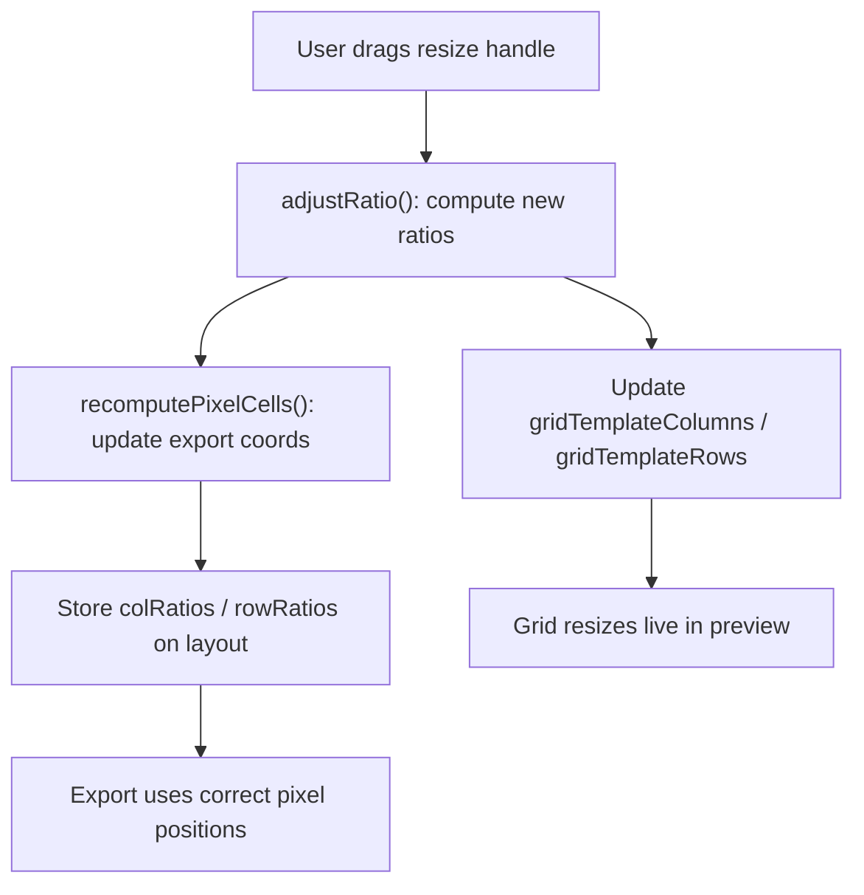
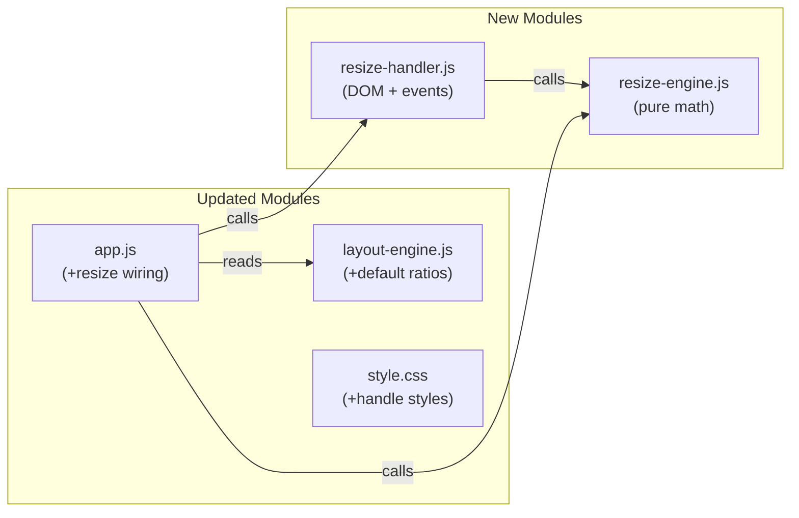

# Goja Grid Cell Resizing

## Strategy: Build-Fast-and-Fail-Fast

(Same strategy as prior Goja features -- one function at a time, TDD, run the full suite after each step.)

## Coding Rules

(Carried forward from `goja_drag-drop_watermark_0cc3c71d.plan.md`
historical reference)

- **TDD First**: Write failing tests before implementation. Every new function gets a unit test.
- **99-Line Rule**: No source file may exceed 99 real lines of code (excluding comments and blanks). If a module grows beyond this, split it.
- **Single Responsibility**: One module, one purpose.
- **Functional Programming**: Prefer pure functions, immutable data, composition over mutation.
- **No Hardcoding**: Use CSS custom properties and constants.
- **Bottom-Up Modular**: Build small cooperating modules, each testable in isolation.
- **ES Module Pattern**: Named exports. No monolithic files.
- **Test Location**: All tests in `tests/unit/` and `tests/e2e/`.
- **Clean Codebase**: No temporary files left behind.
- **Run All Tests**: After every phase, run full test suite to catch regressions.

## Responsive UI and CSS Rules

- Breakpoints: <=480px (small phone), <=768px (phone/small tablet), <=1024px (tablet), >1024px (desktop), max-height<=600px (landscape phone)
- Touch targets minimum 44x44px on all touch devices.
- No horizontal overflow on any device.
- Use CSS custom properties in `variables.css`.
- Mobile-first: base styles target phone, `@media` queries scale up.
- Use `-webkit-` prefixes where needed for Safari compatibility.

---

## How It Works

After photos are loaded and the grid is rendered, **resize handles** appear at the boundaries between grid columns and grid rows. The user drags a handle to adjust the proportions of the two adjacent tracks. All cells sharing those tracks resize together (standard CSS Grid behavior).

- **Desktop**: Hovering near a track boundary shows a resize cursor (`col-resize` / `row-resize`). Drag to adjust.
- **Touch (iPhone/iPad)**: A 44px-wide invisible hit zone centered on each gap captures touch drags. Touch starts on a gap (not on an image), so it does not conflict with the existing photo drag-and-drop swap.
- **Live preview**: The CSS Grid updates in real time during the drag.
- **Export**: Pixel cell positions are recomputed from the custom ratios, so the exported image matches the preview exactly.
- **Reset**: Ratios reset to uniform when photos are added/removed (template changes). Double-tap a handle resets that pair to equal.

### Interaction diagram




---

## Data Model

Two new arrays on the layout object:

```javascript
{
  baseRows: 2, baseCols: 3,
  colRatios: [1, 1, 1],   // default uniform
  rowRatios: [1, 1],       // default uniform
  gap: 4, cells: [...], photoOrder: [...],
  canvasWidth: 1080, canvasHeight: 720,
}
```

- `colRatios` and `rowRatios` contain relative proportions (not pixels).
- CSS rendering: `gridTemplateColumns: 1fr 1fr 1fr` becomes `2fr 1fr 1fr` after resizing.
- Pixel export: ratios are converted to absolute pixel widths/heights for Canvas drawing.

---

## Architecture




---

## New Module: `js/resize-engine.js`

Pure functions only (unit-testable, no DOM). Estimated ~40 lines.

```javascript
export function defaultRatios(count)
export function ratiosToFrString(ratios)
export function adjustRatio(ratios, index, deltaPx, totalPx, minFraction)
export function recomputePixelCells(layout)
```

- `defaultRatios(3)` returns `[1, 1, 1]`
- `ratiosToFrString([2, 1, 1])` returns `"2fr 1fr 1fr"`
- `adjustRatio(ratios, index, deltaPx, totalPx, 0.2)`: when handle between track `index` and `index+1` is dragged by `deltaPx`, returns a new ratios array where `ratios[index]` grows and `ratios[index+1]` shrinks (or vice versa). Enforces `minFraction` so no track collapses below 20% of average size.
- `recomputePixelCells(layout)`: takes a layout with `colRatios`, `rowRatios`, `baseRows`, `baseCols`, `gap`, `canvasWidth`, and the template slot coordinates. Returns a new `cells` array with correct pixel `x`, `y`, `width`, `height`. Replaces the uniform `colUnit = rowUnit` logic from [layout-engine.js](02product/01_coding/project/goja/js/layout-engine.js) lines 49-71 with ratio-weighted track sizes.

---

## New Module: `js/resize-handler.js`

DOM interaction module. Estimated ~80 lines.

```javascript
export function enableGridResize(gridEl, layout, onResize)
```

- Creates a transparent **overlay div** positioned on top of the grid (not inside it, so `renderGrid`'s `innerHTML = ''` does not destroy handles).
- For each internal grid boundary (N-1 column boundaries, M-1 row boundaries), creates an invisible handle element.
- **Handle sizing**: each handle is 44px wide (for touch targets), centered on the gap. On desktop, the visual indicator (a thin line) only appears on hover.
- **Desktop events**: `mousedown` -> `mousemove` -> `mouseup` on each handle. During `mousemove`, computes delta and calls `adjustRatio`, then calls `onResize({ colRatios, rowRatios })`.
- **Touch events**: `touchstart` -> `touchmove` -> `touchend` (same logic). Uses `{ passive: false }` for `touchmove` to allow `preventDefault`.
- Returns a **cleanup function** that removes the overlay and all event listeners.
- Handle positions are derived from `gridEl.getBoundingClientRect()` and the current ratios, so they reposition correctly after CSS Grid updates.

---

## Updated: `js/layout-engine.js`

Minimal change (+1 line, stays at ~94/99 non-blank lines).

Add default ratios to the `computeGridLayout` return value:

```javascript
return {
  baseRows: best.baseRows, baseCols: best.baseCols,
  gap, cells, photoOrder: indices,
  canvasWidth: outputWidth, canvasHeight: totalH,
  colRatios: Array(best.baseCols).fill(1), rowRatios: Array(best.baseRows).fill(1),
};
```

The existing `computePixelCells` stays unchanged -- it still computes the initial uniform layout. Ratio-adjusted recomputation is handled by `resize-engine.js`.

---

## Updated: `js/app.js`

Add ~8 non-blank lines (stays under 99). Changes:

1. **Imports**: add `resize-engine.js` and `resize-handler.js` (+2 lines)
2. **State**: add `let cleanupResize = null;` (+1 line)
3. **renderGrid**: change `repeat(N, 1fr)` to `ratiosToFrString(layout.colRatios)` and `ratiosToFrString(layout.rowRatios)` (modify existing lines, +0 lines)
4. **updatePreview**: after `renderGrid`, set up resize handler (+5 lines):

```javascript
if (cleanupResize) cleanupResize();
cleanupResize = enableGridResize(previewGrid, currentLayout, (ratios) => {
  Object.assign(currentLayout, ratios);
  currentLayout.cells = recomputePixelCells(currentLayout);
  previewGrid.style.gridTemplateColumns = ratiosToFrString(currentLayout.colRatios);
  previewGrid.style.gridTemplateRows = ratiosToFrString(currentLayout.rowRatios);
});
```

The resize callback only updates CSS properties (no `innerHTML` clear), so photos stay in place and resize smoothly in real time. The `currentLayout.cells` are updated for accurate export.

1. **clearAll**: add `if (cleanupResize) { cleanupResize(); cleanupResize = null; }` (+1 line)

---

## Updated: `css/style.css` and `css/variables.css`

### variables.css (+3 lines)

```css
--resize-handle-color: var(--color-primary);
--resize-handle-width: 4px;
--z-resize-overlay: 50;
```

### style.css (~15 lines)

```css
.resize-overlay {
  position: absolute;
  inset: 0;
  pointer-events: none;
  z-index: var(--z-resize-overlay);
}

.resize-handle {
  position: absolute;
  pointer-events: auto;
  opacity: 0;
  transition: opacity 0.15s;
}

.resize-handle:hover,
.resize-handle.active {
  opacity: 1;
  background: var(--resize-handle-color);
}

.resize-handle--col { cursor: col-resize; width: 44px; }
.resize-handle--row { cursor: row-resize; height: 44px; }
```

The `.preview` container needs `position: relative` (add to existing `.preview` rule).

---

## Tests

### New: `tests/unit/resize-engine.test.js`

- `defaultRatios(3)` returns `[1, 1, 1]`
- `ratiosToFrString([2, 1, 1])` returns `"2fr 1fr 1fr"`
- `ratiosToFrString([1])` returns `"1fr"`
- `adjustRatio` increases left track and decreases right track on positive delta
- `adjustRatio` respects `minFraction` (neither track goes below minimum)
- `adjustRatio` with zero delta returns unchanged ratios
- `adjustRatio` at boundary (index 0 and last valid index) works correctly
- `recomputePixelCells` with uniform ratios matches original layout-engine output
- `recomputePixelCells` with `[2, 1]` colRatios gives first column double width
- `recomputePixelCells` with spanning slots correctly sums non-uniform track sizes
- `recomputePixelCells` preserves total canvas dimensions

### Updated: `tests/unit/layout-engine.test.js`

- Verify `computeGridLayout` output includes `colRatios` and `rowRatios` arrays
- Verify default ratios are all 1s with correct length

---

## Implementation Order (TDD)

1. **resize-engine tests**: Write failing tests for all pure functions
2. **resize-engine implementation**: Implement `resize-engine.js` until all tests pass
3. **layout-engine update**: Add default ratios to output; update layout-engine tests
4. **resize-handler implementation**: Implement `resize-handler.js` (DOM module)
5. **Integration**: Wire into `app.js`, update `renderGrid`, add CSS styles
6. **Full regression**: Run full test suite (unit + E2E), fix any regressions

