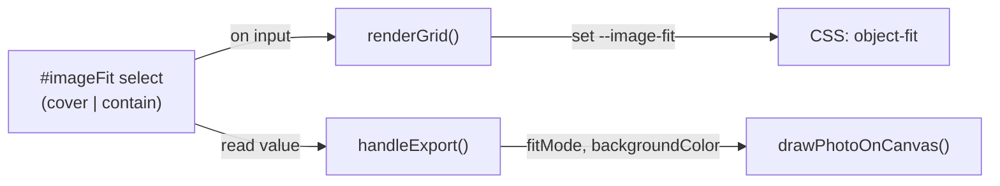

# Goja Image Fit Mode Setting

## Strategy

TDD first, bottom-up: image-processor (pure draw logic) → export-handler (passthrough) → app.js + HTML + CSS (UI wiring). Follow the same coding rules and responsive UI rules from [goja_grid_cell_resizing_260bac6c.plan.md]().

## Data Flow




## Coding Rules (from plan)

- TDD first; 99-line rule; single responsibility; functional style
- Touch targets 44x44px; CSS custom properties; mobile-first; no horizontal overflow
- Test location: `tests/unit/`, `tests/e2e/`
- Run full test suite after each phase

---

## 1. HTML: Add Settings Control

In [index.html](02product/01_coding/project/goja/index.html), inside the Grid `fieldset` (after the gap slider, before closing `</fieldset>`), add:

```html
<div class="control-group">
  <label for="imageFit">Image fit</label>
  <select id="imageFit">
    <option value="cover">Fill</option>
    <option value="contain">Full display</option>
  </select>
</div>
```

- Uses existing `control-group` and `select` patterns; meets 44px min-height via existing `.control-group select` styles.

---

## 2. image-processor.js: Support fitMode

### Tests (TDD first)

Add to [tests/unit/image-processor.test.js](02product/01_coding/project/goja/tests/unit/image-processor.test.js):

- `drawPhotoOnCanvas` with `fitMode: 'cover'` crops and fills cell (current behavior).
- `drawPhotoOnCanvas` with `fitMode: 'contain'` draws full image, letterboxed; calls `fillRect` with `backgroundColor` for cell, then `drawImage` centered.
- `drawPhotoOnCanvas` defaults to `cover` when no options passed (backward compatible).

### Implementation

Update [js/image-processor.js](02product/01_coding/project/goja/js/image-processor.js):

```javascript
export function drawPhotoOnCanvas(ctx, img, cell, options = {}) {
  const fitMode = options.fitMode ?? 'cover';
  const backgroundColor = options.backgroundColor ?? '#ffffff';
  const srcRatio = img.naturalWidth / img.naturalHeight;
  const cellRatio = cell.width / cell.height;

  if (fitMode === 'contain') {
    let drawW, drawH, drawX, drawY;
    if (srcRatio > cellRatio) {
      drawW = cell.width;
      drawH = cell.width / srcRatio;
      drawX = cell.x;
      drawY = cell.y + (cell.height - drawH) / 2;
    } else {
      drawH = cell.height;
      drawW = cell.height * srcRatio;
      drawX = cell.x + (cell.width - drawW) / 2;
      drawY = cell.y;
    }
    ctx.fillStyle = backgroundColor;
    ctx.fillRect(cell.x, cell.y, cell.width, cell.height);
    ctx.drawImage(img, 0, 0, img.naturalWidth, img.naturalHeight, drawX, drawY, drawW, drawH);
  } else {
    // cover (existing logic)
    let sx = 0, sy = 0, sw = img.naturalWidth, sh = img.naturalHeight;
    if (srcRatio > cellRatio) {
      sw = img.naturalHeight * cellRatio;
      sx = (img.naturalWidth - sw) / 2;
    } else {
      sh = img.naturalWidth / cellRatio;
      sy = (img.naturalHeight - sh) / 2;
    }
    ctx.drawImage(img, sx, sy, sw, sh, cell.x, cell.y, cell.width, cell.height);
  }
}
```

---

## 3. export-handler.js: Pass fitMode and backgroundColor

Update [js/export-handler.js](02product/01_coding/project/goja/js/export-handler.js):

- Destructure `fitMode` from options (default `'cover'`).
- Pass `{ fitMode, backgroundColor }` into `drawPhotoOnCanvas`:

```javascript
const { fitMode = 'cover' } = options;
// ...
drawPhotoOnCanvas(ctx, imgElements[photoOrder[i]], layout.cells[i], {
  fitMode,
  backgroundColor: options.backgroundColor ?? '#ffffff',
});
```

### Tests

- Extend [tests/unit/export-handler.test.js](02product/01_coding/project/goja/tests/unit/export-handler.test.js): verify `drawPhotoOnCanvas` is called with correct options when `fitMode: 'contain'` is passed in options (mock/spy on image-processor).

---

## 4. app.js: Wire Setting to Preview and Export

Update [js/app.js](02product/01_coding/project/goja/js/app.js):

1. Add `imageFit` to the DOM refs list (e.g. `#imageFit`).
2. In `renderGrid`, set a CSS custom property on the grid for preview:

```javascript
   g.style.setProperty('--image-fit', imageFit.value);
   

```

1. Add `imageFit` to the `input` listeners that call `updatePreview`.
2. In `onExport`, pass `fitMode: imageFit.value` into `handleExport` options.

---

## 5. CSS: Use Custom Property for object-fit

Update [css/style.css](02product/01_coding/project/goja/css/style.css):

```css
.preview__grid img {
  width: 100%;
  height: 100%;
  object-fit: var(--image-fit, cover);
  display: block;
  cursor: grab;
}
```

- Default `cover` when `--image-fit` is unset. `renderGrid` will set `--image-fit` from the select value.

---

## 6. Tests and Regression

- **Unit**: image-processor (drawPhotoOnCanvas cover/contain), export-handler (options passthrough).
- **E2E**: Add a test that opens Settings, selects "Full display", verifies images use `object-fit: contain` (e.g. via `getComputedStyle` on an img); export still triggers download.
- Run full suite: `npm test` and E2E; fix regressions.

---

## 7. CHANGELOG

Add entry for today's date: new "Image fit" setting (Fill / Full display).

---

## Implementation Order

1. TDD: Write failing image-processor tests for `drawPhotoOnCanvas` cover/contain.
2. Implement `drawPhotoOnCanvas` options until tests pass.
3. Update export-handler to pass options; add/update tests.
4. Add HTML control; wire app.js (renderGrid, onExport, listeners).
5. Update CSS for `--image-fit`.
6. E2E test for setting.
7. Full regression; CHANGELOG.

