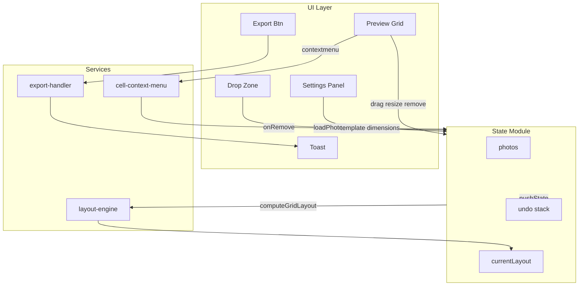

# Goja Improvement Proposals

## Table of Contents

1. [Quick Reference](#quick-reference)
2. [Guiding Principles](#1-guiding-principles) — rules for all work
3. [GATE Checkpoints](#gate-checkpoints) — milestones and workflow
4. [Progress Checklist](#progress-checklist) — per-GATE verification
5. [Current Architecture](#2-current-architecture) — baseline
6. [Phase Specifications](#phase-specifications) — detailed feature specs (Phases 1–8)
7. [Implementation Roadmap](#11-implementation-roadmap) — recommended order
8. [Reference](#reference) — architecture diagram, file list

---

## Quick Reference

**Implementation order (recommended):** 1.1 → 1.2 → 1.3 → 5.1 → 2.1 → 2.2 → 2.3 → 2.5 → 3.1 → 2.4/5.2 → remainder

**GATE rule:** Implementation pauses at each GATE checkpoint. Proceed only after user approval.

---

## 1. Guiding Principles

Apply these throughout all phases.

### 1.1 Development Strategy

- **Build-fast, fail-fast:** One change at a time; run tests after each.
- **TDD first:** Write failing tests before implementation where possible.
- **99-line rule:** Split modules exceeding 99 real-code lines for modularity.
- **No hardcoding:** Use config/constants for all magic values.
- **Bottom-up modules:** Small cooperating units, testable in isolation.
- **Non-breaking changes:** New code must not break existing behavior without explicit approval.

### 1.2 Coding Rules

- Prefer functional style: pure functions, immutable data, higher-order functions.
- Leverage JavaScript/Node.js parallelism where appropriate.
- Tests in `tests/` (unit: `tests/unit/`, E2E: `tests/e2e/`).
- ES modules, named exports.
- Run full test suite after every phase.

### 1.3 Responsive / Mobile UI

- Touch targets ≥ 44×44px (`--touch-min`).
- Mobile-first: base styles for phone, `@media` for tablet/desktop.
- Settings: bottom sheet (60vh) on phone, side panel (320px) on tablet.
- Use CSS custom properties from [css/variables.css](02product/01_coding/project/goja/css/variables.css).

---

## GATE Checkpoints

Each GATE is a working milestone. **Implementation stops at each GATE; do not proceed to the next until you have approved the current one.**

**Workflow:** Implement scope → run tests → demonstrate → await your approval → continue to next GATE.

| GATE        | Scope                                        | Verification                                                                   |
| ----------- | -------------------------------------------- | ------------------------------------------------------------------------------ |
| **GATE 1**  | Toast (3.1)                                  | Export success/error shows toast; unit + E2E pass                              |
| **GATE 2**  | PWA update (3.2)                             | Update banner appears when SW has update; Refresh works                        |
| **GATE 3**  | Remove single photo (3.3)                    | Long-press + right-click show menu; Remove works; layout recomputes            |
| **GATE 4**  | Config constants (7.1)                       | `js/config.js` exists; no magic numbers; tests pass                            |
| **GATE 5**  | Template picker (4.1)                        | Settings shows templates for current count; selection persists; layout updates |
| **GATE 6**  | Export filename (4.2) + Aspect presets (4.3) | Custom filename + date; preset buttons set dimensions                          |
| **GATE 7**  | Focus management (4.5) + Skip link (5.1)     | Focus moves into/out of settings; skip link visible on focus                   |
| **GATE 8**  | Undo/redo + state module (4.4, 7.2)          | Ctrl/Cmd+Z reverts changes; state centralized                                  |
| **GATE 9**  | Phase 3 remainder (5.2–5.4)                  | Keyboard nav, error handling, loading indicator                                |
| **GATE 10** | Phase 4 (6.1–6.2)                            | Watermark opacity, positions, dark mode                                       |
| **GATE 11** | Phase 6 (8.1–8.3)                            | Web Worker export, lazy templates, offline banner                              |
| **GATE 12** | Phase 7 (9.1–9.3)                            | E2E + unit coverage; optional visual regression                                |
| **GATE 13** | Phase 8                                      | CSP, manifest, dark export verified                                            |

---

## Progress Checklist

Use this checklist during implementation.

**Rule: Stop at each GATE. Run tests. Demonstrate. Obtain your approval. Only then proceed to the next GATE.**

### GATE 1 — Toast
- [ ] `js/toast.js` created; `showToast(message, type)` works
- [ ] Export success shows toast; export error shows toast with message
- [ ] i18n keys `exportSuccess`, `exportFailed` added to all locales
- [ ] Unit + E2E tests pass
- [ ] **Approved** (implementation may proceed to GATE 2)

### GATE 2 — PWA Update Notification
- [ ] `updatefound` + `statechange` listeners wired in app.js
- [ ] Banner "New version available. Refresh to update." appears when SW waiting
- [ ] Refresh button calls `postMessage({type: 'SKIP_WAITING'})`
- [ ] sw.js listens for message, calls `self.skipWaiting()`
- [ ] **Approved** (implementation may proceed to GATE 3)

### GATE 3 — Remove Single Photo
- [ ] `js/cell-context-menu.js` created
- [ ] Context menu on right-click (desktop) and long-press (touch)
- [ ] Remove removes correct photo; layout recomputes
- [ ] i18n `removePhoto` added
- [ ] **Approved** (implementation may proceed to GATE 4)

### GATE 4 — Config Constants
- [ ] `js/config.js` created with constants
- [ ] Hardcodes replaced in image-processor, resize-handler, app.js
- [ ] Tests pass
- [ ] **Approved** (implementation may proceed to GATE 5)

### GATE 5 — Template Picker
- [ ] Template selector in Settings → Grid for current photo count
- [ ] "Auto" option; selection persists (localStorage)
- [ ] layout-engine accepts optional `templateId`
- [ ] **Approved** (implementation may proceed to GATE 6)

### GATE 6 — Export Filename + Aspect Presets
- [ ] `downloadBlob` accepts optional filename
- [ ] Date option; user-editable base name in Settings
- [ ] Preset buttons (1:1, 4:3, 16:9, Instagram, Stories, 抖音, 小红书, 快手, 视频号) set dimensions
- [ ] **Approved** (implementation may proceed to GATE 7)

### GATE 7 — Focus Management + Skip Link
- [ ] Focus moves into panel on open; restores to gear button on close
- [ ] Skip link before header; appears on focus; `#main-content` on main
- [ ] **Approved** (implementation may proceed to GATE 8)

### GATE 8 — Undo/Redo + State Module
- [ ] `js/state.js` created; photos + layout centralized
- [ ] History stack (last 5); pushState on load, remove, swap, resize
- [ ] Ctrl/Cmd+Z undo, Ctrl/Cmd+Shift+Z redo
- [ ] **Approved** (implementation may proceed to GATE 9)

### GATE 9 — Phase 3 Remainder
- [ ] Keyboard navigation between cells; swap with previous/next
- [ ] Frame dimension validation; toast on invalid
- [ ] Loading indicator during `loadPhotos` ("Loading... 1/5")
- [ ] **Approved** (implementation may proceed to GATE 10)

### GATE 10 — Phase 4 Watermark
- [ ] Opacity slider; font size; positions top-left, top-right, bottom-left
- [ ] Dark mode watermark (luminance-based fill)
- [ ] **Approved** (implementation may proceed to GATE 11)

### GATE 11 — Phase 6 Performance
- [ ] Web Worker for export (with main-thread fallback)
- [ ] Lazy load templates
- [ ] Offline banner when `navigator.onLine === false`
- [ ] **Approved** (implementation may proceed to GATE 12)

### GATE 12 — Phase 7 Testing
- [ ] E2E: drag, watermark export, settings, toast, update banner
- [ ] Unit: pure functions from app.js, resize-handler, layout-engine
- [ ] (Optional) Visual regression with Playwright screenshots
- [ ] **Approved** (implementation may proceed to GATE 13)

### GATE 13 — Phase 8 Minor
- [ ] CSP updated; manifest aligned with package.json
- [ ] Dark background in export verified
- [ ] **Approved** (implementation complete)

---

| Phase | Item                                                        | Effort   | Impact   |
| ----- | ----------------------------------------------------------- | -------- | -------- |
| 1     | Toast, PWA update, Remove single photo                      | Low–Med  | High     |
| 2     | Template picker, Export filename, Presets, Undo/redo, Focus | Low–High | High     |
| 3     | Skip link, Keyboard nav, Error handling, Loading state      | Low–Med  | Medium   |
| 4     | Watermark options, Dark mode watermark                      | Low      | Low      |
| 5     | Config constants, Centralized state                         | Low–High | Low–High |
| 6     | Web Worker, Lazy templates, Offline messaging               | Low–Med  | Low–Med  |
| 7     | E2E, unit, visual regression tests                          | Medium   | Medium   |
| 8     | CSP, manifest, dark export                                  | Low      | Low      |

---

## 2. Current Architecture

- **State:** Photos, layout, settings in [js/app.js](02product/01_coding/project/goja/js/app.js); DOM inputs hold settings; no centralized state.
- **Export:** [js/export-handler.js](02product/01_coding/project/goja/js/export-handler.js) → `image-processor.js` → `watermark.js`; fixed filename; button text is only feedback.
- **Templates:** [js/layout-engine.js](02product/01_coding/project/goja/js/layout-engine.js) auto-selects from [js/layout-templates.js](02product/01_coding/project/goja/js/layout-templates.js) by photo count and aspect scoring.
- **Settings:** [js/settings-panel.js](02product/01_coding/project/goja/js/settings-panel.js) toggles panel; no focus trapping or return-focus.
- **PWA:** [sw.js](02product/01_coding/project/goja/sw.js) cache-first; no client-side update notification.

---

## Phase Specifications

### 3. Phase 1 — High-Priority Quick Wins

#### 3.1 Toast for Export Success/Failure

**Effort:** Low | **Impact:** High

| Step | Action                                                                                                                                                                                                      |
| ---- | ----------------------------------------------------------------------------------------------------------------------------------------------------------------------------------------------------------- |
| 1    | Create `js/toast.js` with `showToast(message, type: 'success'\|'error')`; fixed position, auto-dismiss ~3s, mobile-friendly.                                                                                 |
| 2    | In [js/app.js](02product/01_coding/project/goja/js/app.js) `onExport()`: on success → `showToast(t('exportSuccess'), 'success')`; on catch → `showToast(t('exportFailed') + ' — ' + err.message, 'error')`. |
| 3    | Add i18n `exportSuccess`, `exportFailed` to all [js/locales/*.js](02product/01_coding/project/goja/js/locales/).                                                                                            |

#### 3.2 PWA Update Notification

**Effort:** Low | **Impact:** High

| Step | Action                                                                                                                                |
| ---- | ------------------------------------------------------------------------------------------------------------------------------------- |
| 1    | In [js/app.js](02product/01_coding/project/goja/js/app.js) after SW register: use `updatefound` + `statechange` to detect waiting SW. |
| 2    | When `state === 'installed'` and controller exists: show banner "New version available. Refresh to update." with Refresh/Dismiss.     |
| 3    | Refresh calls `reg.waiting.postMessage({type: 'SKIP_WAITING'})`.                                                                      |
| 4    | In [sw.js](02product/01_coding/project/goja/sw.js): listen for message, call `self.skipWaiting()` when `type === 'SKIP_WAITING'`.     |

#### 3.3 Remove Single Photo

**Effort:** Medium | **Impact:** High

| Step | Action                                                                                                                   |
| ---- | ------------------------------------------------------------------------------------------------------------------------ |
| 1    | Create `js/cell-context-menu.js`: `enableCellContextMenu(gridEl, getLayout, onRemove)`.                                  |
| 2    | Support `contextmenu` (desktop) and long-press ~500ms (touch) on grid cells.                                             |
| 3    | `onRemove(cellIndex)`: map to photo index via `layout.photoOrder`, revoke blob, splice `photos`, call `updatePreview()`. |
| 4    | Recompute layout after removal (fewer photos → possible template change).                                                |
| 5    | Add i18n `removePhoto`.                                                                                                  |

---

### 4. Phase 2 — Medium-Priority Features

#### 4.1 Template Picker

**Effort:** Medium | **Impact:** High

- Add template selector in Settings → Grid: thumbnails or radio group for templates matching `photos.length`, plus "Auto".
- Store `selectedTemplateId` in localStorage; pass optional `templateId` to [js/layout-engine.js](02product/01_coding/project/goja/js/layout-engine.js).
- If `templateId === 'auto'`, keep current behavior; else use selected template with fallback to auto.

#### 4.2 Export Filename Customization

**Effort:** Low | **Impact:** Medium

- Optional date: `goja-grid-YYYY-MM-DD.{ext}`; user-editable base name (Settings input or prompt).
- Update `downloadBlob(blob, format, filename?)` in [js/export-handler.js](02product/01_coding/project/goja/js/export-handler.js).
- i18n: `exportFilename`, `exportFilenamePlaceholder`, `exportUseDate`.

#### 4.3 Aspect Ratio Presets

**Effort:** Low | **Impact:** Medium

- Preset buttons in Settings → Grid:
  - General: 1:1 (1080×1080), 4:3 (1080×1440), 16:9 (1080×608)
  - International: Instagram (1080×1350), Stories (1080×1920)
  - 中国大陆 China: 抖音 (1080×1920), 小红书 (1080×1440), 快手 (1080×1920), 视频号 (1080×1920)
- Buttons set `frameWidth`/`frameHeight` and trigger `updatePreview()`.
- i18n: presetDouyin, presetXiaohongshu, presetKuaishou, presetWechatChannels for all locales.

#### 4.4 Undo/Redo

**Effort:** High | **Impact:** High

- Create `js/state.js`: centralize photos + layout; history stack (last 5); `pushState()`, `undo()`, `redo()`.
- Triggers: photo load, removal, drag swap, resize.
- Keyboard: Ctrl/Cmd+Z undo, Ctrl/Cmd+Shift+Z redo.
- Optional undo/redo buttons in bottom bar.

#### 4.5 Focus Management in Settings

**Effort:** Low | **Impact:** Medium

- On open: save `document.activeElement`, focus first focusable in panel.
- On close: restore focus to saved element (e.g. `#settingsBtn`).
- Optional: trap focus inside panel while open.

---

### 5. Phase 3 — Accessibility & UX Refinements

#### 5.1 Skip Link

**Effort:** Low | **Impact:** Low–Medium

- Add `<a href="#main-content" class="skip-link">Skip to main content</a>` before header; style to appear on focus only.
- Add `id="main-content"` to main content landmark.

#### 5.2 Keyboard Navigation for Photo Order

**Effort:** Medium | **Impact:** Medium

- Arrow keys: move focus between cells (focusable cells or `tabindex=0`).
- Enter + modifier or dedicated keys: swap with previous/next using `swapOrder`.
- i18n: `swapWithPrevious`, `swapWithNext`.

#### 5.3 Error Handling for Invalid Inputs

**Effort:** Low | **Impact:** Medium

- Validate frame dimensions (320–4096); clamp or toast on invalid.
- For exports >4096 px: cap with warning or refuse with toast.

#### 5.4 Loading State for Photo Load

**Effort:** Low | **Impact:** Medium

- In `loadPhotos`: show "Loading... 1/5" (or overlay); update after each `readImageDimensions`; hide when done.

---

### 6. Phase 4 — Watermark Enhancements

#### 6.1 Watermark Options

**Effort:** Low | **Impact:** Low

- Opacity slider (0.3–0.9); font size (relative); positions: `top-left`, `top-right`, `bottom-left` in addition to existing.
- Update [js/watermark.js](02product/01_coding/project/goja/js/watermark.js) to accept options object.

#### 6.2 Dark Mode Watermark

**Effort:** Low | **Impact:** Low

- Compute luminance from `backgroundColor`; if dark, use dark fill (e.g. `rgba(0,0,0,0.6)`) instead of white.

---

### 7. Phase 5 — Code Quality & Architecture

#### 7.1 Configuration Constants

**Effort:** Low | **Impact:** Low

- Create `js/config.js`: `JPEG_QUALITY`, `MIN_FRACTION`, `FRAME_MIN`, `FRAME_MAX`, `MAX_PHOTOS`, etc.
- Replace hardcodes in image-processor, resize-handler, app.js.
- Optional: JPEG quality slider in Settings.

#### 7.2 Centralized State

**Effort:** High | **Impact:** High

- Implemented with 4.4 Undo/Redo; state module is single source of truth and emits change events.

---

### 8. Phase 6 — Performance & PWA

#### 8.1 Web Worker for Export

**Effort:** Medium | **Impact:** Medium

- OffscreenCanvas + Web Worker for export pipeline; fallback to main thread if unsupported.

#### 8.2 Lazy Load Templates

**Effort:** Low | **Impact:** Low

- Dynamic `import()` of templates-small/large when first needed.

#### 8.3 Offline Messaging

**Effort:** Low | **Impact:** Low

- Listen `navigator.onLine` and `offline`/`online`; show "Offline — Goja works offline" banner when offline.

---

### 9. Phase 7 — Testing

#### 9.1 E2E Coverage

- Drag-and-drop (HTML5 + touch); watermark export; settings open/close and focus return; resize handle; toast; update banner.

#### 9.2 Unit Tests

- Extract pure functions from app.js; test `trackBoundaryPos`/`makeHandle` (extract if needed); extend layout-engine for template override.

#### 9.3 Visual Regression (Optional)

- Playwright screenshots for key flows; compare baseline in CI.

---

### 10. Phase 8 — Minor Improvements

- CSP: add `script-src` if needed.
- manifest.json: align with package.json.
- Verify dark background color in export.

---

## 11. Implementation Roadmap

| #   | GATE | Item                                     | Rationale                            |
| --- | ---- | ---------------------------------------- | ------------------------------------ |
| 1   | 1    | Toast (3.1)                              | Quick win, immediate export UX       |
| 2   | 2    | PWA update (3.2)                         | Quick win, critical for deployed PWA |
| 3   | 3    | Remove single photo (3.3)                | High user value                      |
| 4   | 4    | Config constants (7.1)                   | Enables cleaner later work           |
| 5   | 5    | Template picker (4.1)                    | High impact                          |
| 6   | 6    | Export filename (4.2) + Presets (4.3)    | Simple additions                     |
| 7   | 7    | Focus management (4.5) + Skip link (5.1) | Low effort, good a11y                |
| 8   | 8    | Undo/redo + state (4.4, 7.2)             | Larger refactor                      |
| 9   | 9    | Phase 3 remainder                        | Keyboard, errors, loading            |
| 10  | 10   | Phase 4                                  | Watermark enhancements               |
| 11  | 11   | Phase 6                                  | Performance, offline                 |
| 12  | 12   | Phase 7                                  | Testing                              |
| 13  | 13   | Phase 8                                  | Minor improvements                   |

---

## Reference

### Architecture (Post State Module)

### File Reference

### Create

| File                      | Purpose                       |
| ------------------------- | ----------------------------- |
| `js/toast.js`             | Toast component               |
| `js/cell-context-menu.js` | Context menu for remove photo |
| `js/config.js`            | Centralized constants         |
| `js/state.js`             | State + undo/redo             |

### Modify

| File                                                                              | Changes                                                    |
| --------------------------------------------------------------------------------- | ---------------------------------------------------------- |
| [js/app.js](02product/01_coding/project/goja/js/app.js)                           | Toast, update notification, remove photo, state, shortcuts |
| [js/export-handler.js](02product/01_coding/project/goja/js/export-handler.js)     | Filename parameter                                         |
| [js/settings-panel.js](02product/01_coding/project/goja/js/settings-panel.js)     | Focus management                                           |
| [js/watermark.js](02product/01_coding/project/goja/js/watermark.js)               | Opacity, font, positions, dark mode                        |
| [js/layout-engine.js](02product/01_coding/project/goja/js/layout-engine.js)       | Optional templateId                                        |
| [index.html](02product/01_coding/project/goja/index.html)                         | Template picker, presets, skip link, watermark options     |
| [sw.js](02product/01_coding/project/goja/sw.js)                                   | SKIP_WAITING listener                                      |
| [js/locales/*.js](02product/01_coding/project/goja/js/locales/)                   | New i18n keys                                              |
| [tests/e2e/goja.spec.js](02product/01_coding/project/goja/tests/e2e/goja.spec.js) | New E2E tests                                              |
| [tests/unit/](02product/01_coding/project/goja/tests/unit/)                       | New/extended unit tests                                    |
