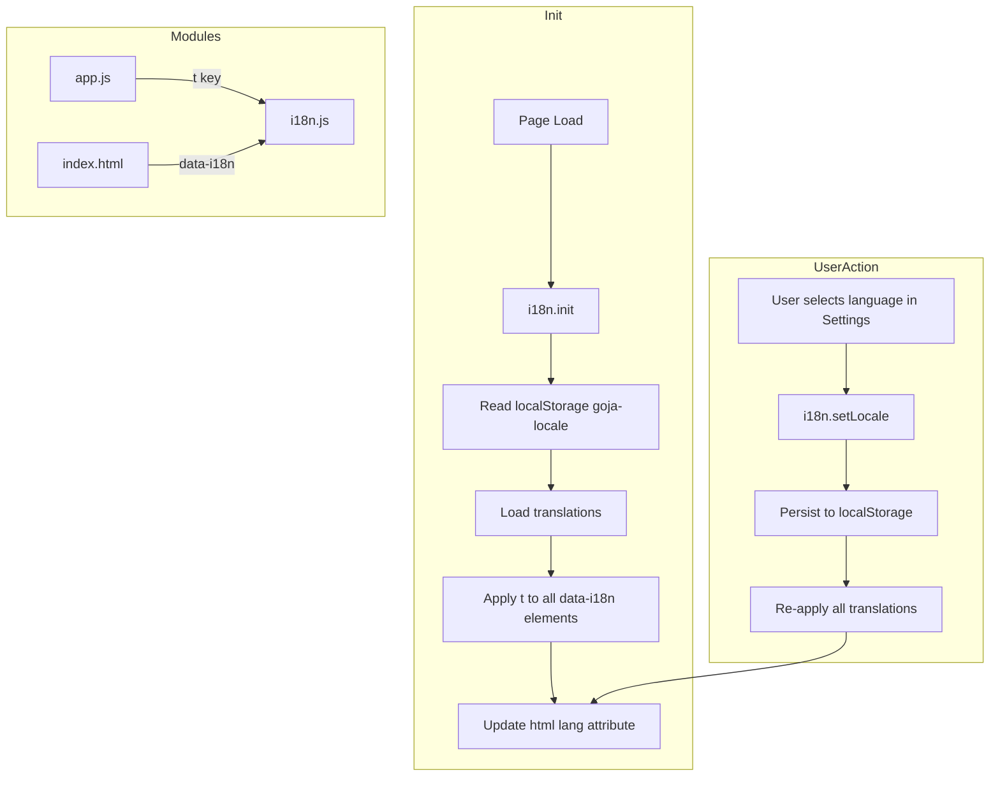

# Goja Multi-Language Support (i18n)

## Is i18n Suitable?

Yes. i18n (internationalization) is the standard approach for multi-language support. For a vanilla JS PWA like Goja, a **lightweight custom i18n module** fits better than heavy frameworks (i18next, formatjs) because:

- Zero runtime dependency, minimal bundle impact
- Works offline (PWA) — translations loaded at init from static files
- Simple `t(key)` lookup and `data-i18n` attribute convention
- Fits the project's bottom-up modular style

---

## Strategy (from [goja_prototype_build_178e81ca.plan.md]())

- **Build-fast, fail-fast**: One change at a time, run tests after each.
- **TDD first**: Write failing tests before implementation; Apply TDD to all changes, if possible.
- **99-line rule**: Split modules, if they exceed 99 real-code lines into smaller ones for modularity
- **No hardcoding**: Use config/constants for all magic values.
- **Bottom-up modules**: Small cooperating units, testable in isolation.
- **DO NOT break other code:** new changes do not break current code unless you have explicit approved reasons.

---

## Coding Rules (from prototype plan)

- Prefer functional programming across the code base, that is, pure functions, immutable data, higher-order functions, etc.
- Take Advantage of JavaScript & Node.js in parallel computing
- All tests in `tests/` (unit in `tests/unit/`, E2E in `tests/e2e/`)
- ES module pattern, named exports
- Run full test suite after every phase

---

## Responsive / Mobile UI Rules (from prototype plan)

- Touch targets minimum 44x44px (`--touch-min`)
- Mobile-first: base styles for phone, `@media` for tablet/desktop
- Settings: bottom sheet on phone (60vh), side panel on tablet (320px)
- Use CSS custom properties in [css/variables.css](02product/01_coding/project/goja/css/variables.css)

---

## Languages


| Code      | Language            | Display label |
| --------- | ------------------- | ------------- |
| `en`      | English             | English       |
| `zh-Hans` | Simplified Chinese  | 简体中文          |
| `zh-Hant` | Traditional Chinese | 繁體中文          |


---

## Architecture




---

## Translation Keys (complete inventory)

All user-visible strings to translate:


| Key                    | English                           | Use                     |
| ---------------------- | --------------------------------- | ----------------------- |
| `brand`                | Goja                              | Top bar brand           |
| `tagline`              | Grid craft. One and only.         | Top bar tagline         |
| `dropZoneText`         | Drop photos here or tap to select | Drop zone               |
| `addBtn`               | + Add                             | Bottom bar              |
| `exportBtn`            | Export                            | Bottom bar              |
| `exporting`            | Exporting...                      | Button state            |
| `clearBtn`             | Clear                             | Bottom bar              |
| `settings`             | Settings                          | Panel title, aria-label |
| `closeSettings`        | Close settings                    | aria-label              |
| `grid`                 | Grid                              | Section legend          |
| `width`                | Width                             | Label                   |
| `height`               | Height                            | Label                   |
| `gap`                  | Gap                               | Label                   |
| `imageFit`             | Image fit                         | Label                   |
| `fitCover`             | Fill                              | Option                  |
| `fitContain`           | Full display                      | Option                  |
| `exportSection`        | Export                            | Section legend          |
| `background`           | Background                        | Label                   |
| `format`               | Format                            | Label                   |
| `watermark`            | Watermark                         | Section legend          |
| `watermarkType`        | Type                              | Label                   |
| `watermarkNone`        | None                              | Option                  |
| `watermarkText`        | Free text                         | Option                  |
| `watermarkDatetime`    | Date/time                         | Option                  |
| `watermarkCopyright`   | Copyright                         | Option                  |
| `watermarkPos`         | Position                          | Label                   |
| `posBottomRight`       | Bottom-right                      | Option                  |
| `posCenter`            | Center                            | Option                  |
| `posTiled`             | Tiled                             | Option                  |
| `watermarkTextLabel`   | Text                              | Label                   |
| `watermarkPlaceholder` | Your name or text                 | Placeholder             |
| `language`             | Language                          | New Settings label      |
| `photoAlt`             | Photo {n}                         | img alt (parameterized) |


**Meta / manifest** (optional, often left in one language): `title`, `description`. Can add `lang`-aware meta via JS if desired.

---

## Directory Structure

```
goja/
  js/
    i18n.js              # Core: t(key), setLocale, init, applyToDOM (~60 lines)
    locales/
      en.js              # English strings
      zh-Hans.js         # Simplified Chinese
      zh-Hant.js         # Traditional Chinese
  index.html             # Add data-i18n attributes, language selector
  tests/
    unit/
      i18n.test.js       # Unit tests for t(), fallback, setLocale
    e2e/
      goja.spec.js       # Add: language switch E2E
```

---

## Implementation Phases

### Phase 1: i18n Core Module (TDD)

1. **Write tests** in `tests/unit/i18n.test.js`:
  - `t(key)` returns translation for current locale
  - `t(key)` falls back to `en` if key missing in current locale
  - `t(key)` returns key if not found anywhere
  - `t('photoAlt', { n: 1 })` supports simple interpolation
  - `setLocale(locale)` changes current locale and persists
  - `getLocale()` returns current locale
  - `getAvailableLocales()` returns `['en','zh-Hans','zh-Hant']`
2. **Implement** [js/i18n.js](02product/01_coding/project/goja/js/i18n.js):
  - Export `t`, `setLocale`, `getLocale`, `init`, `applyToDOM`, `getAvailableLocales`
  - Store translations as imported objects: `import en from './locales/en.js'`
  - `localStorage` key: `goja-locale`
  - Default locale: `en` (or detect from `navigator.language` with fallback)

### Phase 2: Locale Files

Create `js/locales/en.js`, `zh-Hans.js`, `zh-Hant.js`. Each exports default object of key-value pairs. Keep `value` keys aligned across files.

### Phase 3: HTML Integration

1. Add `data-i18n="key"` to elements in [index.html](02product/01_coding/project/goja/index.html) that have static text
2. For `placeholder` and `aria-label`, use `data-i18n-placeholder="key"` and `data-i18n-aria-label="key"` (or a convention like `data-i18n="key"` with `data-i18n-attr="placeholder"`)
3. Add Language selector in Settings:
  - New control group under Grid (or new "General" section)
  - `<select id="langSelect">` with options: English, 简体中文, 繁體中文
  - On change: `i18n.setLocale()`, `i18n.applyToDOM()`, update `document.documentElement.lang`

### Phase 4: JS Dynamic Strings

In [js/app.js](02product/01_coding/project/goja/js/app.js):

- Replace hardcoded "Exporting...", "Export" with `t('exporting')`, `t('exportBtn')`
- In `renderGrid`, replace `Photo ${i+1}` with `t('photoAlt', { n: i + 1 })`
- Call `i18n.init()` at app startup (before other wiring)
- Subscribe to locale change to re-run text updates (or call `applyToDOM` from `setLocale`)

### Phase 5: applyToDOM Logic

- `applyToDOM()`: `querySelectorAll('[data-i18n]')` and set `textContent = t(el.dataset.i18n)`
- For `data-i18n-placeholder`, `data-i18n-aria-label`: set corresponding attribute
- For `<option>` elements: translate text content, keep `value` unchanged
- Update `document.title` and meta description if keys exist

### Phase 6: E2E Tests

Add to [tests/e2e/goja.spec.js](02product/01_coding/project/goja/tests/e2e/goja.spec.js):

- Language selector exists when settings open
- Switching to 简体中文 updates visible text (e.g. "添加" for Add)
- Page refresh persists language choice
- Optionally: test Traditional Chinese

### Phase 7: Service Worker and manifest

- Add [js/i18n.js](02product/01_coding/project/goja/js/i18n.js) and `js/locales/*.js` to [sw.js](02product/01_coding/project/goja/sw.js) ASSETS
- Run `validate-version` / sync if applicable
- manifest.json: Name/description typically stay in one language; optional: document that PWA display name may not change with locale

---

## Interpolation Convention

For parameterized strings (e.g. "Photo 1"):

```javascript
// In locale file: "photoAlt": "Photo {n}"
t('photoAlt', { n: 1 })  // "Photo 1"
```

Simple replace: `str.replace(/\{(\w+)\}/g, (_, k) => params[k] ?? '')`

---

## Browser Language Detection

On first load (no `goja-locale` in storage): detect `navigator.language` or `navigator.languages[0]`. Map to `en`, `zh-Hans`, or `zh-Hant`. Fallback to `en`.

---

## Risk / Edge Cases

- **RTL**: Not needed for zh/en; skip for now
- **Watermark datetime**: `toLocaleString()` in [js/watermark.js](02product/01_coding/project/goja/js/watermark.js) — pass `locale` so date format follows selected language. Requires passing locale into `drawWatermark` or reading from i18n.
- **CSP**: No change; translations are static JS, no `eval`
- **99-line rule**: Keep `i18n.js` under 99 lines; split `applyToDOM` into helper if needed

---

## Files to Create/Modify


| Action | File                                                   |
| ------ | ------------------------------------------------------ |
| Create | `js/i18n.js`                                           |
| Create | `js/locales/en.js`                                     |
| Create | `js/locales/zh-Hans.js`                                |
| Create | `js/locales/zh-Hant.js`                                |
| Create | `tests/unit/i18n.test.js`                              |
| Modify | `index.html` (data-i18n, language selector)            |
| Modify | `js/app.js` (import i18n, use t(), init)               |
| Modify | `js/watermark.js` (optional: pass locale for datetime) |
| Modify | `sw.js` (add i18n + locales to ASSETS)                 |
| Modify | `tests/e2e/goja.spec.js` (language E2E)                |


