# OPPO Export UX: Fix Share Error and Prioritize Save

---

## 1. Guiding Principles (Explicit)

Apply these throughout implementation. Source:
[goja_settings_polish_381858f4.plan.md](goja_settings_polish_381858f4.plan.md).

### 1.1 Development Strategy

- **Build-fast, fail-fast:** One change at a time; run tests after each.
- **TDD first:** Write failing tests before implementation where possible.
- **99-line rule:** Split a source file exceeding 99 real-code lines into smaller files for modularity.
- **No hardcoding:** ALWAYS use config/constants for all magic values.
- **Bottom-up modules:** Small cooperating units, testable in isolation.
- **Non-breaking changes:** New code must not break existing behavior without explicit approval.
- **Reuse code:** Always consider reusing code at the beginning time or in the design phase.

### 1.2 Coding Rules

- Prefer the functional programming paradigm: pure functions, immutable data, higher-order functions.
- Tests in `tests/` (unit: `tests/unit/`, E2E: `tests/e2e/`).
- ES modules, named exports.
- Run full test suite after every phase.

### 1.3 Responsive / Mobile UI Rules

- **Touch targets:** ≥ 44×44px (`--touch-min`).
- **Mobile-first:** Base styles for phone; `@media (min-width: 768px)` for tablet/desktop.
- **Settings pattern:** Bottom sheet (60vh) on phone; side panel (320px) on tablet.
- **Variables:** Use CSS custom properties from [css/variables.css](02product/01_coding/project/goja/css/variables.css) for all layout/spacing values.

---

## 2. Problem Summary

1. **Share shows but fails on OPPO Browser**: `canShareFiles()` uses `hasShare || isNarrowViewport`, so Share appears on mobile even when `navigator.share` is absent. OPPO built-in browser (v40.8.38.9) does not support Web Share API; tapping Share throws "Share not supported".
2. **User priority**: OPPO users urgently need to save the grid image to their phone (ideally gallery). Download is the best web-based option when Share is unavailable.

## 3. Implementation

### 3.1 Fix Share visibility: require `navigator.share`

**File**: [js/export-options.js](02product/01_coding/project/goja/js/export-options.js)

Change `canShareFiles()` to only show Share when the API exists:

```javascript
export function canShareFiles() {
  return typeof navigator !== 'undefined' && typeof navigator.share === 'function';
}
```

- Remove the `isNarrowViewport` fallback; it causes false positives on OPPO.
- On OPPO Browser, Share will no longer appear; Download becomes the primary save path.

### 3.2 Prioritize Download when Share is hidden

**File**: [js/export-options.js](02product/01_coding/project/goja/js/export-options.js)

The first-visible button already gets focus (`firstVisible`). When Share is hidden, Download is first in the array, so focus order is correct.

**Optional enhancement**: Make Download the primary (btn-primary) when Share is hidden so it’s visually prominent:

```javascript
// In showExportOptions, after setting showShare:
if (showShare) {
  shareBtn.classList.add('btn-primary');
  downloadBtn.classList.remove('btn-primary');
  downloadBtn.classList.add('btn-secondary');
} else {
  shareBtn.classList.remove('btn-primary');
  downloadBtn.classList.add('btn-primary');
  downloadBtn.classList.remove('btn-secondary');
}
```

This ensures on OPPO the main CTA is "Save" rather than a secondary button.

### 3.3 i18n: clearer save-action labels for Chinese

**Files**: [js/locales/zh-Hans.js](02product/01_coding/project/goja/js/locales/zh-Hans.js), [js/locales/zh-Hant.js](02product/01_coding/project/goja/js/locales/zh-Hant.js)

Update `exportDownload` to better reflect “save to device”:

- zh-Hans: `"下载"` → `"保存到手机"` (save to phone) or `"保存图片"` (save image)
- zh-Hant: same pattern

Recommend `"保存到手机"` to align with the user’s need; it’s accurate since download saves to the device (often visible in gallery on many Android OEMs).

### 3.4 Optional: success toast for Download

**File**: [js/app.js](02product/01_coding/project/goja/js/app.js)

Current toast: `t('exportSuccess')` for all export actions. For Download specifically, we could use a more helpful message, e.g. a new key `exportDownloadSuccess`: "图片已保存，可在相册或下载中查看". This is optional; the generic success may suffice.

### 3.5 Unit tests

**File**: [tests/unit/export-options.test.js](02product/01_coding/project/goja/tests/unit/export-options.test.js)

Update `canShareFiles` tests:

- Remove the “returns true when viewport is narrow even without navigator.share” case.
- Add “returns false when navigator.share is undefined” (including on narrow viewport).
- Keep “returns true when navigator.share exists”.

### 3.6 CHANGELOG

**File**: [CHANGELOG.md](02product/01_coding/project/goja/CHANGELOG.md)

Add under Unreleased or new patch:

```markdown
### Fixed
- Share option no longer shown on OPPO Browser and similar browsers that lack navigator.share; prevents "Share not supported" error

### Changed
- canShareFiles: require navigator.share (removed viewport fallback)
- Export options: Download becomes primary when Share unavailable
- zh-Hans/zh-Hant: exportDownload label updated to 保存到手机 for clearer save-to-device intent
```

## Flow After Changes

```mermaid
flowchart TD
    subgraph before [Before - OPPO Browser]
        A1[Export clicked] --> B1[Sheet opens]
        B1 --> C1[Share visible - viewport fallback]
        C1 --> D1[User taps Share]
        D1 --> E1[Error: Share not supported]
    end
    
    subgraph after [After - OPPO Browser]
        A2[Export clicked] --> B2[Sheet opens]
        B2 --> C2[Share hidden - no navigator.share]
        C2 --> D2[Download first and primary]
        D2 --> E2[User taps Download]
        E2 --> F2[Image saved to device]
    end
```




## Scope and Risks

- **Low risk**: `canShareFiles` change only hides Share where it would fail.
- **Regression**: On devices where Share worked via the viewport fallback (e.g. `navigator.share` exists but `canShare` was unreliable), Share will still show because `navigator.share` exists.
- **Tests**: Run unit tests for export-options and export-handler; run E2E export flow to confirm Download path.

