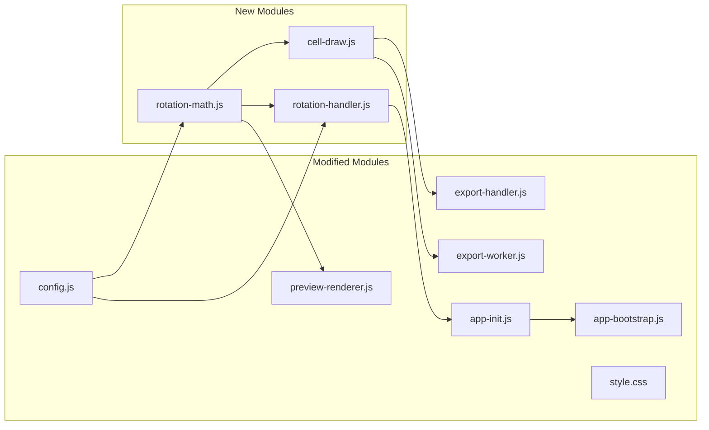

# Goja: Per-Photo Rotation via Draggable Handle

---

## 1. Rules

All rules below MUST be followed during implementation. No exceptions.

### 1.1 Strategy: Build-Fast-and-Fail-Fast

**Principle**: For every change -- bug fix, refactoring, or new feature -- make the smallest possible change first, run the relevant test suite immediately, and fail visibly if something breaks. Do not batch changes. Do not accumulate broken state.

- **New features**: Build one function at a time. Write a failing test first (TDD). Implement to pass. Run the full suite. Move on.
- **Refactoring**: Extract one module at a time. Run tests after each extraction. If a test breaks, fix it before the next extraction. Never refactor two files simultaneously.
- **New tests**: Write tests for one untested module at a time. If writing the test reveals a bug, fix the bug immediately rather than deferring it.
- **One change, one test**: After each atomic change, run the relevant test suite. If it passes, proceed. If it fails, fix immediately.
- **Console.log before polish**: When investigating a bug, log intermediate values. Delete the logs after the fix is proven.
- **Fail visibly**: Prefer `console.warn` over silent swallowing. Catch blocks must at least log.

### 1.2 Coding Rules

- **99-Line Rule**: No JS source file may exceed 99 real lines of code. If a module grows beyond this, split it.
- **Single Responsibility**: One module, one purpose. Split if needed.
- **Functional Programming**: Prefer pure functions, immutable data, composition over mutation.
- **No Hardcoding**: Use CSS custom properties and JS constants for all magic numbers.
- **Bottom-Up Modular**: Build small cooperating modules testable in isolation.
- **ES Module Pattern**: Each module exports named functions. No monolithic files.
- **Test Location**: All tests in `tests/unit/`. E2E tests in `tests/e2e/`.
- **Clean Codebase**: No temporary files left behind.

### 1.3 Responsive UI and CSS

#### Breakpoints

- `<= 480px` -- small phone (iPhone SE, older iPhones)
- `<= 768px` -- large phone / small tablet (iPhone Pro Max, iPad Mini)
- `<= 1024px` -- tablet (iPad, iPad Air)
- `> 1024px` -- desktop (Mac, PC)
- `max-height <= 600px` -- landscape phone mode

#### Cross-Platform

- Touch targets minimum 44x44px on all touch devices.
- No horizontal overflow on any device.
- Use CSS custom properties in `variables.css` -- no hardcoded values.
- Mobile-first: base styles target phone, `@media` queries scale up.
- All interactive controls must be thumb-reachable on phone screens.
- Use `-webkit-` prefixes for Safari compatibility.
- Respect `prefers-color-scheme` for light/dark mode.
- Use `viewport-fit=cover` for iPhone notch/Dynamic Island support.

---

## 2. Feature Overview

Each photo in the grid gains a per-cell rotation angle (0-360 degrees). A small rotation handle appears on each cell. The user drags the handle around the cell center to rotate. The **entire cell** (rectangle + photo + overlays) rotates as one unit. To prevent overlapping neighbors, the rotated cell is **scaled down** so its bounding box fits within the original grid slot. The grid background color is visible in the gaps around each tilted cell.

```
  0 degrees               15 degrees (shrink-to-fit)

┌─────────────┐          ┌─────────────────┐
│             │          │                 │
│   Photo     │   ──►    │   ╱─────────╲   │
│             │          │ ╱   Photo    ╲  │
│             │          │ ╲            ╱  │
└─────────────┘          │   ╲─────────╱   │
                         └─────────────────┘
  Cell flat in grid       Cell tilted + shrunk;
                          background visible in gaps
```

Rotation persists through undo/redo and is applied identically during Canvas export.

### 2.1 Architecture




### 2.2 Photo State Extension

Each photo object gains an `angle` property (degrees, default `0`):

```javascript
{ url: 'blob:...', width: 1920, height: 1080, dateOriginal: Date, angle: 0 }
```

The existing `state.js` `snapshot()` already shallow-copies photo objects with spread, so the `angle` property is automatically preserved through undo/redo with zero changes to [state.js](02product/01_coding/project/goja/js/state.js).

### 2.3 Key Design Decisions

**Whole-cell rotation with shrink-to-fit**:

- The CSS `transform: rotate() scale()` is applied to the `.preview-cell` div, **not** the `` inside it. The photo, vignette overlay, and capture date all rotate together.
- The scale-down factor ensures the rotated cell's axis-aligned bounding box fits within the original grid slot. Formula: `s = min(w / bbW, h / bbH)` where `bbW = w|cos θ| + h|sin θ|` and `bbH = w|sin θ| + h|cos θ|`. Result clamped to `min(s, 1.0)` to guard against floating-point imprecision at exact multiples of 90 degrees.
- At 0 degrees: scale = 1 (no change). At 45 degrees on a square: scale = 1/sqrt(2) = 0.707.
- `fitScaleFactor` MUST receive actual cell dimensions (not 1:1), because cells are rectangular depending on template and ratios. Using `(1, 1)` overestimates the scale and causes overlap on non-square cells.

**Direct CSS update during drag (no full re-render)**:

- `renderGrid` starts with `container.innerHTML = ''`, which destroys all DOM including rotation handles. A full re-render during drag would destroy the handle mid-interaction and cause 60+ `renderGrid` calls per second.
- Instead: during active drag, the rotation handler updates `cell.style.transform` directly on the existing DOM element. Only on drag-end does the handler write the final angle to photo state and trigger a full `updatePreview`.

**Handle counter-scale for touch target**:

- The rotation handle is inside the cell div. When the cell scales down, the handle shrinks with it. At 45 degrees on a square cell, a 28px handle becomes ~20px and the 44px touch target becomes ~31px, violating the minimum.
- Fix: set a CSS custom property `--cell-scale` on the cell; the handle applies `transform: scale(calc(1 / var(--cell-scale, 1)))` to maintain constant visual and touch size.

**Extracted `cell-draw.js` module (DRY)**:

- The per-cell draw loop (photo + vignette + capture date) is currently duplicated in `export-handler.js` (lines 36-56) and `export-worker.js` (lines 37-57). Adding rotation to both would create triple duplication.
- A new `cell-draw.js` module provides `drawCellContent(ctx, img, cell, options)` that handles the full sequence: rotation transform, photo, vignette, capture date, context restore. Both export paths import and call it.
- This also helps `export-handler.js` (currently 126 lines) stay within the 99-line rule.

### 2.4 Files Changed Per Phase

- **Phase 1** -- New: `js/rotation-math.js`, `tests/unit/rotation-math.test.js`
- **Phase 2** -- Modified: `js/config.js`
- **Phase 3** -- New: `js/cell-draw.js`, `tests/unit/cell-draw.test.js`; Modified: `js/export-handler.js`, `js/export-worker.js`
- **Phase 4** -- New: `js/rotation-handler.js`, `tests/unit/rotation-handler.test.js`
- **Phase 5** -- Modified: `js/preview-renderer.js`
- **Phase 6** -- Modified: `js/cell-draw.js` (add rotation); `js/export-handler.js`, `js/export-worker.js` (pass angles)
- **Phase 7** -- Modified: `js/app-init.js`, `js/app-bootstrap.js`, `css/style.css`
- **Phase 8** -- Modified: all 11 locale files under `js/i18n/`

---

## 3. Implementation Phases

### Phase 1: Pure Math Module

**New file**: [js/rotation-math.js](02product/01_coding/project/goja/js/rotation-math.js)
**Test file**: [tests/unit/rotation-math.test.js](02product/01_coding/project/goja/tests/unit/rotation-math.test.js)

Three pure functions:

- `computeAngleDeg(cx, cy, px, py)` -- Returns the angle in degrees (0-360) from center `(cx, cy)` to pointer `(px, py)`. Uses `Math.atan2`. 0 degrees = up (12 o'clock), clockwise positive.
- `fitScaleFactor(angleDeg, cellW, cellH)` -- Returns the scale-down factor `s` so a rectangle of `(cellW, cellH)` rotated by `angleDeg` has a bounding box that fits within the original `(cellW, cellH)`. Formula: `bbW = cellW * |cos θ| + cellH * |sin θ|; bbH = cellW * |sin θ| + cellH * |cos θ|; s = min(cellW / bbW, cellH / bbH)`. **Clamp result**: `s = Math.min(s, 1.0)` to guard against floating-point imprecision at 0/90/180/270 degrees.
- `normalizeAngle(deg)` -- Normalizes any degree value to `[0, 360)`.

**Tests**:

- `computeAngleDeg`: pointer directly above center = 0, right = 90, below = 180, left = 270, coincident point = 0
- `fitScaleFactor`: 0 deg = 1.0 (any cell shape), 45 deg on 100x100 = ~0.707, 90 deg on 100x100 = 1.0, 90 deg on 200x100 = 0.5, 45 deg on 200x100 = ~0.471, negative angles, result never exceeds 1.0
- `normalizeAngle`: 0 = 0, 360 = 0, -90 = 270, 720 = 0, -450 = 270

### Phase 2: Config Constants

**Modified file**: [js/config.js](02product/01_coding/project/goja/js/config.js)

Add:

- `ROTATION_HANDLE_SIZE = 28` -- Handle visual diameter in CSS px
- `ROTATION_HANDLE_OFFSET = 8` -- Inset from cell corner in CSS px
- `ROTATION_DEFAULT_ANGLE = 0` -- Default rotation angle
- `ROTATION_KEYBOARD_STEP = 1` -- Degrees per arrow key press

### Phase 3: Extract `cell-draw.js` (refactoring, no new behavior)

**New file**: [js/cell-draw.js](02product/01_coding/project/goja/js/cell-draw.js)
**Test file**: [tests/unit/cell-draw.test.js](02product/01_coding/project/goja/tests/unit/cell-draw.test.js)
**Modified files**: [js/export-handler.js](02product/01_coding/project/goja/js/export-handler.js), [js/export-worker.js](02product/01_coding/project/goja/js/export-worker.js)

Extract the duplicated per-cell draw loop into a single function:

```javascript
export function drawCellContent(ctx, img, cell, options) {
  const { fitMode, backgroundColor, filter,
    vignetteEnabled, vignetteStrength,
    showCaptureDate, captureDateStr, captureDatePos,
    captureDateOpacity, captureDateFontScale } = options;

  drawPhotoOnCanvas(ctx, img, cell, { fitMode, backgroundColor, filter });
  if (vignetteEnabled) drawVignetteOverlay(ctx, cell, { strength: vignetteStrength });
  if (showCaptureDate && captureDateStr) {
    drawCaptureDateOverlay(ctx, cell, captureDateStr, {
      position: captureDatePos, opacity: captureDateOpacity,
      fontScale: captureDateFontScale, backgroundColor,
    });
  }
}
```

Both `exportMainThread` and worker `onmessage` replace their per-cell loop bodies with `drawCellContent(ctx, img, cell, opts)`. This is a **pure refactor** -- no behavioral change. All existing export tests must pass.

**Rationale**: Eliminates the existing duplication between export-handler.js and export-worker.js, and prepares a single insertion point for rotation in Phase 6. Also helps export-handler.js stay within the 99-line rule.

### Phase 4: Rotation Handler Module

**New file**: [js/rotation-handler.js](02product/01_coding/project/goja/js/rotation-handler.js)
**Test file**: [tests/unit/rotation-handler.test.js](02product/01_coding/project/goja/tests/unit/rotation-handler.test.js)

Single exported function:

- `enableRotation(gridEl, getPhotos, getLayout, onRotate, onRotateStart)` -- Attaches rotation handles to each `.preview-cell` after render. Returns a cleanup function.

**Behavior**:

- After each `renderGrid` call, iterate over `.preview-cell` elements and append a rotation handle (small circular div with a rotate icon via CSS)
- Position: top-right corner of the cell, offset inward by `ROTATION_HANDLE_OFFSET`
- On `mousedown` / `touchstart` on the handle: call `onRotateStart()` (pushes undo state), begin tracking
- **During drag** (`mousemove` / `touchmove`): compute angle via `computeAngleDeg()` from cell center to pointer. Update `cell.style.transform` and `cell.style.setProperty('--cell-scale', s)` directly on the DOM -- do NOT trigger full re-render. Throttle via `requestAnimationFrame`.
- On `mouseup` / `touchend`: stop tracking, call `onRotate(cellIndex, finalAngleDeg)` which writes to state and triggers full `updatePreview`

**Constraints** (per Section 1.2 and 1.3):

- MUST NOT interfere with existing drag-to-reorder (handle events call `stopPropagation()`)
- MUST be keyboard-accessible (left/right arrow keys rotate by `ROTATION_KEYBOARD_STEP` degrees)
- MUST meet 44x44px minimum touch target (handle uses counter-scale, see Section 2.3)

### Phase 5: Preview Rendering with Rotation

**Modified file**: [js/preview-renderer.js](02product/01_coding/project/goja/js/preview-renderer.js)

Apply rotation to the `.preview-cell` div (not the ``). In `renderGrid`, after building the cell div (line ~42-52), read the photo's angle and the cell's pixel dimensions from `layout.cells[i]`:

```javascript
const angle = photos[idx].angle || 0;
if (angle !== 0) {
  const pixelCell = layout.cells[i];
  const s = fitScaleFactor(angle, pixelCell.width, pixelCell.height);
  cell.style.transform = `rotate(${angle}deg) scale(${s})`;
  cell.style.setProperty('--cell-scale', String(s));
}
```

Import `fitScaleFactor` from `rotation-math.js`. Key points:

- Uses **actual cell pixel dimensions** from `layout.cells[i].width` / `.height` (confirmed available from `computeGridLayout` and `recomputePixelCells`). NOT `(1, 1)` -- using square dimensions would give wrong scale for rectangular cells.
- Sets `--cell-scale` CSS variable so the rotation handle can counter-scale itself (see Phase 7 CSS).
- The cell's `overflow: hidden` (line 48) clips photo content. The shrink-to-fit prevents neighbor overlap.

### Phase 6: Canvas Export with Rotation

**Modified file**: [js/cell-draw.js](02product/01_coding/project/goja/js/cell-draw.js)

Add rotation wrapping to `drawCellContent`. The rotation transform wraps the entire cell draw sequence:

```javascript
export function drawCellContent(ctx, img, cell, options) {
  const angle = options.angle || 0;
  if (angle !== 0) {
    const cx = cell.x + cell.width / 2;
    const cy = cell.y + cell.height / 2;
    const s = fitScaleFactor(angle, cell.width, cell.height);
    ctx.save();
    ctx.translate(cx, cy);
    ctx.rotate(angle * Math.PI / 180);
    ctx.scale(s, s);
    ctx.translate(-cx, -cy);
  }

  drawPhotoOnCanvas(ctx, img, cell, { ... });
  if (vignetteEnabled) drawVignetteOverlay(ctx, cell, { ... });
  if (showCaptureDate && captureDateStr) drawCaptureDateOverlay(ctx, cell, ...);

  if (angle !== 0) ctx.restore();
}
```

**Modified files**: [js/export-handler.js](02product/01_coding/project/goja/js/export-handler.js) and [js/export-worker.js](02product/01_coding/project/goja/js/export-worker.js)

Pass per-photo angles into `drawCellContent`:

- In `exportMainThread`: `angle: photos[photoOrder[i]]?.angle || 0` added to the options
- In `exportViaWorker`: construct `angles: photos.map(p => p.angle || 0)` and include in `postMessage` payload
- In worker `onmessage`: read `angles` from `e.data` and pass `angle: (angles || [])[photoOrder[i]] || 0` to `drawCellContent`

Import `fitScaleFactor` from `rotation-math.js` only in `cell-draw.js`. The export files don't need it directly.

### Phase 7: Integration Wiring and CSS

**JS wiring**:

- [js/app-init.js](02product/01_coding/project/goja/js/app-init.js) -- Call `enableRotation()` after `enableDragAndDrop()` and `enableCellContextMenu()`. Wire `onRotate` to update `stateRef.photos[idx].angle` and call `updatePreview`. Wire `onRotateStart` to call `pushState`.
- [js/app-bootstrap.js](02product/01_coding/project/goja/js/app-bootstrap.js) -- Import `enableRotation`, pass it into `initApp` via `deps`.

**CSS** ([css/style.css](02product/01_coding/project/goja/css/style.css)):

Rotation handle styles (must comply with Section 1.3):

- `.rotation-handle`: absolute positioned, top-right corner, circular, semi-transparent background, rotate icon (CSS-only or inline SVG), `cursor: grab`, z-index above vignette overlay
- `.rotation-handle:active`: `cursor: grabbing`
- **Counter-scale**: `.rotation-handle { transform: scale(calc(1 / var(--cell-scale, 1))); }` -- maintains constant 28px visual and 44px touch target regardless of cell shrink
- Touch target: 44px minimum hit area via padding or `::before` pseudo-element
- Mobile-first: base styles for phone; scale handle size via `@media` if needed at larger breakpoints
- Use `-webkit-` prefixes for `transform` and `cursor` where needed for Safari
- Handle must not cause horizontal overflow on any viewport width

### Phase 8: i18n

Add `rotatePhoto` key to all 11 locale files for the rotation handle's `aria-label`:

- en: "Rotate photo"
- zh-Hans: "旋转照片"
- zh-Hant: "旋轉照片"
- de: "Foto drehen"
- nl: "Foto draaien"
- es: "Rotar foto"
- it: "Ruota foto"
- tr: "Fotoğrafı döndür"
- fi: "Kierrä kuvaa"
- ja: "写真を回転"
- eo: "Turni foton"

---

## 4. Known Risks and Mitigations

### 4.1 Touch gesture conflicts

The rotation handle's `touchstart` calls `stopPropagation()`, preventing it from reaching the grid's drag-to-reorder and long-press context menu handlers. This is deliberate: touching the handle initiates rotation, not drag or menu. The rest of the cell image remains draggable for reordering.

### 4.2 Reduced draggable area at extreme angles

At 45 degrees, cells shrink to ~70% of their slot. The visible gap area within the grid slot does not respond to drag-to-reorder (since `elementFromPoint` hits the grid container, not an image). This is expected behavior. At moderate angles (< 20 degrees, scale > 0.9), the impact is negligible.

### 4.3 Resize handles unaffected

Resize handles live in a separate overlay (not inside cells), so cell rotation does not affect their position or behavior. After resizing, `recomputePixelCells()` updates cell dimensions and a re-render recomputes rotation scale factors with the new aspect ratios.

### 4.4 Angle persists with photo, not cell slot

The `angle` property is on the photo object, not the cell. When photos are reordered (swapped), the rotation follows the photo to its new cell. This is the intended behavior: rotation is a property of the photo, not of the grid position.

---

## 5. Verification Checklist

Run after **every** phase. All items must pass before proceeding to the next phase.

**Tests**:

- All unit tests pass: `npm run test`
- All E2E tests pass: `npm run test:e2e`

**Code quality** (per Section 1.2):

- No new magic numbers; all constants imported from `config.js`
- Each new file respects the 99-line rule
- No temporary files left behind

**Non-breaking** (per Section 1.1):

- Existing features unbroken: drag-to-reorder, long-press remove, resize handles, undo/redo, export

**Responsive and accessible** (per Section 1.3):

- Touch targets meet 44x44px minimum (including after cell shrink via counter-scale)
- No horizontal overflow on any breakpoint (480px, 768px, 1024px, desktop)
- Handle accessible via keyboard (arrow keys) and screen reader (`aria-label`)

