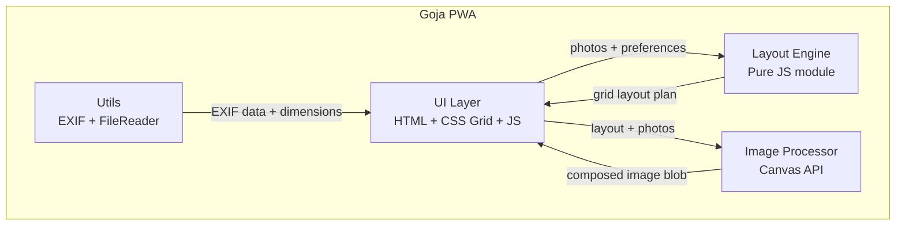
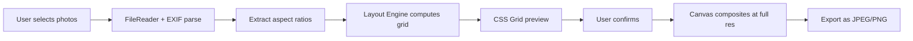

# Goja Prototype Build Plan

## Branding

- **English name**: Goja
- **Chinese name**: 宫将
- **English tagline**: Grid craft. One and only.
- **Chinese tagline**: 宫格匠，独一个。
- **Logo concept**: Minimal geometric -- a 2x2 grid of rounded squares with subtle shade variations (light to deep teal/blue). Monochrome variant for favicon/PWA icon. Wordmark "Goja" sits beside the icon when space allows.

## Project Location

`02product/01_coding/project/goja/`

## Target Platforms

Goja must work well on all of the following devices and form factors:

- **iPhone** (Safari) -- small screen, touch-only, portrait-dominant
- **iPad** (Safari) -- medium screen, touch-only, both orientations
- **Mac** (Safari / Chrome) -- desktop, trackpad/mouse, including Mac Studio, MacBook, iMac
- **Windows PC** (Chrome / Edge) -- desktop, mouse, various screen sizes

As a PWA, Goja runs in the browser on all platforms with no native app install required. The UI must adapt seamlessly across these devices:

- **Phone (iPhone)**: Single-column layout, large touch targets, bottom-reachable controls, full-width preview
- **Tablet (iPad)**: Two-column or flexible layout, side panel for controls, larger preview area
- **Desktop (Mac / PC)**: Spacious layout, drag-and-drop zone prominent, side-by-side controls and preview, keyboard shortcuts

## Architecture (Plan B: Pure Canvas API)




## Data Flow




## Directory Structure

```
goja/
  index.html                    # Main app with responsive layout
  manifest.json                 # PWA manifest with Goja branding
  sw.js                         # Service worker for offline caching
  assets/
    logo.svg                    # 512x512 logo (2x2 teal grid)
    logo-192.svg                # 192x192 icon variant
  css/
    variables.css               # CSS custom properties (colors, spacing, breakpoints, dark mode)
    style.css                   # Main styles, mobile-first, 4 breakpoints
  js/
    app.js                      # UI controller, event wiring (96 LoC)
    layout-engine.js            # Grid layout computation (71 LoC)
    image-processor.js          # Canvas compositing (42 LoC)
    export-handler.js           # Export + download logic (33 LoC)
    utils.js                    # EXIF orientation helpers (30 LoC)
  tests/
    unit/
      layout-engine.test.js     # 19 tests
      image-processor.test.js   # 7 tests
      utils.test.js             # 15 tests
    e2e/
      goja.spec.js              # 6 E2E tests
    fixtures/                   # Test images (landscape, portrait, square)
  package.json
  vitest.config.js
  playwright.config.js
```

## Strategy: Build-Fast-and-Fail-Fast

**Principle**: For every change -- bug fix, refactoring, or new feature -- make the smallest possible change first, run the relevant test suite immediately, and fail visibly if something breaks. Do not batch changes. Do not accumulate broken state.

- **New features**: Build one function at a time. Write a failing test first (TDD). Implement to pass. Run the full suite. Move on.
- **Refactoring**: Extract one module at a time. Run tests after each extraction. If a test breaks, fix it before the next extraction. Never refactor two files simultaneously.
- **New tests**: Write tests for one untested module at a time. If writing the test reveals a bug, fix the bug immediately rather than deferring it.
- **One change, one test**: After each atomic change, run the relevant test suite. If it passes, proceed. If it fails, fix immediately.
- **Console.log before polish**: When investigating a bug, log intermediate values. Delete the logs after the fix is proven.
- **Fail visibly**: Prefer `console.warn` over silent swallowing. Catch blocks must at least log.

---

## Coding Rules

These rules govern ALL changes in this project:

- **TDD First**: Write failing tests before implementation. Every new function gets a unit test.
- **99-Line Rule**: No source file may exceed 99 real lines of code (excluding comments and blanks). If a module grows beyond this, split it.
- **Single Responsibility**: One module, one purpose. If a module has two responsibilities, split it.
- **Functional Programming**: Prefer pure functions, immutable data, composition over mutation. Isolate side effects at module boundaries.
- **No Hardcoding**: Use configuration objects or constants for all magic numbers, breakpoints, timeouts, colors.
- **Bottom-Up Modular**: Build small cooperating modules. Each module testable in isolation.
- **ES Module Pattern**: Each module exports named functions. No monolithic files.
- **Test Location**: All tests in `tests/` (unit in `tests/unit/`, E2E in `tests/e2e/`).
- **Clean Codebase**: No temporary files left behind.
- **Run All Tests**: After every phase, run full test suite to catch regressions.

---

## Responsive UI and CSS Rules

### Breakpoints

- `<= 480px` -- small phone (iPhone SE, older iPhones)
- `<= 768px` -- large phone / small tablet (iPhone Pro Max, iPad Mini)
- `<= 1024px` -- tablet (iPad, iPad Air)
- `> 1024px` -- desktop (Mac, PC)
- `max-height <= 600px` -- landscape phone mode

### Layout Behavior

- **Phone (<=768px)**: Single-column, controls stacked below preview, full-width photo grid, bottom-sheet style controls
- **Tablet (<=1024px)**: Preview takes 2/3 width, controls panel on the side
- **Desktop (>1024px)**: Spacious layout, drag-and-drop zone prominent, side-by-side controls and full preview

### Cross-Platform Rules

- Touch targets minimum 44x44px on all touch devices (iPhone, iPad).
- No horizontal overflow on any device.
- Use CSS custom properties in `variables.css` -- no hardcoded colors, spacing, or sizes.
- `!important` only as last resort; prefer specificity instead.
- Mobile-first: base styles target phone, `@media` queries scale up for tablet and desktop.
- All interactive controls must be thumb-reachable on phone screens.
- Test on Safari (iOS/macOS) and Chrome (desktop) -- these are the primary browsers for the target platforms.
- Use `-webkit-` prefixes where needed for Safari compatibility (e.g., `-webkit-touch-callout`, `-webkit-overflow-scrolling`).
- Respect `prefers-color-scheme` for light/dark mode support across all platforms.
- Use `viewport` meta tag with `viewport-fit=cover` for iPhone notch/Dynamic Island support.

---

## Tech Stack

- **UI**: Vanilla HTML + CSS Grid + JavaScript (ES modules)
- **Image Processing**: Native Canvas API (`drawImage`, `toBlob`)
- **Unit/Integration Tests**: Vitest + jsdom (same as [Todoja/package.json](02product/01_coding/project/Todoja/package.json))
- **E2E Tests**: Playwright (same config pattern as [Todoja/playwright.config.js](02product/01_coding/project/Todoja/playwright.config.js))
- **Dev Server**: Live Server (VS Code extension) or `http-server` for Playwright

## Implementation Phases (Bottom-Up, TDD)

### Phase 1: Project Scaffolding

- Create directory structure, `package.json` (ES modules), Vitest config, Playwright config
- Follow the same conventions as Todoja: `"type": "module"`, same Playwright `webServer` pattern with `http-server`

### Phase 2: Layout Engine (TDD)

Core pure-JS module with zero DOM dependency — fully testable with Vitest.

**Key functions:**

- `classifyPhoto(width, height)` — returns `"landscape"` / `"portrait"` / `"square"`
- `computeGridLayout(photos, options)` — given an array of `{width, height}`, returns `{rows, cols, cells: [{row, col, width, height, cropRegion}]}`
- Layout templates for common counts (2-9 photos)
- Scoring function to pick the best template based on aspect ratio distribution

**TDD sequence:**

1. Write tests for `classifyPhoto` with landscape/portrait/square inputs
2. Write tests for `computeGridLayout` with 2, 4, 6, 9 photos (all landscape, all portrait, mixed)
3. Implement to pass tests

### Phase 3: Utils Module (TDD)

- `readImageDimensions(file)` — read image dimensions via Image element
- EXIF orientation correction helper (basic implementation, no heavy library for v1)

### Phase 4: Image Processor (TDD)

Canvas compositing module. Uses jsdom + mock canvas for unit tests.

**Key functions:**

- `compositeGrid(photos, layout, options)` — draws all photos onto a single canvas per the layout
- `exportImage(canvas, format, quality)` — exports as Blob

**Options:** `{gap, backgroundColor, borderRadius, outputWidth}`

### Phase 5: UI Layer

- `index.html` with drag-and-drop zone + file picker
- CSS Grid live preview (thumbnail size)
- Controls: gap slider, background color picker, export format selector
- Export/download button
- Modern, clean design with responsive layout

### Phase 6: E2E Tests (Playwright)

- Upload photos and verify grid preview renders
- Change settings and verify preview updates
- Export and verify download triggers

### Phase 7: Logo and Branding

- Generate Goja logo: minimal geometric 2x2 grid of rounded squares (teal/blue palette)
- Create favicon, PWA icons (192x192, 512x512)
- Integrate tagline "Grid craft. One and only." into the UI header/splash

### Phase 8: PWA (Lightweight)

- `manifest.json` with Goja branding, icons, theme color
- Basic `sw.js` for offline caching

---

## Completion Summary (2026-02-20)

All 8 phases completed. Prototype v0.1.0 is functional.

### Test Results

- **Unit tests (Vitest)**: 41 passed (19 layout-engine + 15 utils + 7 image-processor)
- **E2E tests (Playwright)**: 6 passed (branding, drop zone, upload, gap slider, clear, export)
- **Total: 47 tests, all green**

### Key Implementation Notes

- `export-handler.js` was extracted from `app.js` to satisfy the 99-line rule
- Playwright config uses port 5501 to avoid conflict with Live Server on 5500
- Logo created as SVG (vector, scalable) rather than raster PNG
- Canvas `getContext('2d')` mocked in unit tests since jsdom has no native canvas support
- Dark mode supported via `prefers-color-scheme` media query in `variables.css`

