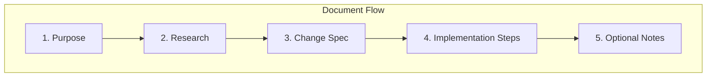

# Refactor China App Presets Plan

## Current Issues

- **Guiding Principles (lines 71–99)** — Generic Goja rules (TDD, 99-line rule, etc.) are out of scope for this small addendum and dilute the focus.
- **Flat structure** — Research, change spec, and implementation are interleaved without a clear hierarchy.
- **Vague implementation scope** — Three bullet points lack the step-by-step format used in the parent plan.
- **Redundant context** — Summary and "Plan File Changes" overlap in intent.

## Proposed New Structure




### Section 1: Purpose (1 short paragraph)

- State what we're doing and where it fits (section 4.3 of parent plan).
- Link to parent plan.

### Section 2: China App Specifications

- Keep the table as-is — it's clear.
- Add 2–3 concise bullets for key takeaways (primary formats, Xiaohongshu 3:4, WeChat flexibility).

### Section 3: Change Specification

- **Before:** Exact current text from 4.3.
- **After:** Exact replacement text.
- **Rationale:** One line on why separate presets for Douyin/Kuaishou/WeChat despite shared 1080×1920.

### Section 4: Implementation Steps (actionable table)

Convert the current "Implementation Scope" into a step-by-step table consistent with the parent plan:


| Step | Action                                                    | File                       |
| ---- | --------------------------------------------------------- | -------------------------- |
| 1    | Add 4 preset buttons with `data-w`, `data-h`, `data-i18n` | index.html                 |
| 2    | Add i18n keys for all 11 locales                          | js/locales/*.js            |
| 3    | Update GATE 6 progress checklist                          | goja_improvement_proposals |


### Section 5: Optional Layout

- Keep the two-row / flex-wrap options as a short note.
- Label explicitly as "Optional" so it doesn't distract from core steps.

### Removed

- **Guiding Principles (1.1–1.3)** — Remove entirely. These belong in a project-wide rules doc, not in this feature addendum. The parent plan and project rules already cover TDD and conventions.

## Refactored Content (Replace File With)

---

```markdown
---
name: Add China app presets
overview: "Extend section 4.3 of the Goja Improvement Proposals to add aspect ratio presets for mainland China apps: 抖音, 小红书, 快手, 视频号."
todos: []
isProject: false
---

# Add China App Aspect Presets

## 1. Purpose

Update section **4.3 Aspect Ratio Presets** in [goja_improvement_proposals_9895157a.plan.md](goja_improvement_proposals_9895157a.plan.md) to include presets for popular mainland China apps.

## 2. China App Specifications

| App | Format | Dimensions | Ratio |
|-----|--------|------------|-------|
| **抖音 Douyin** | Vertical video | 1080×1920 | 9:16 |
| **小红书 Xiaohongshu** | Portrait image/video | 1080×1440 | 3:4 |
| **快手 Kuaishou** | Vertical video | 1080×1920 | 9:16 |
| **视频号 WeChat Channels** | Vertical | 1080×1920 or 1080×1236 | 9:16 / ~7:9 |

- Douyin and Kuaishou: primary vertical 1080×1920 (9:16).
- Xiaohongshu: 1080×1440 (3:4) — common portrait format.
- WeChat Channels: 1080×1920 or 1080×1236.

## 3. Change Specification

**Current (section 4.3):**

```

- Preset buttons in Settings → Grid: 1:1 (1080×1080), 4:3, 16:9, Instagram (1080×1350), Stories (1080×1920).
- Buttons set frameWidth/frameHeight and trigger updatePreview().

```

**Replace with:**

```

- Preset buttons in Settings → Grid:
  - General: 1:1 (1080×1080), 4:3 (1080×1440), 16:9 (1080×608)
  - International: Instagram (1080×1350), Stories (1080×1920)
  - 中国大陆 China: 抖音 (1080×1920), 小红书 (1080×1440), 快手 (1080×1920), 视频号 (1080×1920)
- Buttons set frameWidth/frameHeight and trigger updatePreview().
- i18n: presetDouyin, presetXiaohongshu, presetKuaishou, presetWechatChannels for all locales.

```

**Rationale:** Douyin, Kuaishou, and WeChat Channels share 1080×1920 with Stories. Separate presets give Chinese users explicit, familiar names.

## 4. Implementation Steps

| Step | Action | File |
|------|--------|------|
| 1 | Add 4 preset buttons in #aspectPresets with data-w, data-h, data-i18n | [index.html](02product/01_coding/project/goja/index.html) |
| 2 | Add i18n keys for all 11 locales | [js/locales/*.js](02product/01_coding/project/goja/js/locales/) |
| 3 | Update GATE 6 preset list in parent plan | goja_improvement_proposals |

## 5. Optional Layout

If the preset bar is crowded: group into two rows (Row 1: 1:1, 4:3, 16:9, Instagram, Stories; Row 2: 抖音, 小红书, 快手, 视频号) or use flex-wrap.
```

---

## File to Modify

- [goja_add_china_app_presets_d97bd6e9.plan.md](goja_add_china_app_presets_d97bd6e9.plan.md)

## Summary

- **Add:** Clear section hierarchy (Purpose → Research → Change Spec → Implementation → Optional).
- **Improve:** Step table for implementation; explicit before/after and rationale.
- **Remove:** Guiding Principles block (29 lines) — not specific to this feature.

