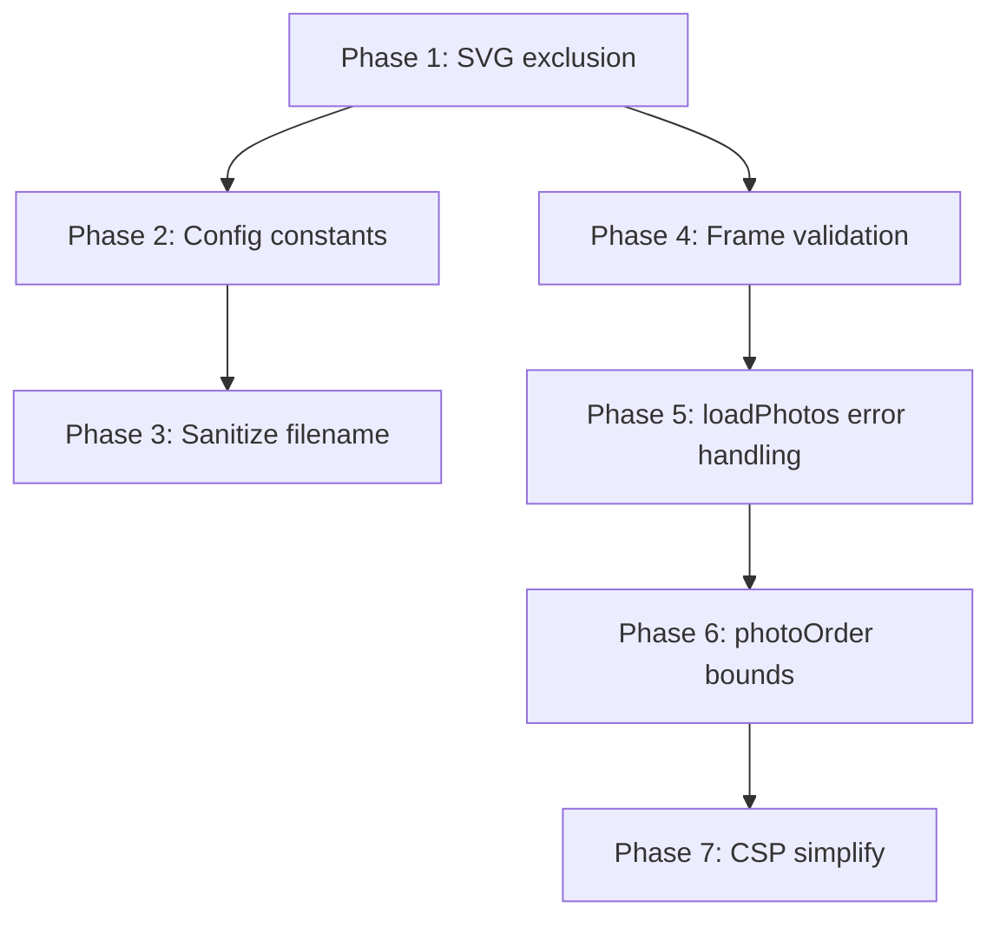

# Goja Security Audit Implementation Plan

## Status: **Completed** (2025-02-23)

All 7 phases implemented. Unit tests: 318 passed. E2E tests: 38 passed.

## Design and Coding Rules (from GRID_EFFECTS_SHARING_ANALYSIS.md)

**These rules MUST be followed during implementation.**

### Development Strategy

- **Build-fast, fail-fast:** Make exactly one logical change at a time. Run the full test suite after each change. If tests fail, fix before proceeding.
- **TDD first:** For any new behavior, write failing tests first. Implement only enough to make them pass.
- **99-line rule:** Any source file exceeding 99 real-code lines (excluding comments and blank lines) MUST be split into smaller modules.
- **No hardcoding:** All magic values MUST live in [js/config.js](02product/01_coding/project/goja/js/config.js). Import from config; never inline literals.
- **Bottom-up modules:** Build from small, cooperable units. Each module does one thing. Higher-level code composes these units.
- **Non-breaking changes:** New code MUST NOT break existing behavior. All existing tests MUST remain green.
- **Reuse code:** Check for existing similar behavior. Reuse or extend existing modules rather than duplicating.

### Coding Rules

- **Functional style:** Prefer pure functions, immutable data, higher-order functions. Isolate mutations.
- **Test location:** Unit tests in `tests/unit/`. E2E tests in `tests/e2e/`.
- **Module system:** ES modules only. Named exports.
- **Full test suite:** After every implementation phase, run `npm run test` and `npm run test:e2e`. All MUST pass.

### Verification (before each phase complete)

- All unit and E2E tests pass.
- No new magic numbers; constants from config.
- File length respects 99-line rule.
- Touch targets and mobile layout rules satisfied (unchanged by this refactor).

---

## Implementation Phases

### Phase 1: Exclude SVG from photo loading (Medium - Security)

**Audit item #1:** SVG images can contain scripts; exclude `image/svg+xml` when accepting files.

**Files to modify:**

- [js/photo-loader.js](02product/01_coding/project/goja/js/photo-loader.js)
- [tests/unit/photo-loader.test.js](02product/01_coding/project/goja/tests/unit/photo-loader.test.js)

**Steps:**

1. **TDD:** Add test in `photo-loader.test.js`: "ignores SVG files" — pass array including an SVG file, expect 0 photos pushed.
2. **Implement:** In `photo-loader.js`, tighten the filter from `f.type.startsWith('image/')` to also exclude `image/svg+xml`:

```js
   const items = Array.from(files).filter((f) => {
     const t = (f.type || '').toLowerCase();
     return t.startsWith('image/') && t !== 'image/svg+xml';
   });
   

```

1. Run `npm run test` and `npm run test:e2e`. Fix any regressions before proceeding.

---

### Phase 2: Add config constants for export filename (Prep for Phase 3)

**Audit item #2 prep:** Centralize export filename defaults and limits before adding sanitization.

**Files to modify:**

- [js/config.js](02product/01_coding/project/goja/js/config.js)

**Steps:**

1. Add to config:

```js
   export const EXPORT_FILENAME_DEFAULT = 'goja-grid';
   export const EXPORT_FILENAME_MAX_LENGTH = 200;
   

```

1. Run full test suite. No behavioral change; only adds constants for use in Phase 3.

---

### Phase 3: Sanitize export filename (Low - Security)

**Audit item #2:** Prevent path traversal and reserved characters in export filename.

**Files to modify:**

- [js/utils.js](02product/01_coding/project/goja/js/utils.js) — add `sanitizeFilename` pure function
- [tests/unit/utils.test.js](02product/01_coding/project/goja/tests/unit/utils.test.js)
- [js/export-flow.js](02product/01_coding/project/goja/js/export-flow.js) — use sanitizeFilename
- [js/export-handler.js](02product/01_coding/project/goja/js/export-handler.js) — use sanitizeFilename (filename is passed in; callers use it from export-flow)

**Steps:**

1. **TDD:** Add tests for `sanitizeFilename` in `utils.test.js`:
  - Returns default when empty/null/whitespace
  - Strips path separators and reserved chars (`/ \ ? % * : | " < >`)
  - Collapses `..` sequences
  - Truncates to EXPORT_FILENAME_MAX_LENGTH
  - Preserves safe characters (letters, numbers, hyphen, underscore)
2. **Implement:** In `utils.js`, add `sanitizeFilename(name, defaultName)` importing EXPORT_FILENAME_DEFAULT and EXPORT_FILENAME_MAX_LENGTH from config.
3. In `export-flow.js`, replace `(exportFilename?.value?.trim()) || 'goja-grid'` with `sanitizeFilename(exportFilename?.value, EXPORT_FILENAME_DEFAULT)`.
4. In `export-handler.js`, `downloadBlob` and `shareBlob` receive `filename` from caller; the caller (export-flow) will pass a sanitized name. No change needed in export-handler if export-flow always passes sanitized — verify export-flow is the only caller.
5. Run full test suite.

---

### Phase 4: Validate frame dimensions before layout (Medium - Bug)

**Audit item #6:** `parseInt` of invalid input yields `NaN`; `computeGridLayout` can produce invalid layout.

**Files to modify:**

- [js/preview-updater.js](02product/01_coding/project/goja/js/preview-updater.js)
- [tests/unit/preview-updater.test.js](02product/01_coding/project/goja/tests/unit/preview-updater.test.js) (if exists; otherwise add coverage via layout-engine tests)

**Steps:**

1. **TDD:** Add/update test: when `frameW.value` or `frameH.value` is invalid (e.g. `"abc"`), `updatePreview` uses clamped values (from `clampFrameValue`) so `computeGridLayout` receives valid numbers. May require mocking or dependency injection — check [tests/unit/preview-updater.test.js](02product/01_coding/project/goja/tests/unit/preview-updater.test.js) structure.
2. **Implement:** In `updatePreview`, before building `opts`:

```js
   const w = clampFrameValue(frameW.value);
   const h = clampFrameValue(frameH.value);
   const opts = {
     gap: parseInt(gapSlider.value, 10),
     outputWidth: w,
     outputHeight: h,
     fitMode: imageFit.value,
     templateId: templateSelect?.value || getStoredTemplate(stateRef.photos.length),
   };
   

```

   Add `clampFrameValue` to deps (passed from app-bootstrap). Ensure `frameW.value` and `frameH.value` are synced back if clamped (optional UX improvement; not required for correctness).
3. Run full test suite.

---

### Phase 5: Handle loadPhotos promise rejections (Low - Bug)

**Audit item #9:** Unhandled rejections when `readImageDimensions` or `readDateTimeOriginal` fails.

**Files to modify:**

- [js/app-init.js](02product/01_coding/project/goja/js/app-init.js) — wire `onLoadError` into loadPhotos flow
- [js/app-bootstrap.js](02product/01_coding/project/goja/js/app-bootstrap.js) — pass `onLoadError` that shows toast
- [js/photo-loader.js](02product/01_coding/project/goja/js/photo-loader.js) — catch rejections and call `onLoadError` when provided

**Steps:**

1. **TDD:** In `photo-loader.test.js`, add test: when `readImageDimensions` rejects, `onLoadError` is called with the error (if provided in context), and `onComplete` is still called so UI can update.
2. **Implement:** In `photo-loader.js`, extend context with optional `onLoadError(err)`. Wrap the load loop in try/catch (or catch on the Promise.all for each item), and on rejection call `onLoadError?.(err)` and optionally still run `onComplete` depending on whether partial success is acceptable. Prefer: on any rejection, call `onLoadError` and do not add corrupted state; `onComplete` still runs so UI can update.
3. In `app-bootstrap.js`, pass `onLoadError: (err) => showToast(\`${t('loadFailed')} — ${err?.message ?? err}, 'error')`(ensure locale key`loadFailed`exists or use existing`exportFailed`-style key).
4. Add locale key for load failure if needed.
5. Run full test suite.

---

### Phase 6: Bounds-check photoOrder indices (Low - Bug)

**Audit item #8:** Guard against out-of-bounds access when using `photoOrder[cellIndex]`.

**Files to modify:**

- [js/app-init.js](02product/01_coding/project/goja/js/app-init.js) — context menu `onRemove` callback
- [js/preview-renderer.js](02product/01_coding/project/goja/js/preview-renderer.js) — `photos[order[i]]` access

**Steps:**

1. **TDD:** Add unit tests (e.g. in preview-renderer or layout-engine) that verify safe behavior when `photoOrder` length !== `photos.length` (defensive case). Alternatively, document as defensive coding; minimal test coverage if logic is hard to trigger.
2. **Implement:** In `app-init.js` context menu callback, before `URL.revokeObjectURL` and splice:

```js
   const photoIndex = photoOrder[cellIndex];
   if (photoIndex == null || photoIndex < 0 || photoIndex >= stateRef.photos.length) return;
   

```

   In `preview-renderer.js`, inside the cell loop:

```js
   const idx = order[i];
   if (idx == null || idx < 0 || idx >= photos.length) continue; // or use a fallback
   const photo = photos[idx];
   

```

1. Run full test suite.

---

### Phase 7: Simplify CSP script-src (Low - Security)

**Audit item #3:** Remove obsolete script hash; use `script-src 'self'` only.

**Files to modify:**

- [index.html](02product/01_coding/project/goja/index.html)

**Steps:**

1. Change CSP from:

```
   script-src 'self' 'sha256-vvt4KWwuNr51XfE5m+hzeNEGhiOfZzG97ccfqGsPwvE=';
   

```

   to:

```
   script-src 'self';
   

```

   (All scripts are loaded via `src`, so no inline script hash is needed.)
2. Run `npm run test` and `npm run test:e2e`. Manually verify app loads correctly in browser.
3. Run full test suite.

---

## Out of Scope (Not Implemented)


| Item                            | Reason                                                                                  |
| ------------------------------- | --------------------------------------------------------------------------------------- |
| Blob URL revocation timing (#7) | Low impact; current 60s delay is acceptable; improving would require tab-load detection |
| style-src 'unsafe-inline' (#4)  | Kept per audit recommendation; removing would require significant CSS refactor          |
| Error messages in toasts (#5)   | Already safe (textContent); no change needed                                            |


---

## Execution Order

Phases must be completed **sequentially**. After each phase:

1. Run `npm run test`
2. Run `npm run test:e2e`
3. Confirm no new magic numbers (all from config)
4. Confirm 99-line rule for any modified files
5. Proceed to next phase only when all pass

---

## Dependency Graph




Phases 1, 2, 4 can be reordered (1 and 4 are independent). Phase 2 must complete before Phase 3. Phases 5–7 are independent of 1–4 except for test stability.

---

## Implementation Summary (Completed)


| Phase | Files Changed                                                                 | Key Changes                                                                              |
| ----- | ----------------------------------------------------------------------------- | ---------------------------------------------------------------------------------------- |
| **1** | `photo-loader.js`, `photo-loader.test.js`                                     | Filter excludes `image/svg+xml`; added "ignores SVG files" test                          |
| **2** | `config.js`, `config.test.js`                                                 | Added `EXPORT_FILENAME_DEFAULT`, `EXPORT_FILENAME_MAX_LENGTH`                            |
| **3** | `utils.js`, `utils.test.js`, `export-flow.js`                                 | Added `sanitizeFilename()`; 7 unit tests; export-flow uses it for filename               |
| **4** | `preview-updater.js`, `app-bootstrap.js`, `preview-updater.test.js`           | `updatePreview` uses `clampFrameValue` for outputWidth/outputHeight; added to deps       |
| **5** | `photo-loader.js`, `app-bootstrap.js`, `photo-loader.test.js`, `locales/*.js` | Optional `onLoadError` callback; try/catch per file; `loadFailed` locale in 11 languages |
| **6** | `app-init.js`, `preview-renderer.js`                                          | Bounds check before `photoOrder[cellIndex]` and `photos[order[i]]`                       |
| **7** | `index.html`                                                                  | CSP `script-src` simplified to `'self'` (removed sha256 hash)                            |


**Note:** Phase 3 – `export-handler.js` unchanged; `downloadBlob`/`shareBlob` receive already-sanitized filename from `export-flow.js`.