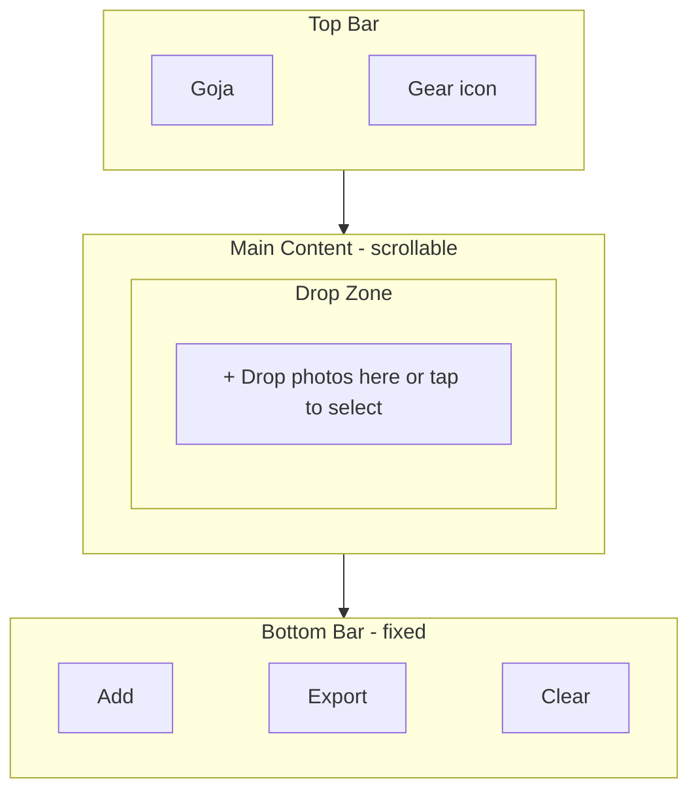
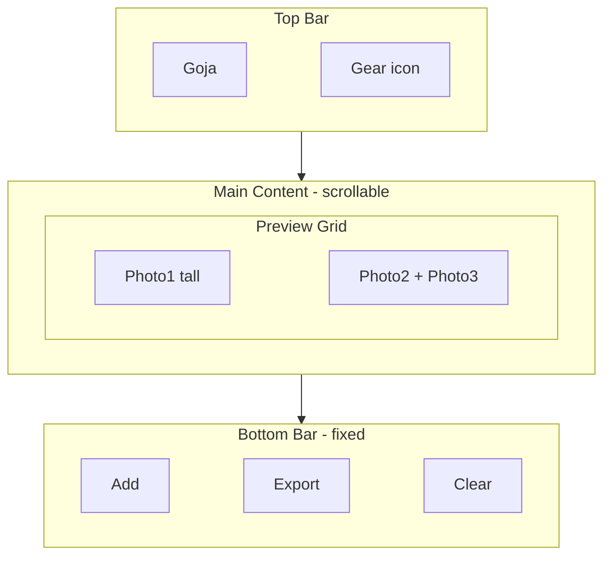
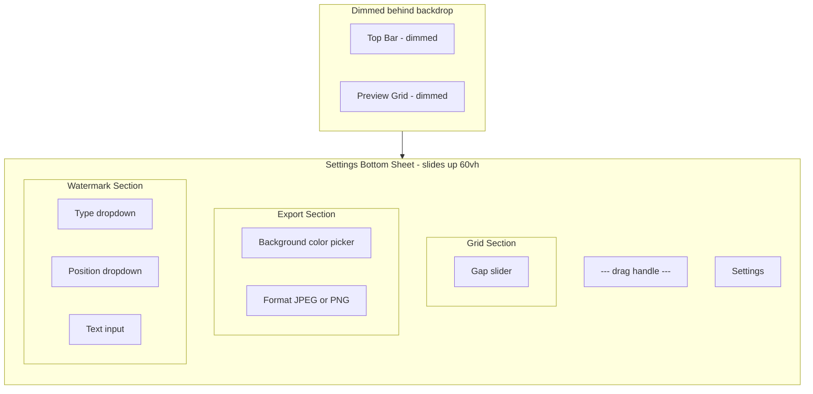
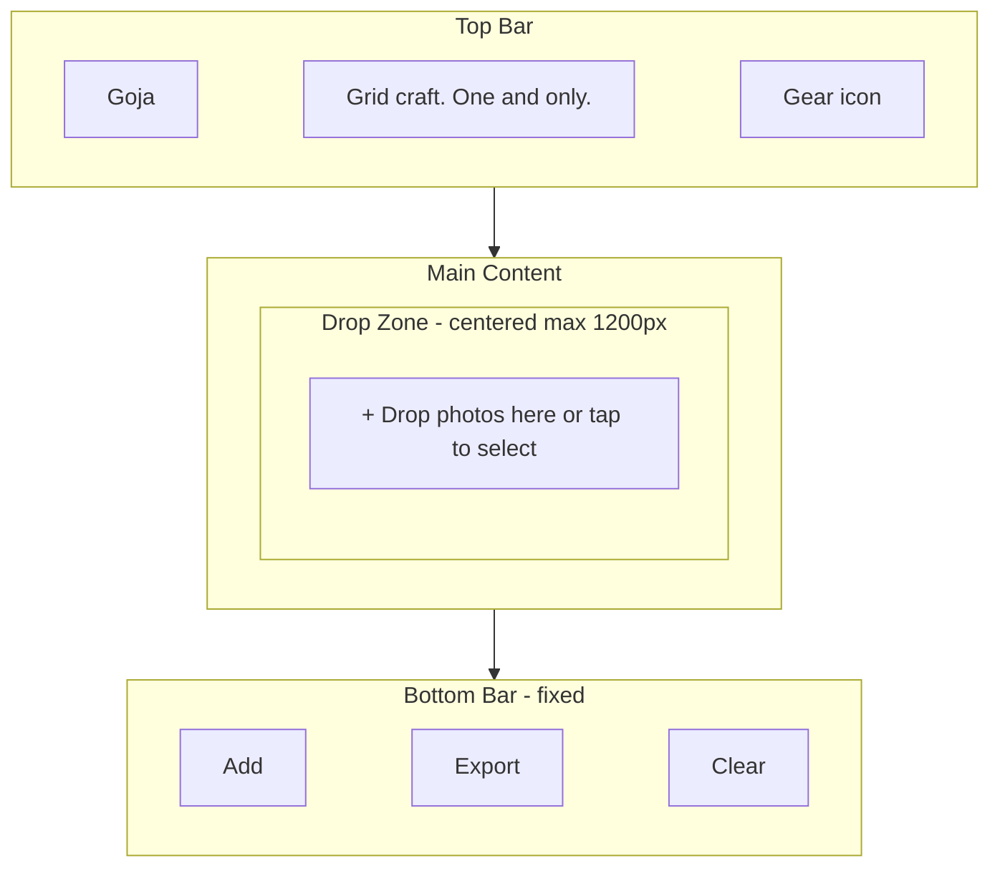
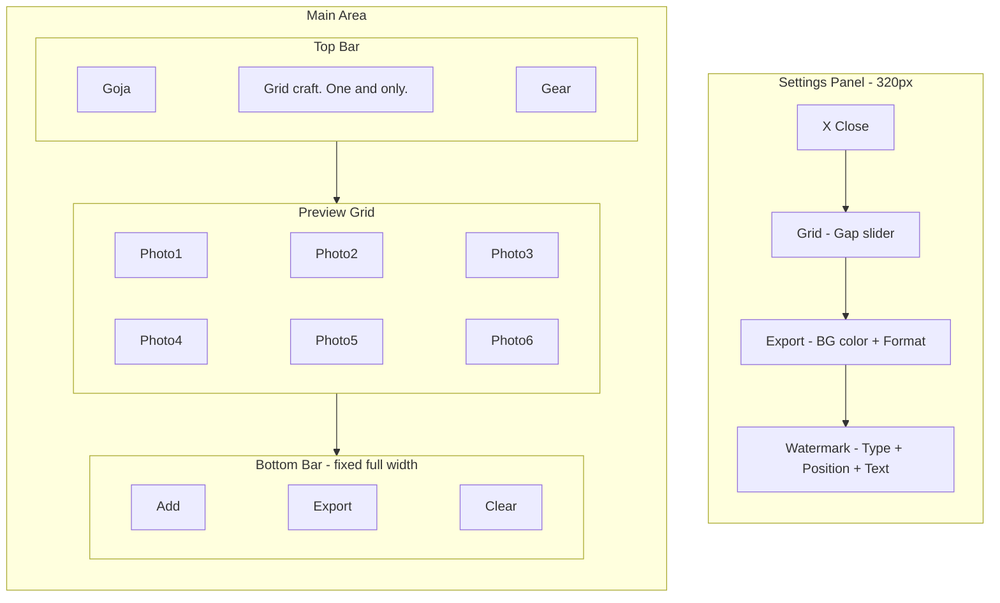
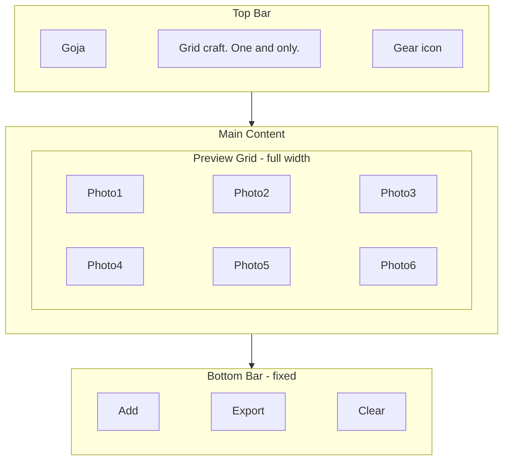
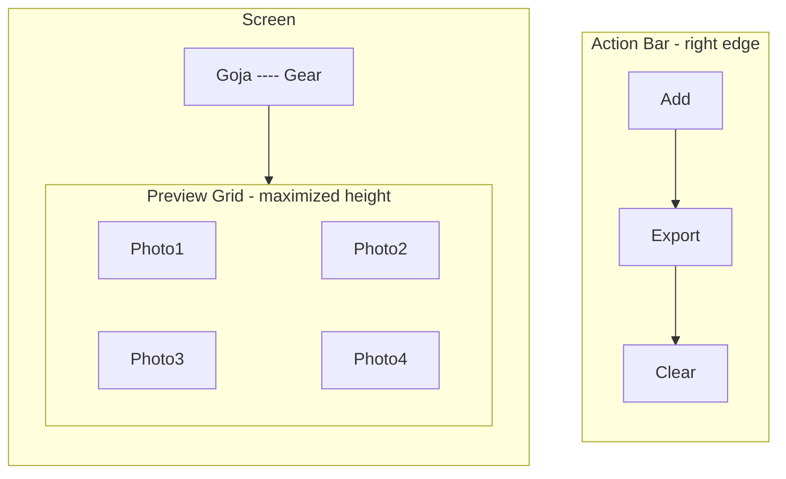

# Goja UI Redesign

## Strategy: Build-Fast-and-Fail-Fast

**Principle**: For every change -- bug fix, refactoring, or new feature -- make the smallest possible change first, run the relevant test suite immediately, and fail visibly if something breaks. Do not batch changes. Do not accumulate broken state.

- **New features**: Build one function at a time. Write a failing test first (TDD). Implement to pass. Run the full suite. Move on.
- **Refactoring**: Extract one module at a time. Run tests after each extraction. If a test breaks, fix it before the next extraction. Never refactor two files simultaneously.
- **New tests**: Write tests for one untested module at a time. If writing the test reveals a bug, fix the bug immediately rather than deferring it.
- **One change, one test**: After each atomic change, run the relevant test suite. If it passes, proceed. If it fails, fix immediately.
- **Console.log before polish**: When investigating a bug, log intermediate values. Delete the logs after the fix is proven.
- **Fail visibly**: Prefer `console.warn` over silent swallowing. Catch blocks must at least log.

---

## Coding Rules

- **TDD First**: Write failing tests before implementation. Every new function gets a unit test.
- **99-Line Rule**: No JS source file may exceed 99 real lines of code. If a module grows beyond this, split it.
- **Single Responsibility**: One module, one purpose. Split if needed.
- **Functional Programming**: Prefer pure functions, immutable data, composition over mutation.
- **No Hardcoding**: Use CSS custom properties and JS constants for all magic numbers.
- **Bottom-Up Modular**: Build small cooperating modules testable in isolation.
- **ES Module Pattern**: Each module exports named functions. No monolithic files.
- **Test Location**: All tests in `tests/unit/`.
- **Clean Codebase**: No temporary files left behind.
- **Run All Tests**: After every phase, run full test suite.

---

## Responsive UI and CSS Rules

### Breakpoints

- `<= 480px` -- small phone (iPhone SE, older iPhones)
- `<= 768px` -- large phone / small tablet (iPhone Pro Max, iPad Mini)
- `<= 1024px` -- tablet (iPad, iPad Air)
- `> 1024px` -- desktop (Mac, PC)
- `max-height <= 600px` -- landscape phone mode

### Cross-Platform Rules

- Touch targets minimum 44x44px on all touch devices.
- No horizontal overflow on any device.
- Use CSS custom properties in `variables.css` -- no hardcoded values.
- Mobile-first: base styles target phone, `@media` queries scale up.
- All interactive controls must be thumb-reachable on phone screens.
- Use `-webkit-` prefixes for Safari compatibility.
- Respect `prefers-color-scheme` for light/dark mode.
- Use `viewport-fit=cover` for iPhone notch/Dynamic Island support.

---

## Current vs. New Architecture

### Current layout (problems)

- All controls (Gap, Background, Format, Watermark) are always visible in a sidebar
- On mobile, controls stack below the preview, pushing Export/Clear far down below the fold
- No clear visual hierarchy; settings and actions compete for attention
- Not thumb-friendly on phones -- Export button is far from bottom of screen

---

## UI Layouts

### Layout 1: Phone -- Default State (no photos loaded)



- Top bar is compact: brand name left, gear icon right
- Drop zone fills the main content area
- Bottom bar is fixed at screen bottom, always thumb-reachable
- Export and Clear are disabled until photos are loaded

### Layout 2: Phone -- Photos Loaded



- Drop zone is hidden; preview grid fills the main area
- Photos are draggable within the grid
- All three bottom bar buttons are active
- Add button opens the file picker to add more photos

### Layout 3: Phone -- Settings Bottom Sheet Open



- Backdrop overlay dims the grid and top bar
- Bottom sheet slides up from bottom, covering ~60% of screen height
- Drag handle at top allows swipe-down to close
- Tapping backdrop also closes the sheet
- Pressing Escape closes the sheet
- Settings are grouped into three sections with headings

### Layout 4: Desktop -- Default State (no photos loaded)



- Tagline is visible next to the brand name on desktop
- Drop zone is centered with max-width constraint
- Bottom bar spans full width

### Layout 5: Desktop -- Photos Loaded + Settings Side Panel Open



- Side panel slides in from the right, 320px wide
- Main content area gets overlaid with backdrop dimming
- Panel has a close button at the top-right
- Backdrop click or Escape closes the panel

### Layout 6: Tablet -- Photos Loaded (Settings Closed)



- Same structure as phone but with more horizontal space
- Preview grid takes full available width
- Settings opens as a side panel (same as desktop) on tablets

### Layout 7: Landscape Phone (max-height 600px or less)



- Top bar is minimal height, tagline hidden
- Action bar optionally reflows to a narrow vertical strip on the right to maximize grid height
- Alternatively, action bar stays horizontal but with reduced padding

---

### Settings Panel -- Interaction Summary

- **Open trigger**: Gear icon in top bar
- **Close triggers**: Backdrop tap, Escape key, swipe-down on drag handle (mobile), X button (desktop)
- **Animation**: CSS `transform` transition (0.3s ease)
  - Mobile: `translateY(100%)` -> `translateY(0)` (slides up)
  - Desktop/Tablet: `translateX(100%)` -> `translateX(0)` (slides in from right)
- **Accessibility**: `aria-hidden` toggled, focus trapped inside panel when open

### Settings Panel Contents (grouped)

- **Grid**: Gap slider
- **Export**: Background color, Format (JPEG/PNG)
- **Watermark**: Type (None/Free text/Date-time/Copyright), Position (Bottom-right/Center/Tiled), Text input

Each group has a section heading for clarity.

---

## File Changes

### New file: [js/settings-panel.js](02product/01_coding/project/goja/js/settings-panel.js)

Pure module for managing panel state:

- `openSettings(panelEl, backdropEl)` -- adds `.open` class, sets `aria-hidden="false"`, traps focus
- `closeSettings(panelEl, backdropEl)` -- removes `.open` class, restores focus
- `isOpen(panelEl)` -- returns boolean
- `initSettingsPanel(panelEl, backdropEl, triggerEl)` -- wires gear click, backdrop click, Escape key

This keeps `app.js` lean (under 99 lines) by extracting all panel interaction logic.

### New file: [tests/unit/settings-panel.test.js](02product/01_coding/project/goja/tests/unit/settings-panel.test.js)

TDD tests for `openSettings`, `closeSettings`, `isOpen`.

### Modified: [index.html](02product/01_coding/project/goja/index.html)

Complete restructure:

```
<body>
  <header class="top-bar">
    <div class="top-bar__brand">Goja</div>
    <p class="top-bar__tagline">Grid craft. One and only.</p>
    <button class="top-bar__settings" id="settingsBtn" aria-label="Settings">gear icon</button>
  </header>

  <main class="main-content">
    <div class="drop-zone" id="dropZone">...</div>
    <section class="preview" id="preview">
      <div class="preview__grid" id="previewGrid"></div>
    </section>
  </main>

  <nav class="bottom-bar" id="bottomBar">
    <button id="addBtn">+ Add</button>
    <button id="exportBtn">Export</button>
    <button id="clearBtn">Clear</button>
  </nav>

  <div class="settings-backdrop" id="settingsBackdrop"></div>
  <aside class="settings-panel" id="settingsPanel" aria-hidden="true">
    <div class="settings-panel__handle"></div>
    <h2>Settings</h2>
    <!-- Grid section -->
    <!-- Export section -->
    <!-- Watermark section -->
  </aside>

  <footer class="footer">...</footer>
</body>
```

### Modified: [css/variables.css](02product/01_coding/project/goja/css/variables.css)

Add new design tokens:

- `--bottom-bar-height: 60px`
- `--settings-panel-width: 320px`
- `--settings-sheet-height: 60vh`
- `--backdrop-color: rgba(0, 0, 0, 0.4)`
- `--transition-speed: 0.3s`
- `--z-bottom-bar`, `--z-backdrop`, `--z-settings-panel` (z-index layers)

### Modified: [css/style.css](02product/01_coding/project/goja/css/style.css)

Major rewrite. Key new sections:

- **Top bar**: Flex row, brand left, gear right, compact height
- **Main content**: Fills space between top bar and bottom bar (`padding-bottom: var(--bottom-bar-height)`)
- **Bottom bar**: `position: fixed; bottom: 0`, full-width, flex row with evenly spaced buttons, safe area inset padding
- **Settings backdrop**: Full-screen overlay, opacity transition, `pointer-events: none` when hidden
- **Settings panel (mobile)**: `position: fixed; bottom: 0`, `transform: translateY(100%)` by default, `.open` -> `translateY(0)`. Rounded top corners, drag handle.
- **Settings panel (desktop)**: `position: fixed; right: 0; top: 0; bottom: 0`, `transform: translateX(100%)` by default, `.open` -> `translateX(0)`.
- **Settings sections**: Grouped with section headings, consistent spacing.
- **Drop zone**: Adapts to fill available space between top bar and bottom bar.

### Modified: [js/app.js](02product/01_coding/project/goja/js/app.js)

- Replace sidebar DOM refs with settings panel refs
- Add `addBtn` ref (opens file picker, same as drop zone click)
- Import and call `initSettingsPanel` from `settings-panel.js`
- Remove old `showUI` toggle on `controls` and `actions` (they're now in the settings panel and bottom bar respectively)
- Keep `showUI` for `preview` only
- Update `clearAll` to also close settings panel if open

### Modified: [sw.js](02product/01_coding/project/goja/sw.js)

- Bump cache version
- Add `js/settings-panel.js` to ASSETS list

---

## Implementation Order (TDD)

1. **Settings panel module**: Write tests, implement `settings-panel.js`
2. **HTML restructure**: New top bar, main content, bottom bar, settings panel markup
3. **CSS variables**: Add new design tokens
4. **CSS rewrite**: Top bar, bottom bar, settings panel (bottom sheet + side panel), responsive breakpoints
5. **Wire JS**: Update `app.js` to use new DOM structure + settings panel module
6. **Update sw.js**: Bump cache, add new asset
7. **Full regression**: Run all tests

