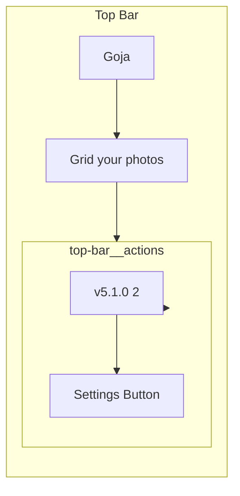

# Version Relocation: Footer to Top Bar (Left of Settings)

## Current State

- Version shown in a fixed footer at bottom-right, above the bottom bar ([index.html](02product/01_coding/project/goja/index.html) lines 185-187)
- Populated by `$('#versionLabel').textContent = \`v${VERSION_STRING}` in [js/app.js](02product/01_coding/project/goja/js/app.js) line 194
- Footer uses `.version` class and `--font-size-sm`, `--color-text-muted` ([css/style.css](02product/01_coding/project/goja/css/style.css) lines 424-434)

## UI Design Guidelines Applied


| Principle                   | Implementation                                                                                                                                      |
| --------------------------- | --------------------------------------------------------------------------------------------------------------------------------------------------- |
| **Visual hierarchy**        | Version is secondary; use small font (`--font-size-sm`), muted color (`--color-text-muted`), no bold                                                |
| **Proximity & grouping**    | Place version in the right-side “utility” cluster with the settings button; use adequate gap (`--gap-sm` or `--gap-md`) between version and button  |
| **Touch target separation** | Maintain clear space so the settings button (44px min touch target) is not accidentally tapped; version text is non-interactive                     |
| **Responsive behavior**     | On landscape/narrow (max-height: 600px, max-width: 480px), abbreviate to `v5.1` if space is tight, or rely on `text-overflow: ellipsis` as fallback |
| **Accessibility**           | Add `aria-hidden="true"` (version is decorative) or `title` attribute with full version for tooltip; ensure no keyboard trap                        |
| **Consistency**             | Reuse existing design tokens (font-size, color) for cohesive look                                                                                   |


## Implementation Plan

### 1. HTML Changes ([index.html](02product/01_coding/project/goja/index.html))

**Remove** the footer element (lines 185-187):

```html
<footer class="footer">
  <span class="version" id="versionLabel"></span>
</footer>
```

**Add** a version span inside the top bar, before the settings button. Wrap version + settings in a right-aligned group for semantic grouping:

```html
<header class="top-bar">
  <div class="top-bar__brand" data-i18n="brand">Goja</div>
  <p class="top-bar__tagline" data-i18n="tagline">Grid your photos.</p>
  <div class="top-bar__actions">
    <span class="top-bar__version" id="versionLabel" aria-hidden="true"></span>
    <button class="top-bar__settings" id="settingsBtn" ...>...</button>
  </div>
</header>
```

### 2. CSS Changes ([css/style.css](02product/01_coding/project/goja/css/style.css))

**Add** styles for the new top-bar structure:

```css
.top-bar__actions {
  display: flex;
  align-items: center;
  gap: var(--gap-md);
  margin-left: auto;
}

.top-bar__version {
  font-size: var(--font-size-sm);
  color: var(--color-text-muted);
  font-weight: 400;
  white-space: nowrap;
}
```

**Remove** the `.footer` block (lines 424-434). Update `.top-bar__settings` to remove `margin-left: auto` (that moves to `.top-bar__actions`).

**Responsive:** On landscape phones (`max-height: 600px`), the tagline is already hidden; version text (e.g. `v5.1.0 (2)`) is short enough to fit. If needed, add `@media (max-width: 360px) { .top-bar__version { font-size: 0.75rem; } }` as a last-resort shrink for very narrow screens.

### 3. JavaScript ([js/app.js](02product/01_coding/project/goja/js/app.js))

No logic change; the existing `$('#versionLabel').textContent = \`v${VERSION_STRING}`continues to work since the`id="versionLabel"` is preserved.

### 4. Tests

- **Manual**: Verify layout on desktop, tablet, mobile, and landscape phone
- **Visual**: Confirm version is left of settings, correctly styled, and footer is gone
- **Regression**: Ensure no tests reference `.footer` or `footer` (grep shows no test references to the version DOM)

### 5. CHANGELOG

Add entry: “Relocate version display from footer to top bar (left of settings button).”

## Layout Diagram




Before: `[Goja][Tagline]........................[Footer: v5.1.0 (2)]` (footer fixed at bottom-right)  
After: `[Goja][Tagline]......................[v5.1.0 (2)][Settings]`